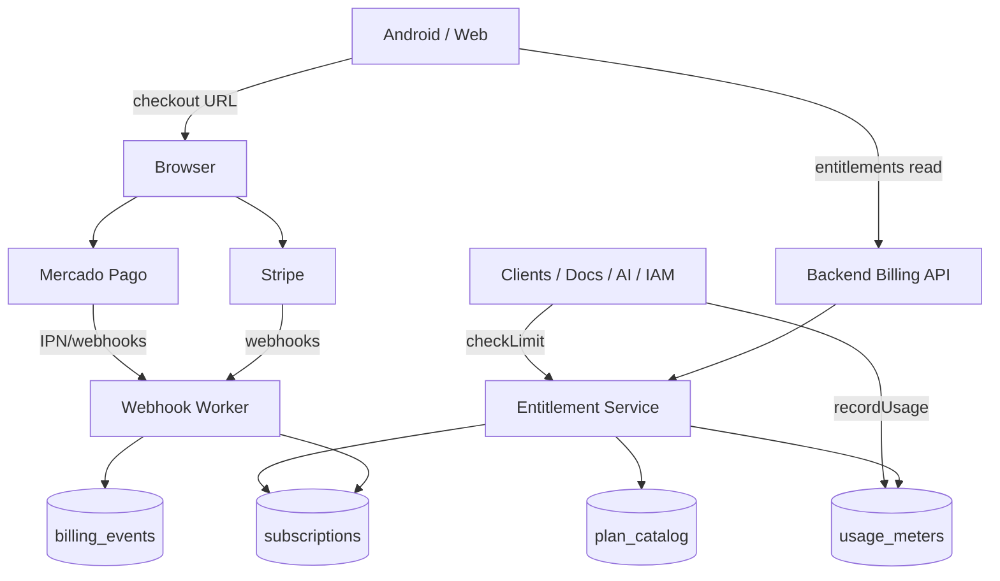

# NexoGo — Billing Foundation Architecture

> **Arquitectura de planes, límites y facturación SaaS**  
> Fecha: 2026-09-19  
> Complementa: `COMPANY_IMPLEMENTATION_PLAN.md` · `MULTITENANT_ARCHITECTURE.md` · `AI_MODULE.md` · `DOCUMENT_MANAGEMENT.md` · `ROLE_SYSTEM.md`  
> **Solo diseño.** No implementa cobros ni SDKs de pago.

---

## 1. Visión

NexoGo vende **suscripciones por Company (tenant)**.

- El **pagador** es la empresa (`companies/{companyId}`), no el usuario individual.  
- El **plan** determina **entitlements** (límites + flags de módulos).  
- Los **proveedores de pago** (Stripe, Mercado Pago) son adaptadores: NexoGo es la fuente de verdad de *qué puede hacer* la Company.  
- FREE permite adopción; STARTER / PRO / ENTERPRISE monetizan escala y capacidades (IA, documentos, usuarios).

Principio rector:

> **Entitlement en plataforma → metering en uso → cobro en PSP.**  
> Nunca confiar solo en el webhook del PSP para autorizar una acción de negocio.

---

## 2. Alcance y fuera de alcance

### 2.1 Incluye (foundation)

| Área | Contenido |
|------|-----------|
| Catálogo de planes | FREE · STARTER · PRO · ENTERPRISE |
| Límites | Usuarios, almacenamiento, IA, documentos (+ relacionados) |
| Modelo de suscripción | Ciclo de vida, estado, períodos |
| Metering | Contadores mensuales / acumulados por Company |
| Enforcement | Soft (warn) → Hard (block) policies |
| PSP adapters | Contratos para Stripe y Mercado Pago |
| Datos Firestore | Colecciones / campos propuestos |

### 2.2 No incluye (aún)

- Implementación de Checkout / SDK en Android  
- Webhooks en producción  
- Facturación fiscal electrónica (DIAN / AFIP / etc.)  
- Marketplace / split payments  
- Add-ons a la carta (se diseñan como extensión futura)

---

## 3. Relación con Company (as-is → to-be)

### 3.1 Código actual

```kotlin
// CompanyModels.kt (hoy)
CompanyPlans: free | pro | business | enterprise
CompanyLimits: maxUsers, maxStorageMb, maxAiRequestsMonth, maxClients, maxCustomRoles
CompanyFlags: aiEnabled, documentsEnabled, crmEnabled
```

### 3.2 Alineación propuesta

| Hoy | To-be Billing Foundation |
|-----|--------------------------|
| `free` | **FREE** |
| *(nuevo)* | **STARTER** |
| `pro` | **PRO** |
| `business` | Deprecar → mapear a **PRO** o **ENTERPRISE** (migración 1:1 en cutover) |
| `enterprise` | **ENTERPRISE** |
| `Company.limits` embebido | **Snapshot** denormalizado desde plan + overrides |
| `Company.flags` | Derivado de plan + feature toggles |

**Recomendación:** introducir `STARTER`; tratar `business` como alias legacy de `pro` hasta limpieza.

---

## 4. Catálogo de planes

### 4.1 Definición comercial

| Plan | Código | Posicionamiento | Ciclo sugerido |
|------|--------|-----------------|----------------|
| Free | `free` | Prueba / micro-negocio | Mensual (sin cobro) |
| Starter | `starter` | Primera clínica / pyme | Mensual / anual |
| Pro | `pro` | Operación completa + IA | Mensual / anual |
| Enterprise | `enterprise` | Multi-sede, SLA, BYOK | Anual + contrato |

Monedas objetivo v1: **COP**, **USD**, **MXN**, **ARS** (catálogo de precios por `priceBook`; el PSP cobra en la moneda del Price).

### 4.2 Matriz de límites (números de foundation)

Valores **sugeridos** para producto; ajustables en `plan_catalog` sin redeploy de app.

| Límite | FREE | STARTER | PRO | ENTERPRISE |
|--------|-----:|--------:|----:|-----------:|
| **Usuarios activos** (`maxUsers`) | 2 | 5 | 25 | Ilimitado* / contrato |
| **Almacenamiento** (`maxStorageMb`) | 512 MB | 5 GB (5 120) | 50 GB (51 200) | 500 GB+ / custom |
| **Documentos** (`maxDocuments`) | 50 | 500 | 10 000 | Ilimitado* |
| **Tamaño máx. archivo** (`maxUploadMb`) | 10 | 25 | 50 | 100 |
| **Requests IA / mes** (`maxAiRequestsMonth`) | 0** | 100 | 2 000 | 20 000+ / BYOK |
| **Tokens IA / mes** (`maxAiTokensMonth`) opcional | 0 | 200 000 | 5 000 000 | Custom |
| **Clientes** (`maxClients`) | 50 | 500 | 10 000 | Ilimitado* |
| **Roles custom** (`maxCustomRoles`) | 0 | 3 | 20 | Ilimitado* |
| **Companies por billing account** | 1 | 1 | 1 | N (holding) fase 2 |

\* “Ilimitado” = soft-cap alto + revisión comercial; siempre hay techo técnico anti-abuso.  
\*\* FREE: IA deshabilitada (`aiEnabled=false`) salvo trial temporal.

### 4.3 Features / flags por plan

| Feature | FREE | STARTER | PRO | ENTERPRISE |
|---------|:----:|:-------:|:---:|:----------:|
| Clientes / Expedientes / Agenda | ✓ | ✓ | ✓ | ✓ |
| Documentos | ✓ básico | ✓ | ✓ | ✓ |
| Chat / Tareas | ✓ | ✓ | ✓ | ✓ |
| CRM | — | ✓ | ✓ | ✓ |
| Ventas / Inventario | — / read | ✓ | ✓ | ✓ |
| Dashboard KPIs | básico | ✓ | ✓ | ✓ |
| **IA (summarize / extract / chat)** | — | limitado | ✓ | ✓ + BYOK |
| Packs industria múltiples | 1 | 1 | N | N |
| SSO / audit export | — | — | — | ✓ |
| Soporte | Community | Email | Prioritario | Dedicated |

### 4.4 Entitlement object (canónico)

```
PlanEntitlement
├── planId                  # free | starter | pro | enterprise
├── displayName
├── limits
│     maxUsers
│     maxStorageMb
│     maxDocuments
│     maxUploadMb
│     maxAiRequestsMonth
│     maxAiTokensMonth?
│     maxClients
│     maxCustomRoles
├── flags
│     aiEnabled
│     documentsEnabled
│     crmEnabled
│     inventoryEnabled
│     salesEnabled
│     ssoEnabled
│     byokOpenAiEnabled
├── softBlockPolicy         # WARN_ONLY | WARN_THEN_BLOCK | BLOCK
└── priceRefs[]             # ids de Price en Stripe / MP (por moneda/ciclo)
```

---

## 5. Modelo de suscripción

### 5.1 Entidades

```
BillingAccount (fase 1 = la misma Company)
└── Subscription
      ├── id
      ├── companyId
      ├── planId
      ├── status              # ver §5.2
      ├── billingCycle        # MONTHLY | YEARLY
      ├── currency
      ├── currentPeriodStart / currentPeriodEnd
      ├── trialEndsAt?
      ├── cancelAtPeriodEnd
      ├── provider            # NONE | STRIPE | MERCADO_PAGO
      ├── providerCustomerId
      ├── providerSubscriptionId
      ├── entitlementSnapshot # copia de PlanEntitlement al inicio del período
      └── updatedAt

UsageMeter (por company + periodKey YYYY-MM)
├── companyId
├── periodKey
├── usersCount
├── storageBytesUsed
├── documentsCount
├── aiRequestsCount
├── aiTokensUsed
└── updatedAt

BillingEvent (audit)
├── companyId
├── type                    # CHECKOUT_STARTED | PAID | FAILED | RENEWED | CANCELED | LIMIT_HIT
├── provider
├── payloadRef
└── createdAt
```

### 5.2 Estados de suscripción

```
NONE / FREE_ACTIVE
    → TRIALING
    → ACTIVE
    → PAST_DUE          # pago fallido; gracia N días
    → SUSPENDED         # hard block módulos pagos
    → CANCELED
    → EXPIRED
```

Reglas:

1. Toda Company nueva nace en **FREE_ACTIVE** con entitlement FREE.  
2. Upgrade STARTER+ requiere Checkout (Stripe o MP).  
3. Downgrade aplica en **fin de período** (salvo admin override).  
4. `PAST_DUE`: soft-block IA y creación de documentos nuevos tras gracia; lectura permitida.  
5. `SUSPENDED`: solo Configuración + facturación + export read-only.

### 5.3 Trial

| Parámetro | Default |
|-----------|---------|
| Trial PRO | 14 días |
| Requiere tarjeta | Configurable por mercado (LATAM: a menudo no en MP) |
| Al expirar | Downgrade a FREE o STARTER según campaña |

---

## 6. Límites — definición operativa

### 6.1 Usuarios (`maxUsers`)

- Cuenta **memberships ACTIVE** (no INVITED / REVOKED).  
- SUPER_ADMIN de plataforma no consume cupo de la Company.  
- Enforcement: bloquear **invitar / aprobar** si `usersCount >= maxUsers`.

### 6.2 Almacenamiento (`maxStorageMb`)

- Suma de bytes en Storage bajo `companies/{companyId}/**` (+ metadatos `Document.size`).  
- Metering: incrementar en upload Document / Chat attachment; reconciliar job diario.  
- Enforcement: bloquear **nuevos uploads** al 100%; warn al 80%.

### 6.3 Documentos (`maxDocuments`)

- Count de `documents` con `status != DELETED`.  
- Independiente del storage (empresa puede tener pocos docs pesados o muchos livianos).  
- Enforcement: bloquear `registerUpload` / create doc metadata.

### 6.4 IA (`maxAiRequestsMonth` / tokens)

- 1 `AIJob` SUCCEEDED (o RUNNING que consuma API) = 1 request (mínimo).  
- Opcional: sumar `usage.totalTokens` contra `maxAiTokensMonth`.  
- FREE: `aiEnabled=false` → UI oculta / enqueue rechazado.  
- ENTERPRISE BYOK: requests cuentan para abuse cap técnico, no contra cuota NexoGo pagada.  
- Enforcement: `AIRepository.enqueue*` consulta meter del período.

### 6.5 Policy de enforcement

```
onAction(companyId, dimension):
  usage = getMeter(companyId, period)
  limit = getEntitlement(companyId).limits[dimension]
  ratio = usage / limit

  if ratio >= 1.0 → BLOCK (o SUSPEND según dimensión)
  if ratio >= 0.8 → WARN (banner + BillingEvent LIMIT_WARN)
  else ALLOW
```

Dimensiones críticas de BLOCK inmediato: storage, AI (costo variable).  
Usuarios/docs: BLOCK en create.

---

## 7. Integración futura — Stripe

### 7.1 Rol

- Mercados: US / EU / global cards.  
- Product Catalog: Product + Prices (monthly/yearly) por `planId`.  
- Customer: 1 Stripe Customer ↔ `companyId` (metadata).  
- Subscription: Stripe Subscription ↔ `Subscription.providerSubscriptionId`.

### 7.2 Flujos

| Flujo | Mecanismo |
|-------|-----------|
| Upgrade | Checkout Session / Customer Portal |
| Cambio de plan | Subscription update + proration |
| Cancel | `cancel_at_period_end` |
| Webhooks | `checkout.session.completed`, `invoice.paid`, `invoice.payment_failed`, `customer.subscription.updated/deleted` |

### 7.3 Adapter contract

```
BillingProviderAdapter
  createCheckout(companyId, planId, cycle, successUrl, cancelUrl) → CheckoutSession
  createCustomerPortal(companyId) → PortalUrl
  mapWebhook(raw) → BillingProviderEvent
  syncSubscription(providerSubscriptionId) → SubscriptionSnapshot
```

Implementación Stripe: Cloud Functions / Cloud Run **solo backend**. App Android abre Custom Tab / browser con URL.

### 7.4 Seguridad

- Webhook signature (`Stripe-Signature`).  
- Idempotencia por `event.id`.  
- Nunca secret key en app.

---

## 8. Integración futura — Mercado Pago

### 8.1 Rol

- Mercados LATAM (CO, MX, AR, CL, BR, …).  
- Preferencias / Suscripciones MP (o Checkout Pro + lógica de renovación según producto).  
- External reference = `companyId` + `subscriptionId` interno.

### 8.2 Flujos

| Flujo | Mecanismo sugerido |
|-------|-------------------|
| Alta plan | Checkout Pro / Subscriptions API |
| IPN / Webhooks | `payment`, `subscription_*` |
| Estados | Mapear approved / pending / rejected → ACTIVE / PAST_DUE |

### 8.3 Particularidades LATAM

- Medios locales (PSE, OXXO, etc.) → estados `pending` prolongados → no ACTIVAR entitlement premium hasta `approved`.  
- Moneda por país en `priceBook`.  
- IVA / retenciones: capa fiscal **fuera** de v1 billing foundation (solo guardar `taxId` de Company).

### 8.4 Adapter

Mismo `BillingProviderAdapter`; implementación `MercadoPagoBillingAdapter`.  
Company elige provider por `billing.preferredProvider` o por país (`CO`→MP default, `US`→Stripe).

---

## 9. Arquitectura lógica



### 9.1 Dónde vive la lógica

| Capa | Responsabilidad |
|------|-----------------|
| **App** | Mostrar plan, banners 80%, deep link a portal; **no** cobrar |
| **Cloud Functions** | Checkout, webhooks, sync entitlement → `Company.planId` + `limits` |
| **Firestore** | `plan_catalog`, `subscriptions`, `usage_meters`, snapshot en Company |
| **Modules** | Llamar `EntitlementGuard.beforeCreateX()` |

### 9.2 Sync hacia Company (denormalización)

Tras pago / cambio de plan:

```
Company.planId = subscription.planId
Company.limits = entitlement.limits
Company.flags  = entitlement.flags
Company.billingStatus = subscription.status
```

Los módulos platform siguen leyendo `Company` / `TenantContext` sin conocer Stripe/MP.

---

## 10. Firestore propuesto

```
/plan_catalog/{planId}                 # FREE..ENTERPRISE + entitlements
/price_book/{priceId}                  # planId, provider, currency, cycle, amountMinor

/companies/{companyId}
  planId, limits, flags, billingStatus
  /billing/subscription                # doc único de suscripción activa
  /billing/usage/{periodKey}           # meters
  /billing/events/{eventId}            # audit

/platform/billing_events/{eventId}     # opcional índice global SUPER_ADMIN
```

Índices: `subscriptions` por `providerSubscriptionId`; usage por `companyId`+`periodKey`.

---

## 11. API interna (contratos futuros)

| Método | Uso |
|--------|-----|
| `getEntitlement(companyId)` | Plan + límites efectivos (incl. overrides) |
| `checkLimit(companyId, dimension, delta)` | ALLOW / WARN / BLOCK |
| `recordUsage(companyId, dimension, delta)` | Metering |
| `createCheckout(companyId, planId, provider, cycle)` | URL |
| `createPortal(companyId)` | URL gestión |
| `applyProviderEvent(event)` | Webhook handler |

Overrides ENTERPRISE: `companies/{id}/billing/overrides` (límites custom firmados por sales).

---

## 12. UX de billing (producto)

| Superficie | Contenido |
|------------|-----------|
| Configuración → Plan | Plan actual, uso vs límites (barras), CTA Upgrade |
| Banner global | 80% storage / IA agotada |
| Bloqueo modal | “Has alcanzado el límite de documentos del plan FREE” → Upgrade |
| Home ADMIN | Chip plan en Company header (opcional) |

Portal CLIENT: **no** ve billing (solo staff ADMIN con `settings.org.update` / `platform.billing.manage` interno).

---

## 13. Seguridad y compliance

1. Secretos PSP solo en Secret Manager.  
2. Webhooks verificados + idempotentes.  
3. App nunca recibe `client_secret` de cargo directo en v1 (solo session URL).  
4. Logs de `BillingEvent` sin PAN / datos de tarjeta.  
5. Permiso: gestión de plan = `ADMIN` de Company; catálogo global = `SUPER_ADMIN`.  
6. Export de facturas PSP: link al portal, no duplicar PCI scope.

---

## 14. Migración desde Company actual

| Paso | Acción |
|------|--------|
| M1 | Publicar `plan_catalog` con FREE/STARTER/PRO/ENTERPRISE |
| M2 | Mapear `business` → `pro` en lectura |
| M3 | Añadir `maxDocuments` / `maxUploadMb` a limits |
| M4 | Seed `Subscription` FREE_ACTIVE por Company existente |
| M5 | Metering jobs (storage reconcile, AI counters desde `ai_jobs`) |
| M6 | Adapters Stripe + MP en backend (sin UI de pago en app hasta M7) |
| M7 | Pantalla Plan + Checkout |

Código Android de cobro: **no** en esta foundation.

---

## 15. Riesgos

| Riesgo | Mitigación |
|--------|------------|
| Doble fuente de verdad PSP vs Firestore | Entitlement solo se actualiza por worker idempotente |
| Abuso FREE (storage) | Caps bajos + reconcile diario |
| IA costo variable | Soft/hard cap mensual + BYOK Enterprise |
| Divergencia Stripe vs MP features | Adapter común; feature matrix por provider |
| Legacy `business` plan | Alias + deprecación documentada |

---

## 16. Criterios de aceptación (diseño)

- [ ] Cuatro planes definidos con límites de **usuarios, storage, IA, documentos**.  
- [ ] Modelo Subscription + UsageMeter + Events especificado.  
- [ ] Contratos de adapter para **Stripe** y **Mercado Pago**.  
- [ ] Enforcement WARN/BLOCK por dimensión.  
- [ ] Sync denormalizado a `Company.planId/limits/flags`.  
- [ ] Sin dependencia de implementación de pagos en el cliente.

---

## 17. Veredicto

**Billing Foundation** queda definida como capa de **entitlements + metering + adapters PSP**, anclada a Company.

| Plan | Usuarios | Storage | Docs | IA / mes |
|------|----------|---------|------|----------|
| FREE | 2 | 512 MB | 50 | 0 |
| STARTER | 5 | 5 GB | 500 | 100 |
| PRO | 25 | 50 GB | 10 000 | 2 000 |
| ENTERPRISE | Custom | 500 GB+ | Ilimitado* | 20 000+ / BYOK |

Siguiente paso de implementación (cuando se autorice): `plan_catalog` + `EntitlementGuard` en Documents/AI/IAM — **sin Checkout todavía**.
