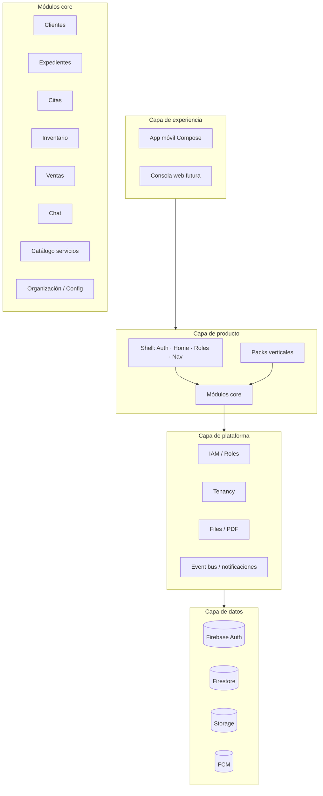
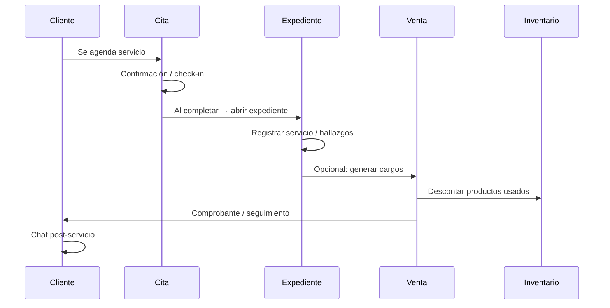

# NexoGo — Business Platform Architecture

> **Arquitectura funcional objetivo** de NexoGo como plataforma empresarial multiindustria.  
> Fecha: 2026-09-18  
> Complementa: `MASTER_ARCHITECTURE.md` (estado técnico actual del código).  
> **Este documento no modifica código; define el modelo de negocio y de producto.**

---

## 1. Visión

NexoGo evoluciona de **app veterinaria monolítica** a **plataforma operativa multiindustria**:

> Un núcleo compartido de operación (clientes, expedientes, citas, inventario, ventas, comunicación)  
> + **packs verticales** por industria (veterinaria, clínica humana, estética, legal, educación, etc.)  
> + **tenancy** por organización (clínica, consultorio, comercio, firma).

El valor no es “gestionar mascotas”, sino **orquestar la relación con el cliente, el servicio agendado, el expediente del caso y el ciclo comercial**.

### 1.1 Principio de abstracción

| Concepto veterinario (hoy) | Concepto plataforma (objetivo) | Naturaleza |
|----------------------------|--------------------------------|------------|
| Paciente (mascota) | **Cliente** (o sujeto de servicio) | Entidad de relación comercial / operativa |
| Dueño / tutor | **Contacto / Account** (opcional) | Relación B2B2C o multi-contacto |
| Historial clínico | **Expediente** | Registro longitudinal del caso / servicio |
| Cita veterinaria | **Cita / Appointment** | Slot de agenda de servicio |
| Inventario de productos vet | **Inventario** | Stock + catálogo |
| Venta / factura | **Venta / Orden** | Transacción comercial |
| Chat staff–cliente | **Chat / Mensajería** | Comunicación en contexto |

---

## 2. Renombrado funcional obligatorio

### 2.1 Pacientes → Clientes

**Cliente** es la entidad central de la plataforma.

Un Cliente puede representar, según industria:

| Industria | Cliente representa |
|-----------|-------------------|
| Veterinaria | Mascota (sujeto) + vínculo a tutor |
| Clínica / odontología | Paciente humano |
| Estética / spa | Cliente persona |
| Legal | Cliente / matter party |
| Educación | Alumno / tutor |
| Retail servicios | Cliente / cuenta |
| Automotriz | Vehículo + propietario |

**Modelo lógico de Cliente (plataforma):**

```
Client
├── id
├── organizationId          # tenant
├── displayName
├── type                    # PERSON | PET | ASSET | ORG | CUSTOM
├── status                  # ACTIVE | INACTIVE | ARCHIVED
├── primaryContactId?       # contacto humano asociado
├── attributes              # mapa extensible (especie, placa, RFC…)
├── tags[]
├── media[]                 # fotos, documentos
├── createdAt / updatedAt
└── industryProfileRef?     # extensión vertical
```

**Reglas:**

1. La UI y la navegación hablan de **Clientes**, no de Pacientes.
2. Campos veterinarios (especie, raza, peso…) viven en **extensión vertical**, no en el núcleo rígido.
3. Un Cliente siempre pertenece a una **organización (tenant)**.
4. Búsqueda, listado, CRUD y permisos son del **core**; el formulario extra es del **pack industria**.

### 2.2 Historial Clínico → Expedientes

**Expediente** es el registro acumulativo de intervenciones/servicios ligados a un Cliente (y opcionalmente a Citas).

| Industria | Expediente representa |
|-----------|----------------------|
| Veterinaria | Historia clínica / consulta |
| Clínica | Expediente médico |
| Estética | Ficha de tratamientos |
| Legal | Expediente / caso |
| Educación | Expediente académico / seguimiento |
| Automotriz | Historial de servicio del vehículo |

**Modelo lógico de Expediente:**

```
Record (Expediente)
├── id
├── organizationId
├── clientId                # FK lógico a Cliente
├── appointmentId?          # origen opcional en una cita
├── title
├── recordType              # CONSULT | FOLLOW_UP | PROCEDURE | NOTE | CUSTOM
├── status                  # DRAFT | FINAL | ARCHIVED
├── summary
├── sections[]              # bloques tipados o libres
├── attachments[]           # Storage
├── authoredBy
├── serviceDate
├── exportArtifacts[]       # PDF, etc.
├── createdAt / updatedAt
└── industryPayload         # JSON/schema vertical (examen físico, diagnóstico…)
```

**Reglas:**

1. La UI habla de **Expedientes**, no de “Historial clínico” ni “Medical records” duplicados.
2. El core provee: listar, crear, editar, adjuntar, exportar PDF, vincular a Cliente/Cita.
3. Plantillas de secciones (examen físico, diagnóstico, etc.) son del **pack veterinaria** (u otro vertical).
4. Unificar en producto las rutas actuales `clinical_records`, `history_*`, `medical_records` bajo **Expedientes**.

---

## 3. Mapa de módulos: de vertical veterinario a plataforma

### 3.1 Matriz de transformación

| Módulo actual (vet) | Módulo plataforma | Capacidad de negocio | Extensible por industria |
|---------------------|-------------------|----------------------|--------------------------|
| Pacientes | **Clientes** | CRM operativo ligero | Sí (atributos/perfil) |
| Historial clínico | **Expedientes** | Case file / service record | Sí (plantillas) |
| Citas | **Citas** | Agenda de servicios | Sí (tipos de servicio, duración) |
| Inventario | **Inventario** | Catálogo + stock | Sí (categorías, UoM) |
| Ventas | **Ventas** | Cobro / órdenes / facturación | Sí (impuestos, series) |
| Chat | **Chat** | Mensajería contextual | Sí (bots, plantillas) |

### 3.2 Módulos de plataforma adicionales (núcleo)

Necesarios para multiindustria / multi-organización, aunque hoy existan de forma parcial:

| Módulo core | Función |
|-------------|---------|
| **Identidad y acceso** | Auth, roles, aprobación, SSO futuro |
| **Organizaciones (Tenants)** | Multi-clínica / multi-sucursal |
| **Catálogo de servicios** | Lo que se agenda y se vende (hoy mezclado en sales/config) |
| **Personal / Staff** | Profesionales que atienden citas y firman expedientes |
| **Notificaciones** | Push, email, recordatorios de cita |
| **Configuración org** | Branding, categorías, horarios, políticas |
| **Auditoría** | Quién cambió qué (exigencia empresarial) |
| **Reportes** | Agregados cross-módulo (hoy placeholders) |

---

## 4. Arquitectura funcional por capas



### 4.1 Capas (responsabilidad)

| Capa | Qué decide | Qué no decide |
|------|------------|---------------|
| **Experiencia** | Pantallas, navegación, UX por rol | Schema de industria |
| **Producto core** | Entidades y flujos universales | Campos de examen clínico |
| **Packs verticales** | Vocabulario, formularios, KPIs de industria | Auth, tenancy, pagos genéricos |
| **Plataforma** | Seguridad, archivos, eventos, multi-org | UI de un vertical |
| **Datos** | Persistencia y reglas | Reglas de negocio de UI |

### 4.2 Separación Core vs Vertical

```
core.clients          → Client CRUD, search, tags
vertical.veterinary   → PetProfile extension, species, breed
core.records          → Record CRUD, attachments, PDF pipeline
vertical.veterinary   → ClinicalSections template (exam, Dx, Rx)
core.appointments     → Calendar, status machine
vertical.veterinary   → Visit reasons, vet assignment rules
```

Un **tenant** activa uno o más packs. La primera vertical productiva sigue siendo **Veterinaria**, pero el producto se nombra y modela en términos de plataforma.

---

## 5. Módulos funcionales detallados

### 5.1 Clientes (ex Pacientes)

**Capacidades:**

- Alta / edición / archivo de clientes
- Búsqueda y filtros (nombre, tag, estado, contacto)
- Media (foto principal, galería)
- Vínculo a contactos (tutor, facturación, emergencias)
- Vista 360°: citas próximas, últimos expedientes, ventas asociadas
- Permisos: staff ve cartera de la org; cliente final ve solo “su” ficha (si aplica rol USER)

**Estados:** `ACTIVE` → `INACTIVE` → `ARCHIVED`

**Eventos de dominio:**

- `ClientCreated` · `ClientUpdated` · `ClientArchived` · `ClientMediaAdded`

### 5.2 Expedientes (ex Historial clínico)

**Capacidades:**

- Crear expediente desde Cliente o desde Cita completada
- Plantillas por `recordType` + pack industria
- Borrador → final (inmutabilidad suave post-final)
- Adjuntos (imagen, PDF, audio)
- Exportación PDF con branding de organización
- Timeline del cliente (lista cronológica de expedientes)

**Estados:** `DRAFT` → `FINAL` → `ARCHIVED`

**Eventos:**

- `RecordCreated` · `RecordFinalized` · `RecordExported` · `AttachmentAdded`

### 5.3 Citas

**Capacidades (universal):**

- Calendario por día/semana/mes
- CRUD de citas ligadas a Cliente + Servicio + Staff
- Máquina de estados: `SCHEDULED` → `CONFIRMED` → `IN_PROGRESS` → `COMPLETED` | `CANCELED` | `NO_SHOW`
- Recordatorios (FCM / futuro email-SMS)
- Desde `COMPLETED` → atajo “Crear expediente” / “Crear venta”

**Extensión vertical:** motivos de visita, duración por tipo, recursos (sala, equipo).

### 5.4 Inventario

**Capacidades:**

- Productos / insumos / kits
- Stock, umbral mínimo, movimientos
- Categorías (módulo config)
- Consumo desde Venta o desde Expediente (opcional)

**Extensión vertical:** lotes, caducidad (fármacos), series.

### 5.5 Ventas

**Capacidades:**

- Orden/venta con ítems de producto y/o servicio
- Métodos de pago y estado de cobro
- Descuento de stock al confirmar
- Documento / PDF de comprobante
- Asociación a Cliente (y opcionalmente a Cita/Expediente)

**Hoy (gap):** lista de ventas en UI es stub; el diseño de plataforma asume lista + detalle + crear como flujo completo.

### 5.6 Chat

**Capacidades:**

- Hilos entre usuarios de la organización (y opcionalmente cliente final)
- Multimedia
- Contexto opcional: deep-link a Cliente / Cita / Expediente
- Notificaciones push

**Extensión:** chatbot de citas, respuestas rápidas por industria.

---

## 6. Identidad, roles y tenancy

### 6.1 Organización (tenant)

```
Organization
├── id
├── name
├── industryPacks[]         # ["veterinary"] | ["clinic"] | …
├── branding                # logo, color, razón social
├── locales / timezone
└── settings
```

Todo documento de negocio lleva `organizationId`. Las reglas de seguridad filtran por tenant + rol.

### 6.2 Roles de plataforma (genéricos)

| Rol plataforma | Equivalente vet actual | Permisos típicos |
|----------------|------------------------|------------------|
| `ORG_ADMIN` | ADMIN | Todo en la org + aprobaciones |
| `STAFF_LEAD` | VET | Expedientes, citas, ventas, inventario lectura/escritura |
| `STAFF` | VET_ASSISTANT | Citas, clientes, apoyo en expedientes |
| `CLIENT_USER` | USER | Ver sus datos, citas propias, chat, pagos propios |
| `PENDING` | (aprobación) | Sin acceso operativo hasta aprobación |

Los nombres de display (Médico Veterinario, etc.) los define el **pack vertical**, no el enum de seguridad.

### 6.3 Matriz de acceso (funcional)

| Módulo | ORG_ADMIN | STAFF_LEAD | STAFF | CLIENT_USER |
|--------|-----------|------------|-------|-------------|
| Clientes | CRUD | CRUD | CRUD limitado | Read propio |
| Expedientes | CRUD | CRUD | Create/Read asistido | Read propio |
| Citas | CRUD | CRUD | CRUD | Create/Read propias |
| Inventario | CRUD | CRUD | Read (+ adjust según policy) | — |
| Ventas | CRUD | CRUD | Create/Read | Read propias |
| Chat | Full | Full | Full | Con staff |
| Config org | Full | Parcial | — | — |

---

## 7. Flujos de negocio transversales

### 7.1 Ciclo operativo estándar (cualquier industria)



### 7.2 Flujo “día de servicio”

1. Staff abre **Citas del día**
2. Selecciona Cliente → check-in
3. Atiende → marca cita `COMPLETED`
4. Crea **Expediente** (plantilla del pack)
5. Agrega ítems a **Venta** (servicios + productos)
6. Cierra cobro; inventario se actualiza
7. Cliente recibe notificación / PDF / mensaje en **Chat**

### 7.3 Flujo onboarding organización

1. Crear Organization + activar pack industria  
2. Invitar staff (aprobación)  
3. Configurar catálogo de servicios y horarios  
4. Cargar o crear Clientes  
5. Operar Citas → Expedientes → Ventas  

---

## 8. Modelo de datos de plataforma (lógico)

### 8.1 Colecciones canónicas (objetivo de producto)

| Colección | Contenido |
|-----------|-----------|
| `organizations` | Tenants |
| `users` | Perfiles IAM (unificados; fin de `usuarios` dual) |
| `clients` | Clientes (ex patients) |
| `contacts` | Personas de contacto / tutores |
| `records` | Expedientes (ex clinical_records / history) |
| `appointments` | Citas (unificar `citas`) |
| `services` | Catálogo de servicios |
| `products` | Inventario |
| `categories` | Taxonomía |
| `sales` / `orders` | Ventas |
| `conversations` / `messages` | Chat |
| `audit_logs` | Auditoría |

Paths de Storage alineados: `orgs/{orgId}/clients/...`, `orgs/{orgId}/records/...`, etc.

### 8.2 Extensibilidad

- Campos universales tipados en el core.
- `attributes` / `industryPayload` validados por JSON Schema del pack.
- Versionado de plantillas de expediente (`templateId` + `templateVersion`).

---

## 9. Packs verticales (ejemplos)

### 9.1 Pack Veterinaria (primera vertical — mapeo desde NexoGo actual)

| UI plataforma | Contenido vet |
|---------------|---------------|
| Clientes | Mascotas + tutor |
| Expedientes | Consulta, examen físico, Dx, Rx |
| Citas | Consulta, vacunación, cirugía |
| Inventario | Fármacos, alimento, insumos |
| Ventas | Consulta + productos |
| Chat | Tutor ↔ clínica |

### 9.2 Otros packs (roadmap de producto)

| Pack | Cliente | Expediente | Cita tipica |
|------|---------|------------|-------------|
| Clínica humana | Paciente | Historia clínica | Consulta |
| Estética | Cliente | Ficha de tratamiento | Sesión |
| Legal | Cliente | Caso / actuado | Audiencia / reunión |
| Educación | Alumno | Seguimiento académico | Clase / tutoría |
| Automotriz | Vehículo | Órdenes de servicio | Cita taller |

Cada pack aporta: strings UI, formularios, KPIs del dashboard, plantillas PDF, roles display.

---

## 10. Arquitectura de aplicación (funcional → capas app)

Sin imponer refactors de código aún; define el **target** alineado a plataforma:

```
app/
  platform/                 # tenancy, iam, navigation shell, design system
  modules/
    clients/                # ex patients
    records/                # ex history / clinical
    appointments/
    inventory/
    sales/
    chat/
    catalog/
    organization/
  verticals/
    veterinary/             # extensions + templates
    # clinic/, beauty/, ...
  shared/
    domain/                 # Client, Record, Appointment...
    data/                   # repos Firebase
```

**Contrato:** pantallas del shell nunca importan tipos `Pet`/`ClinicalExam`; solo `Client`/`Record`. Los composables verticales se inyectan por pack activo.

---

## 11. Experiencia por rol (shell)

### 11.1 Staff / Admin

Hub con módulos: Clientes · Citas · Expedientes · Inventario · Ventas · Chat · Config · Admin

### 11.2 Cliente final (`CLIENT_USER`)

Hub reducido: Mis datos · Mis citas · Mis expedientes (lectura) · Chat · Pagos

El Home actual basado en roles vet se generaliza a **Home por rol de plataforma + pack**.

---

## 12. Relación con el estado actual del código

Referencia: `MASTER_ARCHITECTURE.md`.

| Hecho actual | Implicación para la plataforma |
|--------------|--------------------------------|
| Pacientes en DataStore, no Firestore | Migrar dominio **Clientes** a Firestore `clients` multi-tenant |
| Historial fragmentado (`clinical_records`, history UI, medical_records) | Consolidar producto en **Expedientes** (`records`) |
| Citas en `citas` | Renombrar/unificar a `appointments` en modelo de plataforma |
| Ventas lista stub | Completar módulo Ventas como ciclo comercial core |
| Auth dual + `usuarios`/`users` | Unificar IAM antes de multi-org |
| Sin `organizationId` | Introducir tenancy como condición de multiindustria real |
| Vocabulario vet en UI | Introducir capa de strings / pack vertical |

**Orden de producto recomendado (funcional, no técnico):**

1. Renombrar y unificar conceptos **Clientes** + **Expedientes** en diseño/UX/datos.  
2. Citas como orquestador del día de servicio.  
3. Ventas + Inventario como ciclo comercial cerrado.  
4. Chat contextual.  
5. Tenancy + packs verticales adicionales.

---

## 13. KPIs de plataforma (por organización)

| KPI | Módulo fuente |
|-----|----------------|
| Clientes activos | Clientes |
| Citas del período / tasa de no-show | Citas |
| Expedientes finalizados | Expedientes |
| Ticket promedio / ingresos | Ventas |
| Rotación / stock crítico | Inventario |
| Tiempo de respuesta chat | Chat |

El dashboard deja de ser “vet-only” y muestra KPIs core + widgets del pack activo.

---

## 14. Principios de diseño de producto

1. **Un lenguaje de negocio** en UI: Clientes, Expedientes, Citas, Inventario, Ventas, Chat.  
2. **Core estable, verticales reemplazables.**  
3. **Todo documento con organización.**  
4. **Expediente ≠ Cita ≠ Venta** (se vinculan; no se fusionan).  
5. **Cliente es el ancla** de la vista 360°.  
6. **Extensión por payload/plantilla**, no por fork de app.  
7. **Seguridad por rol de plataforma**; labels por industria.  
8. **PDF y archivos** son capacidad de plataforma, plantillas son del pack.  
9. **Eventos de dominio** habilitan notificaciones y futuros automatismos.  
10. **`MASTER_ARCHITECTURE.md`** sigue siendo la verdad del código; **este documento** es la verdad del producto plataforma.

---

## 15. Glosario

| Término | Definición |
|---------|------------|
| **Plataforma** | NexoGo como sistema multiindustria + multi-organización |
| **Core** | Módulos y entidades universales |
| **Pack / Vertical** | Extensión de industria |
| **Cliente** | Sujeto de servicio/relación (ex Paciente) |
| **Expediente** | Registro longitudinal de servicio/caso (ex Historial clínico) |
| **Tenant / Organización** | Contenedor de datos y usuarios de un negocio |
| **Catálogo** | Servicios y productos vendibles/agendables |
| **Vista 360°** | Cliente + citas + expedientes + ventas + chat |

---

## 16. Cómo usar este documento

- Producto / founders: roadmap y naming multiindustria.  
- Diseño UX: renombrar IA y flujos Pacientes→Clientes, Historial→Expedientes.  
- Ingeniería: alinear refactors futuros a entidades `Client` / `Record` / `Organization` sin acoplar vet en el core.  
- No sustituye `MASTER_ARCHITECTURE.md`; lo **complementa** (actual vs objetivo de negocio).

---

*Fin de BUSINESS_PLATFORM_ARCHITECTURE.md — arquitectura funcional de NexoGo como plataforma empresarial multiindustria.*
