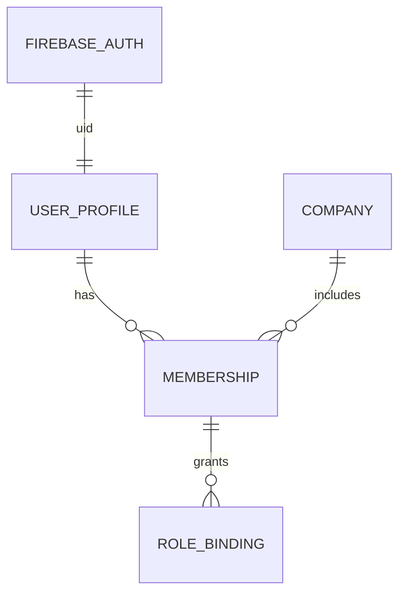

# NexoGo Platform — Company Implementation Plan

> **Diseño de implementación de la entidad Company (Empresa).**  
> Fecha: 2026-09-18  
> Objetivo: **toda la aplicación pertenece a una empresa**.  
> **No incluye código.**  
>  
> Alineado con: `MASTER_ARCHITECTURE.md` · `MULTITENANT_ARCHITECTURE.md` · `ROLE_SYSTEM.md` ·  
> `MODULE_DESIGN.md` · `MIGRATION_MASTER_PLAN.md` · `BUSINESS_PLATFORM_ARCHITECTURE.md`

---

## 0. Decisión de nomenclatura

En documentos previos el tenant se llama `organization` / `organizationId`.  

En este plan, el concepto de producto es **Company (Empresa)**:

| Concepto de producto | Campo / path técnico recomendado | Alias aceptado (docs previos) |
|----------------------|----------------------------------|-------------------------------|
| Company | `companyId` | `organizationId` / `orgId` |
| Colección raíz | `companies/{companyId}` | `organizations/{orgId}` |
| Claim sesión | `companyId` | `orgId` |

**Recomendación de arquitectura:** un solo término en código nuevo (`Company` / `companyId` / `companies`).  
Si el repo ya empezó con `organizations`, mantener un alias de migración (`organizationId == companyId`) hasta cutover; no mantener dos raíces eternas.

En este documento se usa **Company / companyId / companies**.

---

## 1. Análisis de la arquitectura actual

### 1.1 Hechos (as-is)

| Aspecto | Situación |
|---------|-----------|
| Tenant | **Inexistente** — datos globales de proyecto Firebase |
| Usuarios | Doc en `usuarios` (y a veces `users`) con rol embebido |
| Negocio | `citas`, pacientes locales, `clinical_records`, inventory/sales sin dueño empresa |
| Auth | Firebase Auth global; rol en Firestore, no claims de empresa |
| Storage | Paths sin prefijo de empresa |
| Escalabilidad SaaS | No hay aislamiento → no se puede vender multiempresa |

### 1.2 Problema de negocio

Hoy NexoGo es **una sola base compartida**. Dos clínicas reales no pueden coexistir sin verse.

El objetivo “toda la app pertenece a una empresa” implica:

1. Toda entidad de negocio lleva **dueño Company**.  
2. Toda sesión de usuario opera en una **Company activa**.  
3. Roles y permisos son **por Company** (membresía), no globales (salvo `SUPER_ADMIN`).  
4. Archivos viven bajo namespace de Company.  
5. Queries y Security Rules **niegan** cross-company.

### 1.3 Encaje con el plan de migración

Según `MIGRATION_MASTER_PLAN.md`, Company es el núcleo de la **Etapa M3**.  
No se implementa antes de Auth unificado (M1) y claims básicos (M2).

---

## 2. Principios de diseño

| # | Principio |
|---|-----------|
| 1 | **Company es el tenant root** — todo dato operativo cuelga de ella |
| 2 | **Auth uid ≠ membresía** — un humano puede pertenecer a N companies |
| 3 | **Una Company activa por sesión** — claim `companyId` |
| 4 | **Deny by default** — sin membership ACTIVE, sin datos |
| 5 | **Defensa en profundidad** — path + campo `companyId` denormalizado |
| 6 | **Escalabilidad por aislamiento** — no por tablas globales filtradas “con cuidado” |
| 7 | **Veterinaria es un pack**, no el modelo de Company |

---

## 3. Modelo Company

### 3.1 Entidad raíz

```
Company
├── id                          # companyId (ej. "cmp_01HXYZ…")
├── name                        # razón comercial / nombre visible
├── legalName?                  # razón social
├── taxId?                      # NIT / RFC / CIF
├── status                      # DRAFT | ACTIVE | SUSPENDED | DELETED
├── planId                      # free | pro | business | enterprise
├── industryPacks[]             # ["veterinary"] | ["clinic"] | …
├── primaryContactEmail?
├── phone?
├── address?
│     street, city, region, country, postalCode
├── branding
│     logoDocumentId? / logoStoragePath?
│     primaryColor?
│     locale                    # "es", "en"
│     timezone                  # "America/Bogota"
├── limits                      # cuotas SaaS (docs, users, AI requests)
│     maxUsers, maxStorageMb, maxAiRequestsMonth
├── flags
│     aiEnabled, documentsEnabled, crmEnabled
├── createdAt / updatedAt
├── createdBy                   # uid bootstrap ADMIN o SUPER_ADMIN
└── deletedAt?                  # soft delete
```

### 3.2 Settings de Company (doc separado)

Evita documentos Company enormes:

```
CompanySettings  (companies/{companyId}/settings/main)
├── companyId
├── businessHours[]             # horarios Agenda
├── paymentMethods[]
├── documentPolicies            # retención, MIME, maxUploadMb
├── aiPolicies                  # quotas, models, aiIndexable default
├── membershipPolicies          # auto-approve CLIENT? require ADMIN approve?
├── featureToggles{}
└── updatedAt / updatedBy
```

### 3.3 Índice de plataforma (listados SUPER_ADMIN)

```
CompanyIndex (company_index/{companyId})
├── companyId
├── name
├── status
├── planId
├── industryPacks[]
├── createdAt
└── ownerUserId?                # primer ADMIN
```

Datos mínimos para no forzar lecturas profundas del árbol tenant.

### 3.4 Estados de Company

| Status | Efecto |
|--------|--------|
| `DRAFT` | Provisioning; sin operación |
| `ACTIVE` | Normal |
| `SUSPENDED` | Login posible; acceso a datos denegado / mensaje de billing |
| `DELETED` | Soft; jobs de purge posteriores |

---

## 4. Firestore collections

### 4.1 Estrategia: Hierarchical Tenant Root

```
companies/{companyId}/…subcolecciones…
```

Todo documento de negocio bajo el árbol **y** con campo:

```
companyId: string   # denormalizado (= id del padre)
```

### 4.2 Árbol canónico

```
/ (root)
├── platform/
│   ├── config/main
│   ├── plans/{planId}
│   └── audit_logs/{logId}
│
├── users/{uid}                              # perfil global Auth
│   └── company_memberships/{companyId}      # espejo liviano (opcional)
│
├── company_index/{companyId}                # índice SUPER_ADMIN
│
└── companies/{companyId}                    # ========== TENANT ROOT ==========
    │  (campos Company en el doc raíz)
    │
    ├── settings/main
    │
    ├── memberships/{uid}                    # usuarios de ESTA empresa
    ├── roles/{roleId}                       # roles custom
    ├── role_permissions/{roleCode}          # permisos compilados
    │
    ├── clients/{clientId}
    ├── contacts/{contactId}
    ├── records/{recordId}
    ├── record_templates/{templateId}
    ├── appointments/{appointmentId}
    ├── services/{serviceId}
    ├── products/{productId}
    ├── stock_movements/{movementId}
    ├── categories/{categoryId}
    ├── sales/{saleId}
    ├── conversations/{conversationId}
    │     └── messages/{messageId}
    ├── documents/{documentId}
    │     └── versions/{versionId}
    ├── document_links/{linkId}
    ├── folders/{folderId}
    ├── tags/{tagId}
    ├── opportunities/{opportunityId}
    ├── crm_activities/{activityId}
    ├── pipeline_stages/{stageId}
    ├── dashboard_layouts/{uid}
    └── audit_logs/{logId}
```

### 4.3 Qué NO va en root (prohibido post-cutover)

| Legacy actual | Destino |
|---------------|---------|
| `usuarios` | `users` + `companies/.../memberships` |
| `citas` | `companies/.../appointments` |
| `patients` / DataStore | `companies/.../clients` |
| `clinical_records` | `companies/.../records` |
| `products` / `sales` sueltos | bajo `companies/{companyId}/` |

### 4.4 Invariantes Firestore

1. Ningún write de negocio sin `companyId` coincidente con el path.  
2. IDs de cliente/venta/etc. son **locales al tenant** (no asumir unicidad global).  
3. Queries de app: siempre bajo `companies/{activeCompanyId}/…`.  
4. Collection group solo para casos plataforma (memberships del uid) con rules estrictas.

---

## 5. Storage structure

### 5.1 Namespace obligatorio

```
companies/{companyId}/          # preferido product naming
# o alias técnico ya documentado:
orgs/{companyId}/               # equivalente; elegir UNO en implementación
```

**Decisión a fijar al implementar:** un solo prefijo. Recomendación de producto: `companies/{companyId}/`.

### 5.2 Árbol de objetos

```
companies/{companyId}/
  ├── branding/
  │     logo.png
  ├── clients/{clientId}/
  │     profile/
  │     gallery/
  ├── records/{recordId}/
  │     files/
  │     pdfs/
  ├── sales/{saleId}/
  │     documents/
  ├── employees/{uid}/
  │     files/
  ├── chat/{conversationId}/
  │     files/
  ├── products/{productId}/
  │     images/
  ├── documents/{documentId}/
  │     v{versionNumber}/{fileName}
  │     thumb.jpg
  └── ai/
        texts/{documentId}/v{n}.txt
```

### 5.3 Reglas de Storage

| Regla | Detalle |
|-------|---------|
| Prefijo | Path debe empezar por `companies/{claim.companyId}/` |
| Metadata | `companyId`, `uploadedBy` |
| Sin objetos huérfanos | Todo archivo relevante tiene doc en Firestore Documentos o branding settings |
| Cuotas | `Company.limits.maxStorageMb` enforced en Functions al firmar upload |

---

## 6. Relaciones con usuarios

### 6.1 Tres capas de identidad



| Capa | Dónde | Contenido |
|------|-------|-----------|
| **Identidad** | Firebase Auth | email/password, providers, uid |
| **Perfil global** | `users/{uid}` | displayName, photoURL, email, `platformRole?`, `defaultCompanyId?` |
| **Membresía** | `companies/{companyId}/memberships/{uid}` | roles, status, scopes en ESA empresa |

### 6.2 Modelo Membership

```
CompanyMembership
├── userId                      # = document id recomendado
├── companyId
├── roleCodes[]                 # ["ADMIN"] | ["MANAGER","receptionist"]
├── customRoleIds[]
├── status                      # INVITED | PENDING | ACTIVE | SUSPENDED | REVOKED
├── scopes
│     type                      # COMPANY | BRANCH | TEAM | ASSIGNED | OWN
│     branchIds[]
│     teamIds[]
│     linkedClientId?           # para rol CLIENT
├── isDefault                   # company por defecto al login
├── title?                      # "Recepcionista" display
├── invitedBy / approvedBy?
├── createdAt / updatedAt
└── lastAccessAt?
```

### 6.3 Espejo opcional en usuario

```
users/{uid}/company_memberships/{companyId}
├── companyId
├── companyName                 # denormalizado
├── status
├── roleCodes[]
└── isDefault
```

Sirve para listar “mis empresas” sin collection group. Escritura **solo** Admin SDK / Functions.

### 6.4 Flujos usuario ↔ Company

| Flujo | Pasos |
|-------|-------|
| **Bootstrap** | SUPER_ADMIN o signup business crea Company + membership ADMIN |
| **Invitación** | ADMIN invita email → membership INVITED/PENDING → usuario acepta → ACTIVE + claims |
| **Login** | Auth OK → cargar memberships → elegir default/activa → set claims `companyId` |
| **Switch Company** | Callable `setActiveCompany(companyId)` → valida membership → refresh token |
| **Salida** | REVOKED/SUSPENDED → no puede setear esa company como activa |
| **Cliente portal** | Membership CLIENT + `linkedClientId` |

### 6.5 Regla de sesión

```
Ninguna pantalla de negocio se renderiza sin:
  auth.uid != null
  && claim.companyId != null
  && membership(companyId, uid).status == ACTIVE
  && company.status == ACTIVE
```

Excepciones: onboarding “crear/unirse a empresa”, pantalla SUPER_ADMIN plataforma.

---

## 7. Roles por empresa

Alineado a `ROLE_SYSTEM.md` con nomenclatura Company.

### 7.1 Roles base (códigos inmutables)

| Rol | Ámbito | En Company |
|-----|--------|------------|
| `SUPER_ADMIN` | Plataforma | No es membership; opera cross-company con audit |
| `ADMIN` | Company | Dueño/configuración total de esa Company |
| `MANAGER` | Company | Operación amplia |
| `EMPLOYEE` | Company | Operación diaria |
| `CLIENT` | Company | Solo recursos OWN / shared |

### 7.2 Roles personalizados

Viven en:

```
companies/{companyId}/roles/{roleId}
companies/{companyId}/role_permissions/{roleCode}
```

- Únicos por `companyId + code`  
- No pueden incluir `platform.*`  
- Techo = permisos del ADMIN que los crea  
- Asignación vía `membership.roleCodes` / `customRoleIds`  
- Permisos efectivos = **unión OR** de todos los roles del membership

### 7.3 Claims Firebase (sesión Company)

```json
{
  "platformRole": null,
  "companyId": "cmp_abc",
  "roles": ["ADMIN"],
  "scope": "COMPANY",
  "branches": [],
  "linkedClientId": null,
  "flags": {
    "approved": true,
    "suspended": false
  },
  "permsVersion": 1
}
```

| Campo | Uso |
|-------|-----|
| `companyId` | Tenant activo — **obligatorio** para datos |
| `roles` | AuthZ rápida en rules/app |
| `flags` | Kill switch membership |
| `permsVersion` | Invalidar caché de permisos custom |

Claims los escribe **solo** Cloud Functions (nunca el cliente).

### 7.4 Permisos mínimos relacionados a Company

| Permiso | Descripción |
|---------|-------------|
| `company.profile.read` | Ver datos empresa |
| `company.profile.update` | Editar Company / branding |
| `company.members.manage` | Invitar/aprobar/roles |
| `company.roles.manage` | Custom roles |
| `company.billing.read` | Plan/límites |
| `platform.company.create` | SUPER_ADMIN / signup flow |
| `platform.company.suspend` | SUPER_ADMIN |

---

## 8. Escalabilidad SaaS

### 8.1 Dimensiones de escala

| Dimensión | Estrategia |
|-----------|------------|
| N companies | Aislamiento por path; sin hot collection global de negocio |
| N users / company | Memberships indexados por uid; paginación |
| N docs / company | Subcolecciones; índices compuestos locales |
| Storage | Prefijo por company; cuotas en `limits` |
| IA | Namespace embeddings = `companyId`; metering por company |
| Multi-región | Un proyecto Firebase v1; sharding futuro por `planId` enterprise |

### 8.2 Límites y planes

```
Company.limits
├── maxUsers
├── maxStorageMb
├── maxClients
├── maxAiRequestsMonth
└── maxCustomRoles
```

Enforcement:

- Soft: UI warning  
- Hard: Functions rechazan invite/upload/AI al exceder  

### 8.3 Patrones que escalan

| Hacer | Evitar |
|-------|--------|
| Leer solo `companies/{activeId}/…` | `collectionGroup("clients")` sin filtro company |
| Contadores denormalizados (`stats/main`) | Contar toda la subcolección en cliente |
| Jobs por company (purge, reindex) | Un job global que barre todo el proyecto |
| Índice `company_index` liviano | Meter KPIs pesados en doc Company raíz |
| Shard chat messages como subcolección | Un `messages` global |

### 8.4 Stats opcionales por Company

```
companies/{companyId}/stats/main
├── usersCount
├── clientsCount
├── storageBytes
├── salesMonthTotal
└── updatedAt
```

Actualizar con Functions onCreate/onDelete (eventual consistency OK).

### 8.5 Borrado / offboarding a escala

1. `status = DELETED`  
2. Invalidar memberships + claims  
3. Cola: borrar Storage prefix `companies/{id}/`  
4. Batched delete subárbol Firestore  
5. Quitar `company_index`  
6. Audit en `platform/audit_logs`  

### 8.6 Multi-company UX a escala

- Usuario con 1 company → auto-select.  
- Usuario con N → switcher; última usada en `users/{uid}.lastCompanyId`.  
- CLIENT normalmente 1 company; soportar N solo si hay caso (cadenas).

---

## 9. Seguridad (Company-centric)

### 9.1 Invariantes

1. `claim.companyId == path companyId` para todo acceso de negocio.  
2. Membership ACTIVE requerida.  
3. Company ACTIVE requerida (salvo SUPER_ADMIN soporte).  
4. CLIENT + `linkedClientId` para OWN.  
5. Storage solo bajo prefijo de claim.  
6. No writes de claims desde cliente.

### 9.2 Helpers conceptuales (rules)

```
isMemberOf(companyId) =
  auth != null
  && token.flags.approved
  && !token.flags.suspended
  && token.companyId == companyId

match /companies/{companyId}/{document=**} {
  allow read: if isMemberOf(companyId) && …roles…
}
```

### 9.3 Provisioning seguro

- Crear Company + membership ADMIN en **una transacción/Function**.  
- Nunca permitir que un usuario se auto-asigne ADMIN de company ajena.  
- Primer usuario del signup business nace como ADMIN de la company creada.

---

## 10. Impacto en la aplicación (contrato de implementación futura)

### 10.1 CompanyContext (sesión)

La app debe exponer un contexto global:

```
CompanyContext
├── companyId
├── companyName
├── roles[]
├── permissions effective / version
├── linkedClientId?
└── status
```

Todos los repositorios reciben `companyId` obligatorio (no opcionales “si viene”).

### 10.2 Cambios de flujo UX

| Pantalla | Cambio |
|----------|--------|
| Splash / post-login | Resolver company activa o mostrar selector |
| Home | KPIs de la company activa |
| Settings | Perfil Company (ADMIN) + miembros |
| Admin | Deja de ser “admin global vet”; es ADMIN de company |
| Nueva: Crear empresa / Unirse | Onboarding SaaS |

### 10.3 Módulos

Cada módulo de `MODULE_DESIGN.md` pasa a path:

```
companies/{companyId}/clients|records|appointments|…
```

Sin excepciones “temporales” en código nuevo.

---

## 11. Plan de implementación (sin código) — fases

### Fase C0 — Decisiones (0.5–1 sem)

| Entregable | Decisión |
|------------|----------|
| Path Firestore | `companies/{companyId}` |
| Path Storage | `companies/{companyId}/…` |
| Claim key | `companyId` |
| Alias legacy | mapa `organizationId` → `companyId` si aplica |
| ID format | `cmp_` + ULID/nanoid |

### Fase C1 — Modelo y provisioning (1–2 sem) — tras Auth M1

- Docs Company + Settings + Index  
- Function `createCompany`  
- Membership ADMIN bootstrap  
- Claims iniciales  

### Fase C2 — Session & gate (1–2 sem)

- `setActiveCompany`  
- CompanyContext en app  
- Bloqueo de NavGraph de negocio sin company  
- UI selector  

### Fase C3 — Members & roles (2–3 sem)

- Invite / approve / suspend  
- Roles base en membership  
- Custom roles MVP (opcional paralelo)  

### Fase C4 — Data cutover (oleadas, ver Migration Master)

- Mover cada dominio bajo `companies/{id}/`  
- Rules + Storage  
- Tests 2 companies  

### Fase C5 — Hardening SaaS

- Limits/plans  
- Suspend/delete jobs  
- Audit  
- Stats  

**No** iniciar C4 sin C1–C2.  
**No** iniciar IA hasta Company + Documentos bajo el mismo `companyId`.

---

## 12. Criterios de aceptación

1. No existe pantalla de negocio usable sin `companyId` activo.  
2. Dos companies en staging: A no lee clients/sales/chat/docs de B.  
3. Un mismo uid es ADMIN en A y EMPLOYEE en B con datos correctos tras switch.  
4. Storage rechaza paths de otra company.  
5. Membership SUSPENDED impide acceso aunque el token antiguo exista (refresh + flags).  
6. Crear Company crea membership ADMIN + settings + index en un solo flujo atómico.  
7. Roles efectivos son por company, no globales (excepto SUPER_ADMIN).  
8. `MASTER_ARCHITECTURE.md` se actualiza cuando el flujo vivo use Company.

---

## 13. Riesgos específicos de Company

| Riesgo | Mitigación |
|--------|------------|
| App sigue escribiendo colecciones root | Feature flags + CI grep paths prohibidos |
| Usuario sin company atrapado | Onboarding obligatorio post-login |
| Claim `companyId` null en rules | Deny all negocio |
| Doble raíz `organizations` + `companies` | Elegir una; alias temporal documentado |
| Primer ADMIN pierde acceso | Al menos 1 ADMIN ACTIVE policy |
| Enumerar companyIds | IDs no secuenciales; index no público |

---

## 14. Relación con otros documentos

| Documento | Relación |
|-----------|----------|
| `MULTITENANT_ARCHITECTURE.md` | Misma idea; este plan fija nombre **Company** e implementación |
| `ROLE_SYSTEM.md` | Roles/claims; sustituir orgId → companyId en implementación |
| `MODULE_DESIGN.md` | Módulos viven bajo Company |
| `MIGRATION_MASTER_PLAN.md` | Company = Etapa M3 |
| `DOCUMENT_MANAGEMENT.md` / `AI_MODULE.md` | Corpus e índices scoped por companyId |

---

## 15. Resumen ejecutivo

**Company** es el eje de NexoGo SaaS: raíz de Firestore (`companies/{companyId}`), prefijo de Storage, dueña de memberships y roles, y valor del claim de sesión.  

Sin Company no hay plataforma multiempresa.  
Con Company mal implementada (campo opcional, paths root, rol global) el SaaS es falso.  

Implementar en orden: **modelo + provisioning → sesión/gates → miembros/roles → migración de datos → límites/ops**.  
Código: aún no; este documento es el contrato de diseño.

---

*Fin de COMPANY_IMPLEMENTATION_PLAN.md — diseño de la entidad Company para NexoGo Platform.*
