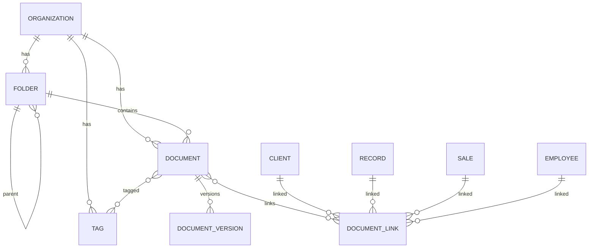
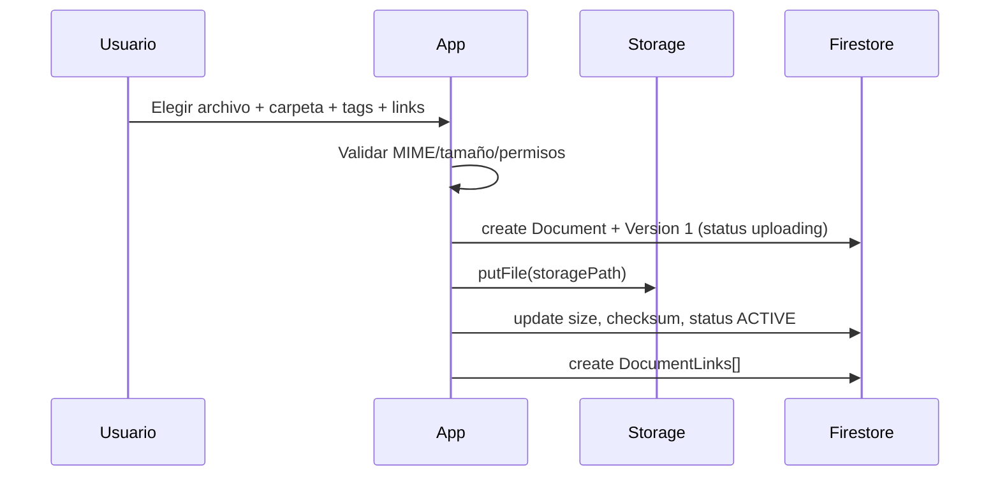

# NexoGo Platform — Document Management

> **Diseño funcional y de datos del módulo Documentos.**  
> Fecha: 2026-09-18  
> Complementa: `MODULE_DESIGN.md` · `MULTITENANT_ARCHITECTURE.md` · `ROLE_SYSTEM.md`  
> **Solo diseño; no modifica código.**

---

## 1. Visión

El módulo **Documentos** es el repositorio unificado de archivos de cada empresa (tenant).

Debe permitir:

| Capacidad | Descripción |
|-----------|-------------|
| **Tipos** | PDF, Word, Excel, imágenes |
| **Carpetas** | Árbol de organización por empresa / contexto |
| **Etiquetas** | Clasificación flexible multi-etiqueta |
| **Versiones** | Historial de revisiones con versión actual |
| **Vínculos** | Relación con Clientes, Expedientes, Ventas, Empleados |

Principios:

1. **Metadatos en Firestore · bytes en Storage** (aislado por `orgId`).  
2. Un documento puede vivir en una carpeta **y** vincularse a N entidades de negocio.  
3. El acceso combina permisos del módulo Documentos + alcance del recurso vinculado.  
4. No interpreta el contenido de negocio (no es el expediente ni la venta); solo almacena, versiona y relaciona.

---

## 2. Alcance del módulo

### 2.1 Incluye

- Subida manual (picker / cámara / drag-and-drop futuro web)
- Generación automática (PDF de expediente, comprobante de venta)
- Navegador de carpetas + búsqueda
- Tags, favoritos, archivo (soft-delete)
- Versionado y restauración
- Vínculos a entidades
- Previsualización según tipo (imagen/PDF; Office vía viewer externo o descarga)
- Cuotas y retención (policy de empresa)

### 2.2 No incluye

- Edición WYSIWYG de Word/Excel dentro de la app (v1: upload/download)
- OCR / indexación full-text del contenido (roadmap)
- Firma electrónica avanzada (roadmap; puede colgarse como metadata)
- Chat file blobs sin registro en Documentos (recomendación: todo archivo pasa por este módulo)

---

## 3. Tipos de archivo soportados

### 3.1 Familias y MIME

| Familia | Extensiones | MIME accept | Preview v1 |
|---------|-------------|-------------|------------|
| **PDF** | `.pdf` | `application/pdf` | Visor PDF nativo / Compose |
| **Word** | `.doc`, `.docx` | `application/msword`, `application/vnd.openxmlformats-officedocument.wordprocessingml.document` | Descarga / intent externo |
| **Excel** | `.xls`, `.xlsx`, `.csv` | `application/vnd.ms-excel`, `application/vnd.openxmlformats-officedocument.spreadsheetml.sheet`, `text/csv` | Descarga / intent externo |
| **Imágenes** | `.jpg`, `.jpeg`, `.png`, `.webp`, `.gif`, `.heic` | `image/*` | Galería / zoom |

### 3.2 Límites recomendados (configurables por empresa)

| Parámetro | Default sugerido |
|-----------|------------------|
| Tamaño máx. por archivo | 25 MB |
| Tamaño máx. imagen | 15 MB |
| Extensiones bloqueadas | ejecutables, `.js`, `.apk`, `.html` |
| Virus scan | Roadmap (Cloud Function + provider) |

### 3.3 Clasificación interna `fileFamily`

```
PDF | WORD | EXCEL | IMAGE | OTHER
```

Derivado del MIME al subir; usado para iconos, filtros y viewers.

---

## 4. Modelo de dominio

### 4.1 Entidades



### 4.2 Documento (cabeza / current)

Representa el **archivo lógico** (no cada bytes históricos).

```
Document
├── id
├── organizationId
├── name                    # nombre visible (sin path)
├── originalFileName
├── fileFamily              # PDF | WORD | EXCEL | IMAGE | OTHER
├── mimeType
├── size                    # bytes de la versión current
├── checksum                # sha256 current (opcional)
├── folderId                # null = raíz de empresa o raíz contextual
├── tagIds[]
├── status                  # ACTIVE | ARCHIVED | DELETED
├── visibility              # ORG_STAFF | CLIENT_SHARED | PRIVATE
├── currentVersionId
├── currentVersionNumber    # int denormalizado
├── storagePath             # path current en Storage
├── thumbnailPath?          # para imágenes / PDF primera página
├── source                  # UPLOAD | GENERATED | IMPORT | CHAT
├── generator?              # RECORD_PDF | SALE_RECEIPT | …
├── createdBy               # uid empleado o sistema
├── updatedBy
├── createdAt / updatedAt
└── searchTokens[]          # nombre normalizado para búsqueda simple
```

### 4.3 Versión

```
DocumentVersion
├── id
├── organizationId
├── documentId
├── versionNumber           # 1..N
├── storagePath
├── mimeType
├── size
├── checksum?
├── changeNote?             # "Corrección de montos"
├── createdBy
├── createdAt
├── isCurrent               # denormalizado / o solo currentVersionId en head
└── status                  # ACTIVE | SUPERSEDED | RESTORED_FROM
```

Reglas de versionado:

1. Upload inicial → versión `1` = current.  
2. Nueva subida sobre el mismo documento lógico → `versionNumber++`, actualiza head.  
3. La versión anterior permanece en Storage + registro.  
4. **Restaurar** versión K: crea nueva versión N+1 copiando bytes/metadata de K (no reescribe historia).  
5. Borrar versión intermedia: solo ADMIN; no borrar la current sin promover otra.

### 4.4 Carpeta

```
Folder
├── id
├── organizationId
├── parentId                # null = raíz
├── name
├── path                    # materializado "/Clientes/2026/" (opcional)
├── contextType?            # ORG | CLIENT | RECORD | SALE | EMPLOYEE | LIBRARY
├── contextId?              # id de entidad si carpeta anclada
├── createdBy
├── createdAt / updatedAt
└── status                  # ACTIVE | ARCHIVED
```

#### Tipos de carpeta

| contextType | Uso |
|-------------|-----|
| `ORG` / `LIBRARY` | Biblioteca general de la empresa |
| `CLIENT` | Carpeta anclada a un cliente (`contextId = clientId`) |
| `RECORD` | Anclada a expediente |
| `SALE` | Anclada a venta |
| `EMPLOYEE` | Anclada a empleado (HR / legajo) |

Las carpetas ancladas pueden crearse automáticamente al primer upload (“Auto-folder”).

Restricciones:

- No ciclos en `parentId`
- Mover documento = cambiar `folderId` (misma org)
- Borrar carpeta: vacía o mover hijos a padre / papelera

### 4.5 Etiqueta (Tag)

```
Tag
├── id
├── organizationId
├── name                    # "Contrato", "Radiografía", "Factura"
├── color?                  # hex UI
├── category?               # LEGAL | CLINICAL | FINANCE | HR | GENERAL
├── createdBy
└── createdAt
```

- N:N con documentos vía `tagIds[]` en Document (simple) o subcolección `document_tags` si se necesita query inversa pesada.
- Tags son **por empresa**, no globales de plataforma.

### 4.6 Vínculo (DocumentLink)

Permite relacionar un documento con **una o varias** entidades sin duplicar bytes.

```
DocumentLink
├── id
├── organizationId
├── documentId
├── entityType              # CLIENT | RECORD | SALE | EMPLOYEE
├── entityId
├── relation                # PRIMARY | ATTACHMENT | EVIDENCE | CONTRACT | IDENTITY | OTHER
├── createdBy
└── createdAt
```

| entityType | Módulo | Ejemplos |
|------------|--------|----------|
| `CLIENT` | Clientes | INE, consentimiento, foto |
| `RECORD` | Expedientes | Adjunto clínico, PDF exportado |
| `SALE` | Ventas | Comprobante, OC, XML |
| `EMPLOYEE` | IAM / RR.HH. ligero | Contrato laboral, ID, certificados |

Un mismo PDF de consentimiento puede vincularse a **Cliente + Expediente**.

`relation = PRIMARY` como máximo uno por `(entityType, entityId)` para “documento principal” (opcional, enforceable en app).

---

## 5. Empleados como entidad vinculable

En el modelo multi-tenant, el empleado es la **membresía** / perfil en empresa:

```
entityType = EMPLOYEE
entityId   = userId (uid)  // membership organizations/{orgId}/memberships/{uid}
```

Casos de uso:

- Legajo digital del staff  
- Firmas / licencias profesionales  
- Documentos solo visibles a ADMIN / HR custom role  

No confundir con `CLIENT`: el portal del cliente usa `entityType = CLIENT`.

---

## 6. Firestore (bajo tenant)

Alineado a `MULTITENANT_ARCHITECTURE.md`:

```
organizations/{orgId}/
  documents/{documentId}
    versions/{versionId}
  document_links/{linkId}
  folders/{folderId}
  tags/{tagId}
```

### 6.1 Índices compuestos sugeridos

| Query | Campos |
|-------|--------|
| Listar por carpeta | `folderId` + `status` + `updatedAt` |
| Por tag | `tagIds` (array-contains) + `status` + `updatedAt` |
| Por familia | `fileFamily` + `status` + `updatedAt` |
| Búsqueda nombre | `searchTokens` array-contains / prefijo |
| Links por entidad | `entityType` + `entityId` + `createdAt` |
| Links por documento | `documentId` + `createdAt` |

### 6.2 Documento ejemplo

```json
{
  "id": "doc_01",
  "organizationId": "org_abc",
  "name": "Consentimiento informado",
  "originalFileName": "consentimiento.pdf",
  "fileFamily": "PDF",
  "mimeType": "application/pdf",
  "size": 245001,
  "folderId": "fld_client_42_root",
  "tagIds": ["tag_legal", "tag_consent"],
  "status": "ACTIVE",
  "visibility": "ORG_STAFF",
  "currentVersionId": "ver_03",
  "currentVersionNumber": 3,
  "storagePath": "orgs/org_abc/documents/doc_01/v3/consentimiento.pdf",
  "source": "UPLOAD",
  "createdBy": "uid_emp_1",
  "updatedAt": "2026-09-18T12:00:00Z",
  "searchTokens": ["consentimiento", "informado"]
}
```

### 6.3 Link ejemplo

```json
{
  "id": "lnk_01",
  "organizationId": "org_abc",
  "documentId": "doc_01",
  "entityType": "CLIENT",
  "entityId": "cli_42",
  "relation": "CONTRACT",
  "createdBy": "uid_emp_1",
  "createdAt": "2026-09-18T12:00:00Z"
}
```

---

## 7. Storage

### 7.1 Paths canónicos

```
orgs/{orgId}/documents/{documentId}/v{versionNumber}/{fileName}
orgs/{orgId}/documents/{documentId}/thumb.jpg
```

Aliases opcionales (espejo o upload directo contextual):

```
orgs/{orgId}/clients/{clientId}/files/...
orgs/{orgId}/records/{recordId}/files/...
orgs/{orgId}/sales/{saleId}/files/...
orgs/{orgId}/employees/{userId}/files/...
```

**Fuente de verdad:** siempre el registro en `documents` + `versions`. Los aliases, si existen, deben registrarse igual.

### 7.2 Naming de versiones

```
.../documents/doc_01/v1/archivo.pdf
.../documents/doc_01/v2/archivo.pdf
.../documents/doc_01/v3/archivo.pdf   ← current
```

### 7.3 Thumbnails

- Imágenes: Cloud Function resize → `thumb.jpg`  
- PDF: primera página (roadmap)  
- Office: icono por `fileFamily` en UI (sin thumb real en v1)

---

## 8. Flujos principales

### 8.1 Subida manual



### 8.2 Nueva versión

1. Usuario abre documento → “Subir nueva versión”.  
2. Se crea `DocumentVersion` N+1.  
3. Upload a `.../v{N+1}/`.  
4. Head apunta a N+1; versión N queda `SUPERSEDED`.

### 8.3 Generación automática (PDF)

| Origen | generator | Links típicos |
|--------|-----------|---------------|
| Expediente finalizado | `RECORD_PDF` | RECORD + CLIENT |
| Comprobante de venta | `SALE_RECEIPT` | SALE + CLIENT |
| Export legajo empleado | `EMPLOYEE_PACK` | EMPLOYEE |

Pipeline:

1. Módulo origen llama `Documents.generate(spec)`.  
2. Function genera PDF (branding de `org_settings`).  
3. Guarda bytes + Document + Version + Links.  
4. Devuelve `documentId` al caller.

### 8.4 Mover / etiquetar / vincular

- Mover: update `folderId`  
- Tags: update `tagIds`  
- Vincular: create `document_links` (idempotente por documentId+entityType+entityId)  
- Desvincular: delete link (no borra archivo)

### 8.5 Papelera

- `status = ARCHIVED` → oculto de listados default  
- `DELETED` + job que borra Storage tras retención (ej. 30 días)

---

## 9. Relaciones con otros módulos

### 9.1 Clientes

| Acción UI | Comportamiento |
|-----------|----------------|
| Pestaña Documentos del cliente | Query links `CLIENT` + `entityId` |
| Subir desde ficha | Auto-link CLIENT + carpeta anclada |
| Vista 360° | Últimos N documentos |

### 9.2 Expedientes

| Acción | Comportamiento |
|--------|----------------|
| Adjuntos del expediente | Links RECORD |
| “Exportar PDF” | Documento GENERATED + link RECORD (+ CLIENT) |
| Finalizar expediente | Opcional: freeze — no nuevas versiones sin permiso |

### 9.3 Ventas

| Acción | Comportamiento |
|--------|----------------|
| Comprobante | GENERATED SALE_RECEIPT |
| OC / facturas proveedor | UPLOAD + link SALE |
| Anulación | Nueva versión o doc “credit note” vinculado |

### 9.4 Empleados

| Acción | Comportamiento |
|--------|----------------|
| Legajo | Carpeta EMPLOYEE + links |
| Solo ADMIN / rol HR | `visibility = PRIVATE` + permiso `documents.employee.manage` |

### 9.5 Chat / Agenda (soft)

Archivos de chat deberían crear Document + link opcional a CLIENT y metadata `source = CHAT`, para no tener blobs huérfanos.

---

## 10. Permisos

Alineado a `ROLE_SYSTEM.md` (roles base).

### 10.1 Permisos del módulo

| Permiso | Descripción |
|---------|-------------|
| `documents.file.read` | Listar/descargar (según scope) |
| `documents.file.upload` | Subir / nueva versión |
| `documents.file.delete` | Archivar / eliminar |
| `documents.file.read_own` | Cliente: solo docs compartidos / propios |
| `documents.folder.manage` | Crear/mover/borrar carpetas |
| `documents.tag.manage` | CRUD tags |
| `documents.link.manage` | Crear/quitar vínculos |
| `documents.version.restore` | Restaurar versión |
| `documents.employee.manage` | Ver/gestionar legajos EMPLOYEE |
| `documents.generate` | Disparar generadores PDF |

### 10.2 Matriz por rol base

| Capacidad | SUPER_ADMIN | ADMIN | MANAGER | EMPLOYEE | CLIENT |
|-----------|:-----------:|:-----:|:-------:|:--------:|:------:|
| Biblioteca org | ✓* | ✓ | ✓ | R/U upload | — |
| Upload / versión | ✓* | ✓ | ✓ | ✓ | † shared |
| Carpetas / tags | ✓* | ✓ | ✓ | limitado | — |
| Links CLIENT/RECORD/SALE | ✓* | ✓ | ✓ | ✓ | — |
| Links EMPLOYEE | ✓* | ✓ | † HR | — | — |
| Restaurar versión | ✓* | ✓ | ✓ | — | — |
| Delete permanente | ✓* | ✓ | † | — | — |
| Ver docs CLIENT_SHARED propios | — | ✓ | ✓ | ✓ | ✓ |

\* en tenant activo / soporte · † policy o custom role

### 10.3 Herencia desde entidad vinculada

Además del permiso Documentos:

```
canRead(doc) =
  has(documents.file.read)
  && inOrg(doc)
  && (
       doc.visibility == ORG_STAFF && isStaff
       || doc.visibility == CLIENT_SHARED && (isStaff || isOwnerClient)
       || doc.visibility == PRIVATE && (isAdmin || isCreator || documents.employee.manage)
       || hasLinkAccess(doc)  // puede leer la entidad vinculada
     )
```

Ejemplo: si el EMPLOYEE no tiene biblioteca general pero sí `records.record.read` sobre el expediente X, puede leer documentos linkeados a X con `visibility` adecuada.

---

## 11. UI funcional (pantallas)

| Pantalla | Función |
|----------|---------|
| **Biblioteca** | Árbol de carpetas + grid/lista, filtros familia/tag |
| **Detalle documento** | Preview, metadata, versiones, links, tags |
| **Subir** | Wizard: archivo → carpeta → tags → vínculos |
| **Nueva versión** | Desde detalle |
| **Gestor tags** | CRUD colores |
| **Papelera** | ARCHIVED / DELETED |
| **Widgets embebidos** | Lista docs en ficha Cliente / Expediente / Venta / Empleado |

---

## 12. Seguridad (resumen tenant)

| Capa | Regla |
|------|-------|
| Path Storage | Solo `orgs/{claim.orgId}/documents/...` |
| Firestore | Bajo `organizations/{orgId}/documents/**` |
| CLIENT | Solo `visibility = CLIENT_SHARED` + link a su `linkedClientId` |
| EMPLOYEE docs | `documents.employee.manage` o ADMIN |
| Generados | `createdBy = system` + audit |

Validaciones al crear link:

- `entityId` existe en la misma org  
- Usuario tiene permiso de escritura sobre esa entidad  
- No links cross-tenant

---

## 13. Configuración de empresa

En `org_settings` / sección Documents:

```json
{
  "documents": {
    "maxUploadMb": 25,
    "allowedFamilies": ["PDF", "WORD", "EXCEL", "IMAGE"],
    "retentionDaysDeleted": 30,
    "autoFolders": {
      "client": true,
      "record": true,
      "sale": true,
      "employee": true
    },
    "clientPortalSharingDefault": false,
    "requireChangeNoteOnNewVersion": false
  }
}
```

---

## 14. Eventos de dominio

| Evento | Uso |
|--------|-----|
| `DocumentUploaded` | Audit, thumbnails |
| `DocumentVersionAdded` | Notificar watchers |
| `DocumentLinked` | Actualizar UI 360° |
| `DocumentArchived` | Papelera |
| `DocumentGenerated` | Abrir preview post-venta/expediente |
| `DocumentRestored` | Audit |

---

## 15. Roadmap

| Fase | Entrega |
|------|---------|
| **v1** | Upload PDF/Word/Excel/Imagen, carpetas, tags, versiones, links a 4 entidades, preview imagen/PDF |
| **v2** | Thumbnails PDF, cuotas, papelera con retención, sharing fino al portal CLIENT |
| **v3** | OCR / búsqueda en contenido, preview Office, e-sign, antivirus |

---

## 16. Criterios de aceptación

1. Se pueden subir PDF, Word, Excel e imágenes dentro de los MIME permitidos.  
2. Existen carpetas anidadas y carpetas ancladas a entidad.  
3. Un documento admite N tags y N links (Cliente, Expediente, Venta, Empleado).  
4. Nueva subida crea versión; se puede restaurar sin borrar historial.  
5. Bytes solo bajo `orgs/{orgId}/…` y metadatos bajo `organizations/{orgId}/documents`.  
6. CLIENT no ve documentos PRIVATE ni de otros clientes.  
7. PDF generado desde Expediente/Venta aparece en Documentos con links correctos.  
8. Empleados tienen legajo separable con permiso dedicado.

---

## 17. Relación con otros documentos

| Documento | Relación |
|-----------|----------|
| `MODULE_DESIGN.md` | Documentos como módulo #7 (se detalla aquí) |
| `MULTITENANT_ARCHITECTURE.md` | Paths Storage/Firestore por empresa |
| `ROLE_SYSTEM.md` | Permisos `documents.*` |
| `BUSINESS_PLATFORM_ARCHITECTURE.md` | Expedientes/Clientes/Ventas como productores de archivos |

---

*Fin de DOCUMENT_MANAGEMENT.md — diseño del módulo Documentos de NexoGo Platform.*
