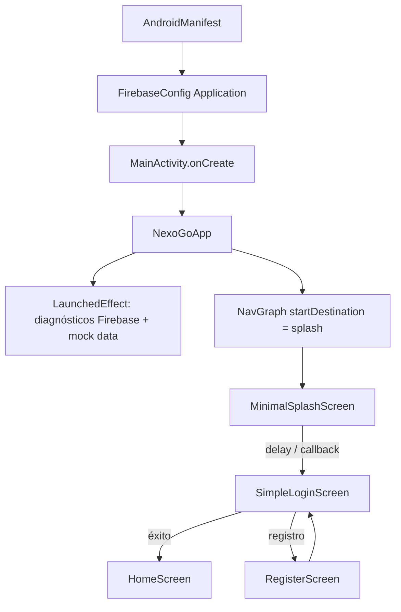
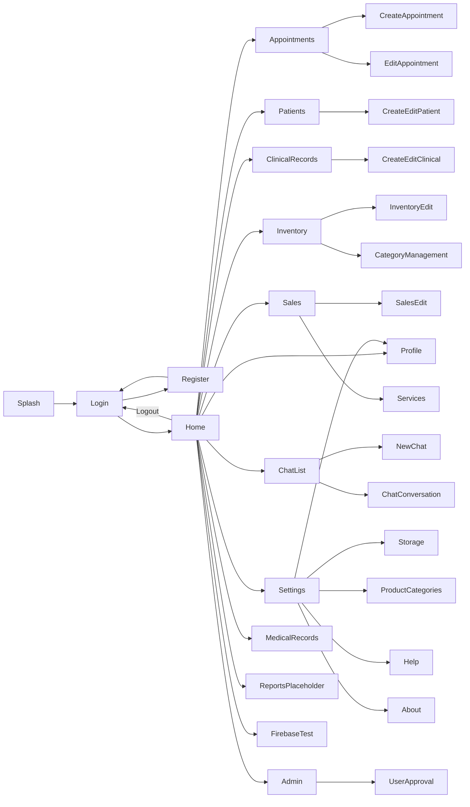

# NexoGo — Master Architecture

> **Documento de referencia oficial del estado actual del proyecto.**  
> Fecha de captura: 2026-09-18  
> Package: `com.example.nexogo`  
> Tipo: Android (Kotlin + Jetpack Compose) · Backend: Firebase  
> **No describe el estado ideal; describe lo que el código hace hoy.**

---

## 1. Resumen ejecutivo

NexoGo es una app de gestión veterinaria con:

| Capa | Tecnología |
|------|------------|
| UI | Jetpack Compose + Material 3 |
| Arquitectura pretendida | MVVM + Repository |
| Navegación | Jetpack Navigation Compose (`NavGraph` + `Screen`) |
| Backend | Firebase Auth, Firestore, Storage, Messaging, Analytics |
| DI | **Hilt deshabilitado** (instanciación manual / singletons `getInstance()`) |
| Persistencia local | DataStore (`AppDataStore`) en algunos flujos (p. ej. pacientes) |

**Punto de entrada real**

```
Application: FirebaseConfig (AndroidManifest)
Activity:    MainActivity → NexoGoApp()
Nav start:   Screen.Splash → MinimalSplashScreen
Login:       Screen.Login  → SimpleLoginScreen
Hub:         Screen.Home   → HomeScreen
```

---

## 2. Flujo actual activo

### 2.1 Arranque



**Detalles de arranque (`MainActivity` / `NexoGoApp`):**

1. Handler global de excepciones → `core.firebase.FirebaseErrorHandler`
2. En `LaunchedEffect`:
   - `SafeFirestoreOperations.safeSet("test", "connection", …)`
   - `FirebaseDiagnostics.runFullDiagnostics`
   - `FirestorePermissionTester`
   - `AppointmentDiagnostics` / `AppointmentDebugger` (pueden crear citas de prueba)
   - Si permisos OK → `MockDataGenerator` vía `core.FirebaseRepository`
3. Navegación con `startDestination = Screen.Splash.route` (sobrescribe el default `Login` de `NavGraph`)

> Nota: el splash **no** restaura sesión Firebase automáticamente; siempre navega a login.

### 2.2 Autenticación (camino vivo)

| Paso | Componente | Datos |
|------|------------|-------|
| Login | `SimpleLoginScreen` | `FirebaseAuth` + `FirebaseAuthRepository` + colección Firestore `usuarios` |
| Sesión en memoria | `PersistentAuthViewModel.getInstance(context)` | Se actualiza tras login exitoso |
| Registro | `RegisterScreen` | `FirebaseAuthRepository.registerUser(...)` |
| Aprobaciones | `UserApprovalScreen` (vía Admin) | `getPendingUsers` / `approveUser` / `rejectUser` |

**No está en el flujo principal de navegación:** Google Sign-In (`GoogleSignInScreen` + `FirebaseAuthManager` con placeholder `YOUR_WEB_CLIENT_ID`).  
`google-services.json` tiene `oauth_client: []`.

### 2.3 Post-login (hub)

`HomeScreen` es el hub activo. Expone navegación por rol hacia:

- Perfil, Citas, Pacientes, Historial clínico, Inventario, Expedientes médicos, Chat, Ventas, Reportes, Ajustes, Admin, Firebase Test, Logout

Logout → `Screen.Login` (limpia back stack de Home).

### 2.4 Flujos de dominio activos desde Home

| Dominio | Ruta Nav | Pantalla activa | Persistencia real |
|---------|----------|-----------------|-------------------|
| Citas | `appointments` | `BeautifulAppointmentsScreen` | Firestore `citas` vía `repository.FirebaseRepository` |
| Crear cita | `create_appointment` | `CreateAppointmentScreen` | `FirebaseAppointmentViewModel` |
| Editar cita | `edit_appointment/{id}` | `BeautifulEditAppointmentScreen` | `AppointmentViewModelImproved` |
| Pacientes | `patients` | `PatientsScreen` | **DataStore local** (`PatientViewModel` / `AppDataStore`), no Firestore |
| Historial (Home → ClinicalRecords) | `clinical_records` | `ClinicalHistoryScreen` | Módulo history + `ClinicalHistoryViewModel` |
| Historial lista (Dashboard path) | `history_list` | `SimpleHistoryListScreen` | `core.FirebaseRepository` → `clinical_records` |
| Inventario | `inventory` | `InventoryMainScreen` | `InventoryRepository` + `core.FirebaseRepository` |
| Ventas lista | `sales` | `SalesMainScreen` | **UI stub** (lista vacía local; sin ViewModel) |
| Ventas crear/editar | `create_edit_sale` | `SalesEditScreen` | `SalesRepository` + Firebase |
| Chat lista | `chat_list` | `modules.chat.ChatListScreen` | `modules.chat.ChatViewModel` + `users` |
| Ajustes | `settings` | `SimpleSettingsScreen` | Sin ViewModel dedicado |
| Admin | `admin` | `AdminScreen` | `PersistentAuthViewModel` |

---

## 3. Pantallas activas

### 3.1 Definición de “activa”

**Activa en flujo principal:** registrada en `NavGraph` **y** alcanzable desde Splash → Login → Home (o desde rutas hijas de ese hub), con implementación real (no solo `Text("Pantalla en desarrollo")`).

### 3.2 Pantallas del flujo principal

| Ruta (`Screen`) | Composable usado en NavGraph | Archivo |
|-----------------|------------------------------|---------|
| `splash` | `MinimalSplashScreen` | `ui/screens/auth/MinimalSplashScreen.kt` |
| `login` | `SimpleLoginScreen` | `ui/screens/auth/SimpleLoginScreen.kt` |
| `register` | `RegisterScreen` | `ui/screens/auth/RegisterScreen.kt` |
| `home` | `HomeScreen` | `ui/screens/home/HomeScreen.kt` |
| `profile` | `ProfileScreen` | `ui/screens/profile/ProfileScreen.kt` |
| `appointments` | `BeautifulAppointmentsScreen` | `ui/screens/appointments/BeautifulAppointmentsScreen.kt` |
| `create_appointment` | `CreateAppointmentScreen` | `ui/screens/appointments/CreateAppointmentScreen.kt` |
| `edit_appointment/{id}` | `BeautifulEditAppointmentScreen` | `ui/screens/appointments/BeautifulEditAppointmentScreen.kt` |
| `patients` | `PatientsScreen` | `ui/screens/patients/PatientsScreen.kt` |
| `create_edit_patient` (+ `/{id}`) | `CreateEditPatientScreen` | `ui/screens/patients/CreateEditPatientScreen.kt` |
| `clinical_records` | `ClinicalHistoryScreen` | `modules/history/ClinicalHistoryScreen.kt` |
| `create_edit_clinical_record` | `CreateEditClinicalRecordScreen` | `ui/screens/clinical/CreateEditClinicalRecordScreen.kt` |
| `view_clinical_record/{id}` | `ViewClinicalRecordScreen` | `ui/screens/clinical/ViewClinicalRecordScreen.kt` |
| `history_list` | `SimpleHistoryListScreen` | `modules/history/ui/SimpleHistoryListScreen.kt` |
| `history_detail/{id}` | `HistoryDetailScreen` | `modules/history/ui/HistoryDetailScreen.kt` |
| `history_edit?recordId=` | `SimpleHistoryEditScreen` | `modules/history/ui/SimpleHistoryEditScreen.kt` |
| `history_pdf_preview/{id}` | `HistoryPdfPreview` | `modules/history/ui/HistoryPdfPreview.kt` |
| `inventory` | `InventoryMainScreen` | `modules/inventory/ui/InventoryMainScreen.kt` |
| `create_edit_product` | `InventoryEditScreen` | `modules/inventory/ui/InventoryEditScreen.kt` |
| `category_management` | `CategoryManagementScreen` | `modules/config/ui/CategoryManagementScreen.kt` |
| `sales` | `SalesMainScreen` | `modules/sales/ui/SalesMainScreen.kt` |
| `create_edit_sale` | `SalesEditScreen` | `modules/sales/ui/SalesEditScreen.kt` |
| `services_management` | `ServicesManagementScreen` | `modules/sales/ui/ServicesManagementScreen.kt` |
| `medical_records` | `MedicalRecordsScreen` | `ui/screens/medical/MedicalRecordsScreen.kt` |
| `chat_list` | `modules.chat.ChatListScreen` | `modules/chat/ChatListScreen.kt` |
| `new_chat` / `chat_conversation/{id}` | `modules.chat.ChatScreen` (alias `NewChatScreen`) | `modules/chat/ChatScreen.kt` |
| `chatbot_config` | `ChatbotConfigScreen` | `ui/screens/chat/ChatbotConfigScreen.kt` |
| `settings` | `SimpleSettingsScreen` | `ui/screens/settings/SimpleSettingsScreen.kt` |
| `storage_management` | `StorageManagementScreen` | `ui/screens/settings/StorageManagementScreen.kt` |
| `product_categories` | `ProductCategoriesScreen` | `ui/screens/settings/ProductCategoriesScreen.kt` |
| `help` | `HelpScreen` | `ui/screens/settings/HelpScreen.kt` |
| `about` | `AboutScreen` | `ui/screens/settings/AboutScreen.kt` |
| `admin` | `AdminScreen` | `ui/screens/admin/AdminScreen.kt` |
| `user_approval` | `UserApprovalScreen` | `ui/screens/admin/UserApprovalScreen.kt` |
| `firebase_test` | `FirebaseTestScreen` | raíz del package |

### 3.3 Rutas registradas pero alternativas / no principales

Alcanzables solo si se navega explícitamente a su route (no desde Splash por defecto):

| Ruta | Pantalla | Notas |
|------|----------|-------|
| `modern_login` | `ModernLoginScreen` | Alternativa de login |
| `ultra_simple_login` | `UltraSimpleLoginScreen` | Alternativa de login |
| `minimal_login` | `MinimalLoginScreen` | Alternativa de login |
| `dashboard` | `MinimalDashboardScreen` | Hub alternativo (no es post-login del flujo Splash) |

### 3.4 Rutas placeholder (“en desarrollo”)

`reports`, `reports_main`, `sales_reports`, `appointments_reports`, `patients_reports`, `inventory_reports`, `clinical_reports` → muestran `Text("Pantalla en desarrollo")`.

### 3.5 Pantallas existentes en disco pero no usadas por el flujo NavGraph principal

Ejemplos (legado / variantes):

- Auth: `LoginScreen`, `GoogleSignInScreen`, `SplashScreen`, `UltraSimpleSplashScreen`, …
- Citas: `AppointmentsScreen`, `SimpleAppointmentsScreen`, `SafeAppointmentsScreen`, `MinimalAppointmentsScreen`, `TestAppointmentsScreen`, `AppointmentsScreenImproved`, …
- Settings: `SettingsScreen` (Nav usa `SimpleSettingsScreen`)
- Modules: `modules/auth/*Screen`, `modules/dashboard/DashboardScreen`, `modules/sales/SalesScreen`, `modules/patients/PatientScreen`, `modules/profile/ProfileScreen`, etc.
- Chat UI legacy: `ui/screens/chat/ChatListScreen`, `ChatConversationScreen`, …

---

## 4. ViewModels activos

### 4.1 Usados por pantallas del flujo principal

| ViewModel | Package | Usado por | Instanciación |
|-----------|---------|-----------|---------------|
| `PersistentAuthViewModel` | `viewmodel` | `SimpleLoginScreen`, `HomeScreen`, `AdminScreen` | Singleton `getInstance(context)` |
| `AuthViewModel` | `viewmodel` | `CreateAppointmentScreen`, `MedicalRecordsScreen`, chat UI legacy paths | Singleton `getInstance()` |
| `ProfileViewModel` | `viewmodel` | `ui/.../ProfileScreen` | `viewModel()` Compose |
| `AppointmentViewModelImproved` | `modules.appointments` | Beautiful list/edit | `remember { ... }` |
| `FirebaseAppointmentViewModel` | `viewmodel` | `CreateAppointmentScreen` | Constructor directo |
| `PatientViewModel` | `viewmodel` | Patients + Create/Edit + CreateAppointment + Clinical | Singleton `getInstance(context)` · **DataStore** |
| `ClinicalRecordViewModel` | `viewmodel` | Create/Edit/View clinical | Singleton `getInstance(context)` |
| `ClinicalHistoryViewModel` | `modules.history` | `ClinicalHistoryScreen` | `viewModel()` |
| `HistoryViewModel` | `modules.history.viewmodel` | Detail + PDF (creado en NavGraph) | Manual + `HistoryRepository` |
| `InventoryViewModel` | `modules.inventory.viewmodel` | Inventory main/edit | Manual + `InventoryRepository` |
| `SalesViewModel` | `modules.sales.viewmodel` | Sales edit + Services | Manual + `SalesRepository` |
| `ChatViewModel` | `modules.chat` | `modules.chat.ChatListScreen` / `ChatScreen` | `viewModel()` |
| `ProductCategoryViewModel` | `viewmodel` | `ProductCategoriesScreen` | Singleton `getInstance(context)` |

### 4.2 ViewModels presentes pero no en el camino Splash→Home primario

Incluyen (no exhaustivo de cada caller legacy):

- `viewmodel.AuthViewModel` vs `modules.auth.AuthViewModel` (duplicado)
- `SafeFirebaseAppointmentViewModel`, `Firebase*ViewModel` varios
- `modules.appointments.AppointmentViewModel`
- `modules.dashboard.DashboardViewModel`
- `modules.config.ConfigViewModel`
- `modules.patients.PatientViewModel` / `modules.profile.ProfileViewModel` / `modules.sales.SalesViewModel` (raíz módulo)
- `modules.inventory.InventoryViewModel` (fuera de `viewmodel/`)
- `viewmodel.ChatViewModel`, `SettingsViewModel`, `FirebaseSettingsViewModel`

---

## 5. Repositorios activos

### 5.1 En el camino vivo

| Repositorio | Package | Rol actual |
|-------------|---------|------------|
| `FirebaseAuthRepository` | `repository` | Login/registro/aprobaciones; colección **`usuarios`** (campos ES: `correo`, `rol`, …) |
| `FirebaseRepository` (**core**) | `core` | Facade genérica Auth/Firestore/Storage; usada por inventory, sales, history simple, MainActivity mock, CategoryManagement |
| `FirebaseRepository` (**repository**) | `repository` | CRUD tipado; citas en **`citas`**, patients/products/sales/messages; usado por `AppointmentViewModelImproved` |
| `InventoryRepository` | `modules.inventory.data` | Inventario sobre `core.FirebaseRepository` |
| `SalesRepository` | `modules.sales.data` | Ventas/servicios sobre `core.FirebaseRepository` |
| `HistoryRepository` | `modules.history.repo` | Historial clínico (Detail/PDF) |
| `PetRepository` | `modules.history.repo` | Mascotas del módulo history |
| `AppDataStore` | `data` | Persistencia local (pacientes vía `PatientViewModel`) |

### 5.2 Repositorios existentes con uso parcial / legacy / Hilt zombie

| Repositorio | Notas |
|-------------|-------|
| `repository.AuthRepository` + `AuthRepositoryImpl` | Interface + `@Inject`; Hilt off |
| `modules.auth.AuthRepository` | Alternativa de auth |
| `repository.UserRepository` | `@Inject`; Hilt off |
| `repository.ChatRepository` / `modules.chat.ChatRepository` | Duplicados |
| `repository.PatientRepository` / `ProductRepository` / `LocalDataRepository` | Legacy |
| `repository.FirebaseFirestoreRepository` / `core.repository.firebase.*` | Capas paralelas |
| `repository.FirebaseStorageRepository` / varios `*StorageManager*` | Capas paralelas |
| `repository.FirebaseMessagingRepository` | Messaging |
| `core.repository.firebase.FileUploadRepository` | Uploads |

---

## 6. Dependencias

Fuente de verdad: `gradle/libs.versions.toml` + `app/build.gradle.kts`.

### 6.1 Build / plugins

| Plugin / tool | Versión |
|---------------|---------|
| Android Gradle Plugin | 8.13.0 |
| Kotlin | 2.0.21 |
| Compose compiler plugin | vía `kotlin.compose` |
| Google Services | 4.4.2 |
| compileSdk / targetSdk | 36 |
| minSdk | 26 |
| JVM | 17 |

### 6.2 Runtime (habilitadas en `app/build.gradle.kts`)

| Área | Artefactos |
|------|------------|
| AndroidX core | `core-ktx`, `lifecycle-runtime-ktx`, `activity-compose`, `activity-ktx` |
| Compose | BOM `2024.09.00` · ui, graphics, tooling-preview, material3, material-icons-extended |
| Navigation | `navigation-compose` 2.8.2 |
| ViewModel Compose | `lifecycle-viewmodel-compose` |
| Firebase | BOM `33.4.0` · analytics, auth, firestore, storage, messaging |
| Google Sign-In | `play-services-auth:21.2.0` |
| Material (Views) | `material:1.9.0` |
| Coroutines | `kotlinx-coroutines-android` 1.8.1 |
| Imágenes | Coil Compose 2.7.0 |
| Permisos | Accompanist permissions 0.32.0 |
| PDF | iText 7.2.5 |
| Cámara | CameraX 1.4.0 (core, camera2, lifecycle, view) |
| WorkManager | 2.9.1 |
| DataStore | preferences 1.0.0 |
| JSON | Gson 2.10.1 |
| Tests | JUnit, Espresso, Compose UI test |

### 6.3 Declaradas pero deshabilitadas

- **Hilt** (`hilt-android`, `hilt-navigation-compose`, `hilt-work`, KSP compiler) — comentadas en `app/build.gradle.kts`
- Anotaciones `@Inject` / `@Singleton` siguen en algunos repos → código zombie respecto al build actual

### 6.4 Version catalog vs uso directo

Firebase y `play-services-auth` / Material se declaran **en línea** en `app/build.gradle.kts` además de existir aliases en el catalog.

---

## 7. Firebase

### 7.1 Proyecto

| Campo | Valor |
|-------|-------|
| Project ID | `nexogo-82003` |
| App ID package | `com.example.nexogo` |
| Storage bucket | `nexogo-82003.firebasestorage.app` |
| Config app | `app/google-services.json` |
| OAuth clients en JSON | **vacío** (`oauth_client: []`) |

### 7.2 Application / inicialización

- Clase Application: `com.example.nexogo.FirebaseConfig` (`AndroidManifest` `android:name=".FirebaseConfig"`)
- Inicializa: `FirebaseApp`, Auth, Firestore, Storage, Analytics
- Existe además `firebase.FirebaseConfig` (**object**) — capa redundante, no es la Application

### 7.3 Servicios usados en código

| Servicio | Uso principal |
|----------|---------------|
| Auth | Login/registro email; Google Sign-In incompleto |
| Firestore | Usuarios, citas, inventario, ventas, historial, chat, config, test |
| Storage | Perfil, PDFs historial, adjuntos (vía repos/managers) |
| Messaging | `NexoGoMessagingService` en Manifest |
| Analytics | Inicializado en Application |

### 7.4 Colecciones Firestore (estado real fragmentado)

El código **no** usa una sola nomenclatura:

| Colección | Quién la usa |
|-----------|--------------|
| `usuarios` | `FirebaseAuthRepository`, `ProfileViewModel` (campos `correo`/`rol`) |
| `users` | `core.FirebaseRepository.signUp`, chat module, parte de rules/storage |
| `citas` | `repository.FirebaseRepository` (appointments activos) |
| `appointments` | Rules + diagnósticos / código legacy |
| `patients` | `repository.FirebaseRepository` (API tipada); UI pacientes usa DataStore |
| `clinical_records` | History simple screens + rules |
| `medical_records` | `repository.FirebaseRepository` tipado |
| `inventory` / productos vía repos de módulo | Inventory module |
| `products` | `repository.FirebaseRepository` |
| `sales` | Sales + tipado |
| `categories` | `CategoryManagementScreen` |
| `chats` / `messages` | Chat + tipado |
| `test` | MainActivity connectivity probe |

### 7.5 Roles canónicos en modelo vs rules

**Modelo app canónico** (`core.models.UserRole`):

`ADMIN` · `VET` · `VET_ASSISTANT` · `USER`

**Enum legacy** (`model.UserRole`):

`ADMIN` · `VETERINARIAN` · `VETERINARY_ASSISTANT` · `PATIENT` · `PENDING_PROFESSIONAL`

**Rules** mezclan `ADMIN`/`VET`/`ASSISTANT` y también `ADMINISTRATOR`/`VETERINARIAN`/`ASSISTANT`.

### 7.6 Archivos de reglas en el repo

| Archivo | Rol |
|---------|-----|
| `firestore.rules` | Principal en repo (dual `users`/`usuarios`, permisos temporales en patients/appointments) |
| `storage.rules` | Principal Storage (roles con nombres distintos al enum app) |
| `firestore_rules_emergency.rules` | `allow … if true` — emergencia |
| `firestore_rules_simple.rules` | Todo autenticado |
| `firestore_rules_final.rules` / `firestore_rules_updated.rules` | Variantes históricas |

### 7.7 Cloud Functions

`cloud-functions/index.js` — callable `notifyUserApproval` (email vía nodemailer; credenciales placeholder).

### 7.8 Activities / servicios Manifest

- `MainActivity` (launcher)
- `FirebaseFullTestActivity`
- `NexoGoMessagingService` (FCM)
- `FileProvider` para PDFs

---

## 8. Navegación

### 8.1 Archivos

| Archivo | Responsabilidad |
|---------|-----------------|
| `navigation/Screen.kt` | Sealed routes + helpers `createRoute` |
| `navigation/NavGraph.kt` | `NavHost` + todos los `composable` |
| `MainActivity.kt` → `NexoGoApp` | Crea `NavController` y fija `startDestination` |

### 8.2 Start destination efectivo

```kotlin
// MainActivity / NexoGoApp
NavGraph(navController, startDestination = Screen.Splash.route)

// Default del parámetro en NavGraph (NO usado por MainActivity)
startDestination: String = Screen.Login.route
```

### 8.3 Grafo conceptual del flujo activo



### 8.4 Particularidades / riesgos de navegación documentados

1. **Import shadowing en chat:** `NavGraph` importa `ui.screens.chat.ChatListScreen` y luego `modules.chat.ChatListScreen` (gana el módulo). `NewChatScreen` queda alias de `modules.chat.ChatScreen`, no de `ui.screens.chat.NewChatScreen`.
2. **ChatList → conversation:** a veces navega con `"${Screen.ChatConversation.route}/$id"` cuando la route ya incluye `{chatId}` → riesgo de path mal formado.
3. **SalesMainScreen** no carga datos; el CRUD real está en `SalesEditScreen`.
4. **Pacientes** en UI no sincronizan con Firestore `patients` del `repository.FirebaseRepository`.
5. **Auth dual:** login escribe sesión en `PersistentAuthViewModel`, pero varias pantallas leen `AuthViewModel.getInstance()` (otra instancia de estado).

---

## 9. Módulos existentes

Ubicación: `app/src/main/java/com/example/nexogo/modules/`

| Módulo | Contenido principal | Integración NavGraph (flujo activo) |
|--------|---------------------|-------------------------------------|
| `auth` | `AuthRepository`, `AuthViewModel`, Login/Register screens | **No** (auth activa está en `ui/screens/auth` + `repository.FirebaseAuthRepository`) |
| `appointments` | `AppointmentViewModel`, `AppointmentViewModelImproved`, `AppointmentScreen` | **Sí** (ViewModelImproved en pantallas Beautiful*) |
| `patients` | `PatientViewModel`, `PatientScreen` | **No** (UI pacientes en `ui/screens/patients`) |
| `profile` | `ProfileViewModel`, `ProfileScreen` | **No** (perfil activo en `ui/screens/profile`) |
| `history` | Screens, repos, PDF utils, `ClinicalHistoryViewModel`, `HistoryViewModel` | **Sí** (ClinicalHistory + SimpleHistory* + Detail/PDF) |
| `inventory` | UI, `InventoryRepository`, `InventoryViewModel`, models, utils | **Sí** (`InventoryMainScreen` / `InventoryEditScreen`) |
| `sales` | UI, `SalesRepository`, `SalesViewModel`, dialogs múltiples | **Sí** (Main stub + Edit + Services) |
| `chat` | `ChatScreen`, `ChatListScreen`, `ChatViewModel`, `ChatRepository` | **Sí** (lista + conversación vía alias) |
| `config` | `ConfigScreen`, `ConfigViewModel`, `CategoryManagementScreen` | **Parcial** (solo CategoryManagement en Nav) |
| `dashboard` | `DashboardScreen`, `DashboardViewModel` | **No** (Nav usa `MinimalDashboardScreen` en route `dashboard`) |

### 9.1 Capas transversales fuera de `modules/`

| Package | Rol |
|---------|-----|
| `core/` | `FirebaseRepository`, models (`User`, citas, etc.), diagnósticos Firebase, mock data |
| `core/firebase/` | Diagnostics, Safe ops, StorageManager, ErrorHandler, debuggers |
| `core/repository/firebase/` | Firestore/Storage/FileUpload repos alternativos |
| `repository/` | Auth, Firebase tipado, Storage, Messaging, User, Chat, Patient, Product |
| `viewmodel/` | ViewModels “globales” / singletons |
| `ui/screens/` | Pantallas Compose por dominio (auth, home, appointments, …) |
| `ui/components/` | Calendario citas, cards, file pickers, … |
| `ui/theme/` | Theme Material |
| `manager/` | `FirebaseAuthManager` (Google Sign-In) |
| `firebase/` | Config object, managers, test data |
| `data/` | `AppDataStore` |
| `notifications/` | FCM service |
| `network/` | `FirebaseService` |
| `model/` | Modelos legacy (incl. `UserRole` distinto) |
| `utils/` | Helpers / `FirebaseErrorHandler` duplicado |

---

## 10. Mapa de responsabilidades por dominio (estado real)

| Dominio | UI activa | Estado / VM | Datos |
|---------|-----------|-------------|-------|
| Auth | SimpleLogin + Register | PersistentAuth + FirebaseAuthRepository | Auth + Firestore `usuarios` |
| Home | HomeScreen | PersistentAuthViewModel | Roles desde usuario en memoria |
| Perfil | ProfileScreen | viewmodel.ProfileViewModel | Firestore `usuarios` + Storage |
| Citas | Beautiful* + Create | AppointmentViewModelImproved / FirebaseAppointmentViewModel | Firestore `citas` (+ Auth/Patient VMs en create) |
| Pacientes | Patients* | viewmodel.PatientViewModel | **DataStore / sample data** |
| Historial | ClinicalHistory + SimpleHistory* | ClinicalHistoryVM / HistoryVM / Firebase directo | `clinical_records` |
| Inventario | InventoryMain/Edit | modules.inventory.viewmodel.InventoryViewModel | Firestore vía InventoryRepository |
| Ventas | SalesMain (stub) + Edit | SalesViewModel en Edit/Services | Firestore vía SalesRepository |
| Chat | modules.chat.* | modules.chat.ChatViewModel | Firestore `users` / chats |
| Ajustes | SimpleSettings + satélites | ProductCategoryViewModel en categorías | Mixto |
| Admin | Admin + UserApproval | PersistentAuth + FirebaseAuthRepository | `usuarios` pendientes |

---

## 11. Inconsistencias estructurales conocidas (referencia)

Estas no son tareas; son hechos del codebase que cualquier cambio debe considerar:

1. **Dos Application-level configs Firebase** (`FirebaseConfig` class vs `firebase.FirebaseConfig` object).
2. **Dos (o más) Auth stacks** (FirebaseAuthRepository + PersistentAuth vs AuthViewModel + modules.auth).
3. **Dos enums `UserRole`** con valores distintos.
4. **Colecciones bilingües** (`users`/`usuarios`, `appointments`/`citas`, `clinical_records`/`medical_records`).
5. **Pacientes UI ≠ pacientes Firestore.**
6. **Sales lista stub ≠ Sales edit real.**
7. **Hilt off** pero anotaciones DI presentes.
8. **Google Sign-In no operativo** (OAuth vacío + Web Client ID placeholder).
9. **Rules y código desalineados** en nombres de rol y colecciones.
10. **Diagnósticos y mock data en cold start** de producción (`MainActivity`).

---

## 12. Inventario rápido de archivos clave

```
app/
  build.gradle.kts
  google-services.json
  src/main/
    AndroidManifest.xml
    java/com/example/nexogo/
      MainActivity.kt
      FirebaseConfig.kt                 # Application
      navigation/{Screen,NavGraph}.kt
      modules/{auth,appointments,patients,profile,history,
               inventory,sales,chat,config,dashboard}/
      viewmodel/                        # VMs globales
      repository/                       # Repos tipados + auth
      core/                             # FirebaseRepository + models + diagnostics
      ui/screens/                       # Pantallas Compose
      manager/FirebaseAuthManager.kt
      notifications/NexoGoMessagingService.kt
firestore.rules
storage.rules
cloud-functions/
gradle/libs.versions.toml
```

---

## 13. Cómo usar este documento

- **Fuente de verdad del estado actual** para onboarding, auditorías y refactor.
- Al cambiar el flujo activo (start destination, pantalla de login, hub, repos), actualizar **este archivo en el mismo PR**.
- Distinguir siempre:
  - **Activo en NavGraph + alcanzable desde Splash**
  - **Registrado pero alternativo**
  - **Legado en disco sin callers del flujo principal**

---

*Fin de MASTER_ARCHITECTURE.md — captura del repositorio NexoGo tal como existe en el workspace.*
