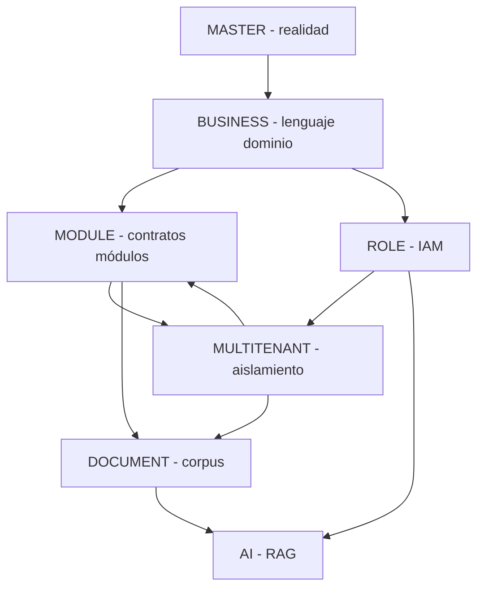

# NexoGo Platform — Migration Master Plan

> **Plan maestro de migración** (Software Architecture).  
> Fecha: 2026-09-18  
> **No modifica código.** Consolida y prioriza la transición desde el estado real del repo hacia la arquitectura Platform documentada.  
>  
> Fuentes analizadas:  
> `MASTER_ARCHITECTURE.md` · `BUSINESS_PLATFORM_ARCHITECTURE.md` · `MODULE_DESIGN.md` ·  
> `ROLE_SYSTEM.md` · `MULTITENANT_ARCHITECTURE.md` · `DOCUMENT_MANAGEMENT.md` · `AI_MODULE.md`  
> (Referencia temporal: `ROADMAP_2026_2027.md`)

---

## 0. Veredicto del arquitecto

NexoGo hoy es una **aplicación veterinaria single-tenant de facto**, con **alta duplicación**, **schemas bilingües**, **auth fragmentado** y **persistencia inconsistente**.  

El destino documentado es una **plataforma SaaS multiempresa multiindustria** con IAM por claims, diez módulos core, Documentos versionados e IA sobre RAG tenant-scoped.

La migración **no** es un big-bang. Es una secuencia obligatoria:

```
Estabilizar → Unificar Auth/Dominio → IAM/Claims → Tenant root →
Módulos core sobre tenant → Documentos → CRM/Dashboard → IA → Verticales
```

Cualquier intento de “meter IA” o “multiempresa” antes de auth único + aislamiento de datos **debe rechazarse**.

---

## 1. Estado actual del proyecto

Fuente primaria: `MASTER_ARCHITECTURE.md`.

### 1.1 Naturaleza del producto hoy

| Dimensión | Estado actual |
|-----------|---------------|
| Tipo | App Android Kotlin + Compose + Firebase |
| Dominio | Veterinaria (pacientes/mascotas, historial clínico, citas) |
| Tenancy | **No existe** `organizationId` ni árbol por empresa |
| IAM | Roles vet (`ADMIN`, `VET`, `VET_ASSISTANT`, `USER`) + enum legacy distinto |
| Auth vivo | `SimpleLoginScreen` → `FirebaseAuthRepository` → colección **`usuarios`** |
| Sesión | `PersistentAuthViewModel` (singleton); otras pantallas usan `AuthViewModel` distinto |
| Hub | `HomeScreen` |
| DI | Hilt deshabilitado; `getInstance()` / `remember { }` |
| Google Sign-In | Roto (`oauth_client: []`, `YOUR_WEB_CLIENT_ID`) |
| Cold start | Diagnósticos Firebase + mock data + citas de prueba en `MainActivity` |

### 1.2 Persistencia real por dominio

| Dominio UI | Persistencia real | Problema |
|------------|-------------------|----------|
| Auth / perfil | `usuarios` (campos ES: correo, rol) | Dual con `users` |
| Citas | `citas` | Dual con `appointments` en rules/legacy |
| Pacientes | **DataStore local** | No cloud; no multi-device |
| Historial | `clinical_records` + pantallas history/medical fragmentadas | Tres caminos |
| Inventario | Firestore vía `InventoryRepository` | Paths/colecciones a unificar en tenant |
| Ventas lista | **Stub** (lista vacía) | Edit sí escribe Firebase |
| Chat | `modules.chat` + import shadowing en Nav | Participantes no tenant-aware |
| Archivos | Storage disperso / managers duplicados | Sin módulo Documentos |
| Rules | Varias variantes; roles `ADMINISTRATOR`/`ASSISTANT` vs app | Desalineadas |

### 1.3 Deuda estructural (hechos)

1. Múltiples AuthRepositories / AuthViewModels / FirebaseConfigs.  
2. Colecciones y campos bilingües (`users`/`usuarios`, `role`/`rol`).  
3. Pacientes ≠ Firestore patients tipados.  
4. Historial clínico ≠ un solo módulo Expedientes.  
5. Sin `organizationId` → imposible aislamiento SaaS.  
6. Sin claims de empresa activa.  
7. Sin Documentos (carpetas/tags/versiones/links) como producto.  
8. Sin IA; cualquier chat “bot” actual no es el módulo `AI_MODULE`.  
9. Pantallas y rutas alternativas vivas en NavGraph (ruido de mantenimiento).  
10. Security rules de emergencia existentes en el repo (riesgo si se despliegan).

### 1.4 Lo que sí funciona como base aprovechable

- Compose + Navigation + Firebase Auth email/password en el camino SimpleLogin.  
- Inventario y SalesEdit con repos sobre `core.FirebaseRepository`.  
- Citas Beautiful* sobre `citas`.  
- Módulo history con PDF utils (semilla de Documentos/generadores).  
- FCM service en Manifest.  
- Documentación de destino ya escrita (reduce ambigüedad de producto).

---

## 2. Estado objetivo

Síntesis de: Business · Module · Role · Multitenant · Documents · AI.

### 2.1 Producto

| Dimensión | Estado objetivo |
|-----------|-----------------|
| Tipo | **Plataforma SaaS** multiempresa + multiindustria |
| Core | 10 módulos: Clientes, Expedientes, Agenda, Inventario, Ventas, Chat, Documentos, CRM, Dashboard, Configuración |
| Verticales | Packs (Veterinaria primero) sobre core estable |
| Valor | Cliente → Agenda → Expediente → Venta/Inventario → Documentos/Chat → (IA) |

### 2.2 Datos y aislamiento

```
organizations/{orgId}/
  memberships, clients, contacts, records, appointments,
  products, sales, conversations, documents, …
orgs/{orgId}/…          # Storage
users/{uid}             # perfil global mínimo
```

- Claims: `orgId`, `roles[]`, `flags`, `scope`, `permsVersion`.  
- Roles base: `SUPER_ADMIN`, `ADMIN`, `MANAGER`, `EMPLOYEE`, `CLIENT` + custom roles por empresa.  
- Permisos atómicos `módulo.recurso.acción`.

### 2.3 Documentos e IA

- Documentos: PDF/Word/Excel/Imágenes, carpetas, tags, versiones, links a Cliente/Expediente/Venta/Empleado.  
- IA: summarize / extract / search / doc_chat vía OpenAI **solo backend**, RAG **por org**, metering y cuotas.

### 2.4 Experiencia

- Un flujo de auth; splash puede restaurar sesión.  
- Shell por rol; Home/Dashboard con KPIs.  
- Vocabulario UI: Clientes, Expedientes, Agenda (no Pacientes/Historial clínico como nombres de plataforma).  
- Sin diagnósticos ni mock en producción.

---

## 3. Diferencias entre ambos (gap analysis)

### 3.1 Matriz actual → objetivo

| Área | Hoy | Objetivo | Gap |
|------|-----|----------|-----|
| Posicionamiento | App vet | Platform multiindustria | Renombre + packs + core abstracto |
| Tenancy | Ausente | Hierarchical tenant | Migración total de datos + rules + Storage |
| Usuarios | Doc en `usuarios` | `users` + `memberships` por org | Modelo IAM nuevo |
| Roles | VET/USER… | SUPER_ADMIN…CLIENT + custom | Catálogo permisos + claims |
| Pacientes | DataStore / “patients” | **Clientes** cloud por org | Nuevo dominio + migración |
| Historial | clinical/history/medical | **Expedientes** (`records`) | Consolidación |
| Citas | `citas` | `appointments` bajo org | Rename + move |
| Ventas | Edit OK, list stub | Ciclo E2E | Completar + tenant |
| Chat | Org-agnostic | Participantes ⊆ org | Rewrite ACL |
| Archivos | Ad-hoc | Módulo Documentos | Greenfield controlado |
| IA | No | RAG OpenAI | Tras Documentos + tenant |
| CRM / Dashboard | Débil / placeholders | Módulos formales | Greenfield sobre Clientes/Ventas |
| Rules | Fragmentadas / permisivas | Deny-by-default por path | Reescritura |
| Código | Duplicados masivos | Módulos `clients/records/…` | Refactor incremental |
| Cold start | Debug + mock | Limpio | Eliminar |

### 3.2 Gaps de mayor riesgo

| Gap | Por qué es crítico |
|-----|--------------------|
| Sin tenant | Todo feature SaaS es cosmética hasta aislar datos |
| Auth dual | Migraciones y claims se aplican al ViewModel equivocado |
| Pacientes locales | Pérdida de datos al cambiar de dispositivo; bloquea vista 360° |
| Schemas bilingües | Rules y app no evalúan el mismo campo de rol |
| Rules emergencia | Un deploy incorrecto abre todos los datos |
| Ventas stub | Ciclo comercial incompleto (KPI/CRM/IA extract facturas) |

### 3.3 Lo que NO es un gap (no reinventar)

- Stack Compose + Firebase como runtime.  
- Existencia de SalesEdit / Inventory / Appointments como capacidad de negocio.  
- PDF generation en history como semilla de generadores Documentos.

---

## 4. Orden exacto de implementación

Orden **estrictamente secuencial** en la espina dorsal. Los ítems “∥” pueden paralelizarse solo tras cumplir el prerequisito indicado.

### Etapa M0 — Congelar y sanear (1–3 semanas)

| # | Trabajo | Done when |
|---|---------|-----------|
| M0.1 | Declarar flujo canónico: Splash → SimpleLogin → Home | Master + equipo alineados |
| M0.2 | Remover del release path: diagnostics, mock, appointment auto-create | Cold start limpio |
| M0.3 | Lista freeze: pantallas/repos **canónicos** vs **legacy (no tocar)** | Documento interno freeze list |
| M0.4 | Smoke tests: login, listar citas, inventario | CI o checklist manual |

### Etapa M1 — Auth único (2–4 semanas)

| # | Trabajo | Done when |
|---|---------|-----------|
| M1.1 | Un AuthRepository + un AuthViewModel/Persistent en camino vivo | Login/registro/logout solo por ellos |
| M1.2 | Decisión: Google Sign-In ahora **o** aplazado formalmente | Ticket cerrado con criterio |
| M1.3 | Dejar de crear admin hardcodeado en runtime | Secrets/ops fuera del cliente |
| M1.4 | Session restore en splash (opcional pero recomendado) | Usuario logueado no ve login vacío |

### Etapa M2 — Dominio y roles (plataforma, aún 1 org implícita) (4–8 semanas)

| # | Trabajo | Done when |
|---|---------|-----------|
| M2.1 | Renombre UX: Pacientes→Clientes, Historial→Expedientes, Citas→Agenda | Strings/rutas visibles |
| M2.2 | Unificar `UserRole` → map a `ADMIN/MANAGER/EMPLOYEE/CLIENT` (compat layer temporal OK) | Un enum canónico en código nuevo |
| M2.3 | Colección canónica `users` (dejar de escribir `usuarios`) + job de copia | Lecturas nuevas en `users` |
| M2.4 | Permission catalog + gates de navegación básicos | Módulos ocultos sin permiso |
| M2.5 | Custom claims: roles + flags (+ `orgId` placeholder de una org default) | Token contiene claims |
| M2.6 | Cloud Function: approve member / set claims | Claims no los escribe el cliente |

### Etapa M3 — Multitenant foundation (8–14 semanas, oleadas)

| # | Trabajo | Done when |
|---|---------|-----------|
| M3.1 | Crear `organizations/{orgId}`, settings, index | Provisioning manual/admin |
| M3.2 | Memberships bajo org; migrar usuarios a membership | Login exige membership ACTIVE |
| M3.3 | `setActiveOrganization` + UI switcher (aunque haya 1 sola org al inicio) | Claims.orgId dinámico |
| M3.4 | **Oleada datos 1:** clients (+ contacts) → path tenant | Cero pacientes solo-DataStore en prod path |
| M3.5 | **Oleada 2:** appointments (`citas`→`appointments`) | UI Agenda lee path tenant |
| M3.6 | **Oleada 3:** products / stock / categories | Inventario tenant |
| M3.7 | **Oleada 4:** sales | Ventas tenant + lista real |
| M3.8 | **Oleada 5:** records (clinical_records unificados) | Un módulo Expedientes |
| M3.9 | **Oleada 6:** chat conversations/messages | Participantes ⊆ org |
| M3.10 | Storage prefix `orgs/{orgId}/` + migración archivos | Rules Storage por prefix |
| M3.11 | Reescritura Security Rules deny-by-default | Tests fuga orgA/orgB en rojo→verde |
| M3.12 | Retirar reads a colecciones root legacy | Feature flag off |

### Etapa M4 — Módulos core sobre tenant (6–12 semanas, parcialmente ∥)

Tras M3.4 como mínimo:

| # | Trabajo | Paralelizable | Done when |
|---|---------|---------------|-----------|
| M4.1 | Clientes 360° (citas/expedientes/ventas links) | base | Ficha cliente usable |
| M4.2 | Agenda estados + atajos a Expediente/Venta | ∥ tras M3.5 | Ciclo día de servicio |
| M4.3 | Expedientes templates + PDF hook | tras M3.8 | Un solo CRUD |
| M4.4 | Ventas E2E (lista+cobro+stock out) | tras M3.6–7 | Ciclo comercial cerrado |
| M4.5 | Chat contextual | tras M3.9 | Deep link cliente |
| M4.6 | Configuración org + services catalog | ∥ | Branding/horarios |
| M4.7 | Pack Veterinaria (atributos pet) | tras M4.1–M4.3 | Vertical no contamina core |

### Etapa M5 — Documentos (6–10 semanas)

| # | Trabajo | Done when |
|---|---------|-----------|
| M5.1 | Document + Version + Storage versionado | Upload/download current |
| M5.2 | Folders + Tags | Biblioteca navegable |
| M5.3 | Links CLIENT/RECORD/SALE/EMPLOYEE | Widgets en fichas |
| M5.4 | Generators RECORD_PDF / SALE_RECEIPT | Artefactos en Documentos |
| M5.5 | Permisos `documents.*` + CLIENT_SHARED | Portal no ve PRIVATE |

### Etapa M6 — CRM + Dashboard (4–8 semanas)

| # | Trabajo | Done when |
|---|---------|-----------|
| M6.1 | Opportunities + activities + stages | Pipeline usable |
| M6.2 | Dashboard KPIs + layouts por rol | Home staff/cliente |
| M6.3 | Cierre oportunidad → venta (soft) | Integración mínima |

### Etapa M7 — IA (8–14 semanas)

| # | Trabajo | Done when |
|---|---------|-----------|
| M7.1 | Orchestrator + secrets + metering | Callable segura |
| M7.2 | Ingestión/embeddings por org | indexStatus READY |
| M7.3 | summarize + extract | Features en UI doc |
| M7.4 | search + doc_chat + citations | Q&A con fuentes |
| M7.5 | Quotas + ACL tests | Sin bypass de Documentos |

### Etapa M8 — Expansión (después de M5–M7 estables)

- Segundo vertical, billing, BRANCH scopes, BYOK, web admin — según `ROADMAP_2026_2027.md` F7.  
- **No** forman parte del camino crítico de migración inicial.

---

## 5. Riesgos técnicos

| ID | Riesgo | Impacto | Probabilidad | Mitigación |
|----|--------|---------|--------------|------------|
| R1 | Migración Firestore incompleta (docs huérfanos en root) | Fuga o pérdida de datos | Alta | Dual-write → cutover → delete; checksum counts por colección |
| R2 | Rules mal desplegadas (emergency `if true`) | Breach multi-tenant | Media | Pipeline de deploy rules + checklist; prohibir archivos emergency en prod |
| R3 | Claims stale tras cambio de rol/org | AuthZ incorrecta | Alta | `permsVersion` + `getIdToken(true)` obligatorio |
| R4 | Auth dual durante migración | Features escriben en sitio viejo | Alta | Freeze list; un solo entrypoint; lint/grep CI |
| R5 | Pacientes DataStore no migrados | Pérdida al adoptar Clientes cloud | Alta | Export DataStore → clients antes de apagar UI vieja |
| R6 | Downtime largo en cutover | Negocio parado | Media | Migrar por oleadas; feature flags por módulo |
| R7 | Storage paths viejos rotos | 404 media/PDF | Alta | Tabla de redirect/re-upload; batch copy |
| R8 | Cost explosion OpenAI prematuro | Quiebra cuota | Media | No M7 hasta cuotas; BYOK después |
| R9 | Prompt injection / fuga vía IA | Datos cross-doc/user | Media | ACL pre-retrieve; citations; `aiIndexable=false` |
| R10 | Scope creep vertical dentro del core | Impide 2º industry pack | Alta | Gate review: atributos vet solo en `verticals/veterinary` |
| R11 | Collection group queries sin filtro | Cross-tenant read | Media | Ban en code review; rules estrictas |
| R12 | Hilt/DI rewrite a mitad de migración | Retraso | Media | **No** reintroducir Hilt hasta M4 estable |
| R13 | Chat import shadowing / rutas rotas | Regresiones UX | Media | NavGraph cleanup en M0/M1 |
| R14 | Equipo implementa IA o CRM “para demo” fuera de orden | Deuda estructural | Alta | Este plan como gate de PRs |

---

## 6. Dependencias

### 6.1 Grafo de dependencias entre documentos / capacidades



### 6.2 Dependencias de implementación (qué bloquea qué)

| Entregable | Requiere antes |
|------------|----------------|
| Claims útiles | Auth único (M1) |
| Membership multi-org | Organizations (M3.1) + Claims (M2.5) |
| Clientes cloud | Tenant path (M3) o al menos org default |
| Expedientes unificados | Clientes |
| Agenda atajos venta/expediente | Clientes + ventas/records paths |
| Ventas E2E | Inventario tenant + Clientes |
| Documentos links | Clientes/Records/Sales/Membership IDs estables |
| Generadores PDF | Documentos + Expedientes/Ventas |
| CRM | Clientes (+ Ventas para cierre) |
| Dashboard KPIs | Datos tenant en módulos core |
| Embeddings / IA | Documentos versionados + Rules tenant + ACL |
| 2º vertical | Core + pack vet sin contaminar modelos |

### 6.3 Dependencias externas / ops

| Dependencia | Para |
|-------------|------|
| Firebase Blaze + Functions | Claims, metering IA, jobs migración |
| Secret Manager | OpenAI key |
| SHA-1/OAuth consola | Google Sign-In (si se activa) |
| Backup Firestore | Antes de cada oleada M3 |
| Entorno staging con 2 orgs | Tests de fuga |

---

## 7. Qué debe hacerse primero

### 7.1 Primeros 30 días (orden inquebrantable)

1. **Congelar flujo canónico** y actualizar `MASTER_ARCHITECTURE.md` si algo cambia.  
2. **Sacar mock/diagnostics** del arranque de producción.  
3. **Unificar Auth** del camino vivo (un repo + un VM).  
4. **Freeze list** de legacy (qué no se edita).  
5. **Rules:** asegurar que prod **no** usa emergency `if true`.  
6. Empezar **renombre UX** Clientes/Expedientes/Agenda (bajo riesgo, alto alineamiento).  
7. Diseñar **org default** + modelo membership (aún sin migrar todo).  

### 7.2 Primera decisión de arquitectura a cerrar en kickoff

| Decisión | Opciones | Recomendación del arquitecto |
|----------|----------|------------------------------|
| Estrategia datos tenant | Solo campo `organizationId` vs árbol `organizations/{id}/` | **Árbol** (`MULTITENANT_ARCHITECTURE.md`) |
| Google Sign-In | Ahora vs después de M3 | **Después de M1**; no bloquea tenant |
| Hilt | Reactivar ahora vs después | **Después de M4** |
| Big-bang migración | Un cutover vs oleadas | **Oleadas M3.4–M3.9** |
| IA piloto | Demo hardcode vs módulo real | **Prohibido** hasta M5+M3.11 |

### 7.3 Definition of Ready para “empezar M3 Multitenant”

- [ ] M0 y M1 cerrados  
- [ ] Claims set vía Admin SDK  
- [ ] Backup + staging  
- [ ] Plan de rollback por oleada  
- [ ] Contadores de documentos legacy baseline  

---

## 8. Qué NO debe tocarse todavía

Hasta la etapa indicada, tratar como **fuera de alcance / no tocar**:

| Ítem | No tocar hasta | Motivo |
|------|----------------|--------|
| OpenAI / embeddings / doc_chat | M7 (post M5 + M3.11) | Sin corpus ni aislamiento = riesgo y costo |
| CRM pipeline completo | M6 (post Clientes tenant) | No hay sujeto comercial estable |
| Dashboard KPIs “bonitos” / reports | M6 | Placeholders OK; no invertir UI sobre datos legacy |
| Segundo pack vertical (clínica, legal…) | M8 | Contamina el core si se hace ya |
| BYOK OpenAI | Post M7.1 | Prematuro |
| Consola web admin | M8 | Duplica superficie antes de estabilizar móvil |
| Multi-sede BRANCH scopes | Post M3 estable | Complejidad de scope prematura |
| Reactivar Hilt en todo el árbol | Post M4 | Mezcla refactor DI + migración datos |
| Reescritura estética total de UI | Post M2 renombres | Cosmético vs estructural |
| Borrar en masa archivos legacy sin freeze list | Siempre con checklist | Regresiones Nav |
| Collection group searches globales | Nunca sin diseño | Fuga tenant |
| Desplegar `firestore_rules_emergency.rules` | Nunca en prod | Breach |
| “Arreglar todo el NavGraph” de una vez | Solo limpiezas M0/M1 del camino vivo | Scope creep |
| Migrar Storage a buckets por empresa | Fuera de 2026–27 salvo enterprise | `orgs/{orgId}/` basta |
| Cambiar package `com.example.nexogo` / rebrand store | Post producto estable | Ruido de release |
| Offline-first / sync compleja | Post M4 | Otro programa |
| E-sign / OCR avanzado Documentos | DOCUMENT v2 (post M5.5) | No bloquea v1 |
| Tool calling IA que escribe Expedientes/CRM | AI v2/v3 | Requiere confirmación humana + ACL madura |
| Facturación SaaS Stripe/etc. | M8 | Tras tenant + cuotas IA |

### 8.1 Regla de oro para PRs

> Si un PR introduce `organizationId` **sin** pasar por Auth único y plan de membership → rechazar.  
> Si un PR llama OpenAI desde la app o indexa docs sin `orgId` → rechazar.  
> Si un PR añade campos `especie/raza` al modelo core `Client` → rechazar (van al pack vet).

---

## 9. Estrategia de migración de datos (resumen operativo)

### 9.1 Patrón por oleada

```
1. Dual-write (legacy + tenant path)
2. Backfill job (legacy → tenant)
3. Read cutover (app lee solo tenant)
4. Disable legacy write
5. Verify counts + sample audit
6. Delete o archive legacy (después de N días)
```

### 9.2 Orden de oleadas (repetido por criticidad)

1. Users/memberships  
2. Clients (+ export DataStore)  
3. Appointments  
4. Inventory  
5. Sales  
6. Records  
7. Chat  
8. Media/Storage  
9. Purge root collections  

### 9.3 Rollback

- Feature flag `useTenantPath_{module}` por módulo.  
- Mantener legacy read-only 2–4 semanas post-cutover.  
- No borrar Storage legacy hasta checksum OK.

---

## 10. Criterios de salida globales (migración “hecha” en su espina dorsal)

La migración maestra se considera **completa en núcleo** cuando:

1. Existen ≥2 organizaciones en staging/prod de prueba sin fuga (tests R11/R2).  
2. Auth único + claims `orgId` + memberships.  
3. Clientes, Agenda, Expedientes, Inventario, Ventas, Chat viven bajo `organizations/{orgId}`.  
4. Storage bajo `orgs/{orgId}/`.  
5. Rules deny-by-default desplegadas; emergency rules no existen en prod.  
6. Documentos v1 con versiones y links.  
7. `MASTER_ARCHITECTURE.md` actualizado al nuevo “estado actual”.  
8. Legacy root collections en read-only o eliminadas.

IA, CRM avanzado y 2º vertical son **ampliaciones**, no el cierre de la migración estructural.

---

## 11. Roles RACI sugeridos (equipo)

| Actividad | Architect | Tech Lead | Dev | Product | Ops |
|-----------|-----------|-----------|-----|---------|-----|
| Freeze list / orden M* | A | R | C | C | I |
| Auth unificado | A | R | R | I | I |
| Claims Functions | A | R | R | I | R |
| Oleadas datos | A | R | R | C | R |
| Rules deploy | A | C | C | I | R |
| Documentos / IA | A | R | R | R | C |

R = Responsible · A = Accountable · C = Consulted · I = Informed

---

## 12. Relación con el resto de documentos

| Documento | Uso en la migración |
|-----------|---------------------|
| `MASTER_ARCHITECTURE.md` | As-is; actualizar en cada cutover |
| `BUSINESS_PLATFORM_ARCHITECTURE.md` | To-be de lenguaje y packs |
| `MODULE_DESIGN.md` | Contratos de módulos post-tenant |
| `ROLE_SYSTEM.md` | IAM y claims |
| `MULTITENANT_ARCHITECTURE.md` | Forma del árbol y rules |
| `DOCUMENT_MANAGEMENT.md` | Etapa M5 |
| `AI_MODULE.md` | Etapa M7 |
| `ROADMAP_2026_2027.md` | Calendario; este plan es el **orden técnico vinculante** |
| **`MIGRATION_MASTER_PLAN.md`** | Gate de secuencia y exclusiones |

---

## 13. Resumen ejecutivo

| Pregunta | Respuesta |
|----------|-----------|
| ¿Dónde estamos? | App vet single-tenant, auth/datos fragmentados |
| ¿A dónde vamos? | SaaS multiempresa, 10 módulos, Documentos, IA |
| ¿Cuál es el mayor salto? | Multitenant hierarchical + IAM claims |
| ¿Qué primero? | Sanear + Auth único + (luego) roles/claims |
| ¿Qué no tocar? | IA, 2º vertical, Hilt global, CRM profundo, web admin |
| ¿Riesgo #1? | Migración/rules cross-tenant |
| ¿Orden? | M0→M1→M2→M3(oleadas)→M4→M5→M6→M7→M8 |

---

*Fin de MIGRATION_MASTER_PLAN.md — plan maestro de migración NexoGo Platform.*
