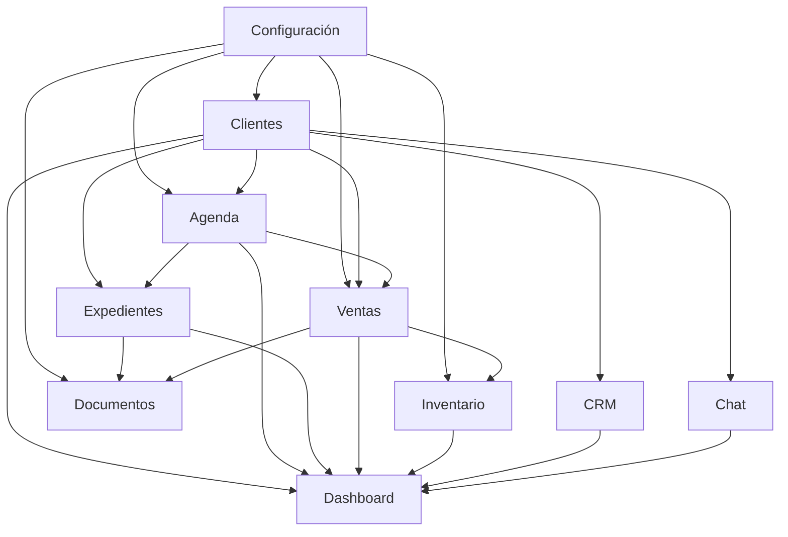
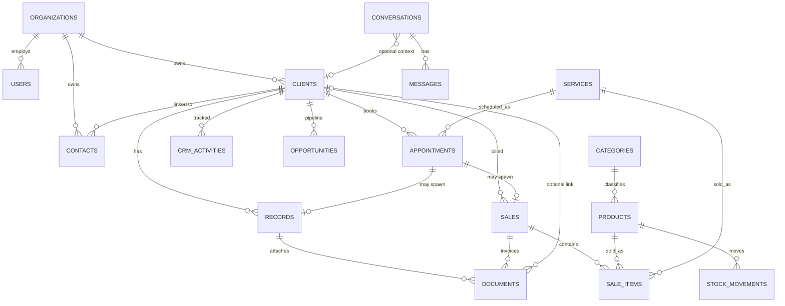

# NexoGo Platform — Module Design

> **Diseño modular oficial** de NexoGo Platform.  
> Fecha: 2026-09-18  
> Complementa: `BUSINESS_PLATFORM_ARCHITECTURE.md` (visión) · `MASTER_ARCHITECTURE.md` (código actual).  
> **Solo diseño; no modifica código.**

---

## 1. Propósito

Definir los **10 módulos obligatorios** del core de plataforma:

| # | Módulo | Código interno | Origen / evolución |
|---|--------|----------------|--------------------|
| 1 | Clientes | `clients` | Pacientes |
| 2 | Expedientes | `records` | Historial clínico |
| 3 | Agenda | `agenda` | Citas |
| 4 | Inventario | `inventory` | Inventario |
| 5 | Ventas | `sales` | Ventas |
| 6 | Chat | `chat` | Chat |
| 7 | Documentos | `documents` | Nuevo (PDF/Storage disperso) |
| 8 | CRM | `crm` | Nuevo (relación comercial sobre Clientes) |
| 9 | Dashboard | `dashboard` | Dashboard / Home KPIs |
| 10 | Configuración | `settings` | Config / Settings / Org |

Cada módulo se describe con: **responsabilidades**, **dependencias**, **relaciones**, **permisos** y **colecciones Firestore**.

---

## 2. Convenciones transversales

### 2.1 Tenancy

Todo documento de negocio incluye:

```
organizationId: string   # tenant obligatorio
```

Consultas y security rules filtran siempre por `organizationId` (+ rol).

### 2.2 Roles de plataforma (IAM)

| Rol | Código | Descripción breve |
|-----|--------|-------------------|
| Administrador de org | `ORG_ADMIN` | Control total del tenant |
| Líder / profesional | `STAFF_LEAD` | Opera expedientes, agenda, ventas, inventario |
| Staff | `STAFF` | Operación diaria acotada |
| Usuario cliente | `CLIENT_USER` | Acceso a lo propio |
| Pendiente | `PENDING` | Sin módulos operativos |

Permisos por módulo usan leyenda:

| Símbolo | Significado |
|---------|-------------|
| C | Create |
| R | Read |
| U | Update |
| D | Delete / Archive |
| — | Sin acceso |
| * | Solo recursos propios / asignados |

### 2.3 IDs y auditoría

Campos comunes recomendados en documentos:

```
id, organizationId, createdAt, updatedAt, createdBy, updatedBy
```

### 2.4 Dependencias (tipos)

| Tipo | Significado |
|------|-------------|
| **Hard** | No puede funcionar sin el módulo/colección |
| **Soft** | Integra opcionalmente (atajos, enriquecimiento) |
| **Platform** | Depende de IAM / Org / Storage (infra) |

---

## 3. Mapa de dependencias entre módulos



**Lectura:** las flechas A → B significan “B depende de A” (A es prerequisite o proveedor de datos).

---

## 4. Grafo de relaciones de dominio



---

## 5. Módulo: Clientes (`clients`)

### 5.1 Responsabilidades

- CRUD de **Clientes** (sujeto de servicio / cuenta operativa).
- Gestión de **Contactos** asociados (tutor, facturación, emergencia).
- Media básica del cliente (foto, galería ligera).
- Búsqueda, filtros, tags, archivo.
- Vista 360° (agrega datos soft de Agenda, Expedientes, Ventas, CRM, Chat).
- **No** posee pipeline comercial pesado (eso es CRM).
- **No** almacena plantillas clínicas (eso es Expedientes + vertical).

### 5.2 Dependencias

| Depende de | Tipo | Motivo |
|------------|------|--------|
| Configuración | Soft | Categorías/tags, campos custom org |
| IAM / Organizations | Platform | `organizationId`, permisos |
| Documentos | Soft | Adjuntos pesados / identidad |
| Agenda, Expedientes, Ventas, CRM, Chat | Soft (consumidor inverso) | Vista 360° lee de ellos |

### 5.3 Relaciones

- 1 Cliente → N Contactos  
- 1 Cliente → N Citas (Agenda)  
- 1 Cliente → N Expedientes  
- 1 Cliente → N Ventas  
- 1 Cliente → N Actividades / Oportunidades (CRM)  
- 1 Cliente → 0..N Conversaciones contextuales (Chat)

### 5.4 Permisos

| Acción | ORG_ADMIN | STAFF_LEAD | STAFF | CLIENT_USER |
|--------|-----------|------------|-------|-------------|
| Listar clientes org | CRUD | CRUD | CRU | R* |
| Crear / editar | ✓ | ✓ | ✓ | U* perfil propio |
| Archivar / eliminar | ✓ | ✓ | — | — |
| Gestionar contactos | ✓ | ✓ | ✓ | R*/U* limitados |
| Ver 360° completo | ✓ | ✓ | ✓ parcial | Solo lo propio |

### 5.5 Colecciones Firestore

| Colección | Documento | Campos clave |
|-----------|-----------|--------------|
| `clients` | `{clientId}` | `organizationId`, `displayName`, `type`, `status`, `primaryContactId`, `attributes`, `tags`, `media`, timestamps |
| `contacts` | `{contactId}` | `organizationId`, `clientIds[]`, `name`, `email`, `phone`, `role` (OWNER/BILLING/…), timestamps |

**Storage:** `orgs/{organizationId}/clients/{clientId}/...`

---

## 6. Módulo: Expedientes (`records`)

### 6.1 Responsabilidades

- CRUD de **Expedientes** ligados a un Cliente.
- Estados: `DRAFT` → `FINAL` → `ARCHIVED`.
- Secciones / payload (core + extensión vertical).
- Vínculo opcional a cita de Agenda.
- Solicitar generación/almacenamiento de PDF vía **Documentos**.
- Timeline por cliente.
- **No** agenda slots; **no** cobra; **no** gestiona stock.

### 6.2 Dependencias

| Depende de | Tipo | Motivo |
|------------|------|--------|
| Clientes | Hard | `clientId` obligatorio |
| Agenda | Soft | Origen desde cita completada |
| Documentos | Hard (export/adjuntos) | PDF y archivos |
| Configuración | Soft | Plantillas habilitadas por org/pack |
| Inventario / Ventas | Soft | Consumos o cargos sugeridos post-cierre |

### 6.3 Relaciones

- N Expedientes → 1 Cliente  
- 0..1 Cita → 0..N Expedientes  
- 1 Expediente → N Documentos (adjuntos / PDF)  
- Soft: puede sugerir ítems de Venta

### 6.4 Permisos

| Acción | ORG_ADMIN | STAFF_LEAD | STAFF | CLIENT_USER |
|--------|-----------|------------|-------|-------------|
| Listar / leer | ✓ | ✓ | ✓ | R* propios |
| Crear / editar borrador | ✓ | ✓ | ✓ asistido | — |
| Finalizar | ✓ | ✓ | — / policy | — |
| Archivar | ✓ | ✓ | — | — |
| Exportar PDF | ✓ | ✓ | ✓ | R* descarga propia |

### 6.5 Colecciones Firestore

| Colección | Documento | Campos clave |
|-----------|-----------|--------------|
| `records` | `{recordId}` | `organizationId`, `clientId`, `appointmentId?`, `title`, `recordType`, `status`, `summary`, `sections[]`, `industryPayload`, `authoredBy`, `serviceDate`, `documentIds[]`, timestamps |
| `record_templates` | `{templateId}` | `organizationId` o global pack, `industry`, `schema`, `version` |

**Storage (vía Documentos):** `orgs/{orgId}/records/{recordId}/...`

---

## 7. Módulo: Agenda (`agenda`)

### 7.1 Responsabilidades

- Calendario de **citas / appointments**.
- Asignación Cliente + Servicio + Staff + slot temporal.
- Máquina de estados: `SCHEDULED` → `CONFIRMED` → `IN_PROGRESS` → `COMPLETED` | `CANCELED` | `NO_SHOW`.
- Filtros por fecha, staff, estado.
- Atajos: crear Expediente / Venta al completar.
- Recordatorios (evento → Notificaciones platform).
- **No** es el CRM de seguimiento comercial; **no** es el expediente clínico.

### 7.2 Dependencias

| Depende de | Tipo | Motivo |
|------------|------|--------|
| Clientes | Hard | Quién se agenda |
| Configuración | Hard/Soft | Servicios, horarios, duración |
| Expedientes | Soft | Post-completado |
| Ventas | Soft | Post-completado |
| Chat | Soft | Recordatorios / confirmación |
| IAM | Platform | Staff asignable |

### 7.3 Relaciones

- N Citas → 1 Cliente  
- N Citas → 0..1 Servicio (`services`)  
- N Citas → 1..N Staff (`users`)  
- 1 Cita → 0..N Expedientes / Ventas (spawn)

### 7.4 Permisos

| Acción | ORG_ADMIN | STAFF_LEAD | STAFF | CLIENT_USER |
|--------|-----------|------------|-------|-------------|
| Ver calendario org | ✓ | ✓ | ✓ | R* propias |
| Crear / editar | ✓ | ✓ | ✓ | C*/U* propias (policy) |
| Cambiar estados | ✓ | ✓ | ✓ | CONFIRMED limitado |
| Cancelar | ✓ | ✓ | ✓ | C* propias |
| Reasignar staff | ✓ | ✓ | — | — |

### 7.5 Colecciones Firestore

| Colección | Documento | Campos clave |
|-----------|-----------|--------------|
| `appointments` | `{appointmentId}` | `organizationId`, `clientId`, `serviceId?`, `staffIds[]`, `startAt`, `endAt`, `status`, `reason`, `notes`, `location?`, timestamps |
| `services` | `{serviceId}` | `organizationId`, `name`, `durationMinutes`, `price`, `categoryId?`, `active`, timestamps |
| `staff_schedules` *(opcional)* | `{userId}` o doc compuesto | `organizationId`, `weeklyHours`, `exceptions[]` |

> Unificar el legacy `citas` → `appointments`.

---

## 8. Módulo: Inventario (`inventory`)

### 8.1 Responsabilidades

- Catálogo de **productos / insumos**.
- Stock actual, umbrales, alertas de mínimo.
- Movimientos: entrada, salida, ajuste, venta, consumo.
- Categorías (compartidas con Configuración).
- **No** factura al cliente (Ventas); **no** agenda.

### 8.2 Dependencias

| Depende de | Tipo | Motivo |
|------------|------|--------|
| Configuración | Soft | Categorías, unidades |
| Ventas | Soft (inverso) | Salidas por venta |
| Expedientes | Soft | Consumo clínico opcional |
| Documentos | Soft | Fichas técnicas / fotos |

### 8.3 Relaciones

- 1 Producto → N Movimientos  
- 1 Categoría → N Productos  
- N SaleItems → 1 Producto  
- Soft: Expediente puede referenciar productos usados

### 8.4 Permisos

| Acción | ORG_ADMIN | STAFF_LEAD | STAFF | CLIENT_USER |
|--------|-----------|------------|-------|-------------|
| Ver catálogo / stock | ✓ | ✓ | R | — |
| CRUD productos | ✓ | ✓ | — | — |
| Ajustar stock | ✓ | ✓ | U limitada | — |
| Ver movimientos | ✓ | ✓ | R | — |

### 8.5 Colecciones Firestore

| Colección | Documento | Campos clave |
|-----------|-----------|--------------|
| `products` | `{productId}` | `organizationId`, `name`, `sku?`, `categoryId?`, `quantity`, `unitPrice`, `cost?`, `lowStockThreshold`, `unit`, `active`, `attributes`, timestamps |
| `stock_movements` | `{movementId}` | `organizationId`, `productId`, `type` (IN/OUT/ADJUST/SALE/CONSUME), `quantity`, `reason`, `refType?`, `refId?`, `createdBy`, `createdAt` |
| `categories` | `{categoryId}` | `organizationId`, `name`, `type` (PRODUCT/SERVICE/…), `active` |

**Storage:** `orgs/{orgId}/products/{productId}/...`

---

## 9. Módulo: Ventas (`sales`)

### 9.1 Responsabilidades

- Crear y gestionar **órdenes / ventas**.
- Ítems de producto y/o servicio.
- Estados de pago: `PENDING` → `PAID` | `CANCELED` | `REFUNDED`.
- Descontar inventario al confirmar (evento a Inventario).
- Generar comprobante PDF vía Documentos.
- Asociar a Cliente (+ opcional Agenda / Expediente).
- **No** es CRM de pipeline; **no** es agenda.

### 9.2 Dependencias

| Depende de | Tipo | Motivo |
|------------|------|--------|
| Clientes | Hard | Destinatario / facturación |
| Inventario | Hard (si hay productos) | Stock |
| Configuración | Soft | Métodos de pago, impuestos, series |
| Documentos | Hard (comprobante) | PDF |
| Agenda / Expedientes | Soft | Origen del cargo |
| CRM | Soft | Cerrar oportunidad |

### 9.3 Relaciones

- N Ventas → 1 Cliente  
- 1 Venta → N Ítems  
- Ítem → Producto y/o Servicio  
- 1 Venta → 0..N Documentos  
- Soft: `appointmentId`, `recordId`, `opportunityId`

### 9.4 Permisos

| Acción | ORG_ADMIN | STAFF_LEAD | STAFF | CLIENT_USER |
|--------|-----------|------------|-------|-------------|
| Listar ventas org | ✓ | ✓ | R | R* propias |
| Crear / editar | ✓ | ✓ | C/U | — |
| Cobrar / cambiar pago | ✓ | ✓ | U | — |
| Anular / reembolso | ✓ | ✓ | — | — |
| Descargar comprobante | ✓ | ✓ | ✓ | R* |

### 9.5 Colecciones Firestore

| Colección | Documento | Campos clave |
|-----------|-----------|--------------|
| `sales` | `{saleId}` | `organizationId`, `clientId`, `appointmentId?`, `recordId?`, `opportunityId?`, `items[]`, `subtotal`, `tax`, `total`, `paymentMethod`, `paymentStatus`, `notes`, `documentIds[]`, `createdBy`, timestamps |
| `sale_items` *(o embebidos en `sales`)* | — | `productId?`, `serviceId?`, `name`, `quantity`, `unitPrice`, `total` |

> Decisión de diseño: **ítems embebidos** en `sales` para lecturas simples; subcolección solo si hay alto volumen/edición concurrente.

---

## 10. Módulo: Chat (`chat`)

### 10.1 Responsabilidades

- Conversaciones 1:1 o grupales internas.
- Mensajes texto + multimedia.
- Contexto opcional: `clientId`, `appointmentId`, `recordId`.
- Notificaciones push (FCM).
- **No** sustituye CRM (tareas/oportunidades); puede crear actividad CRM soft.

### 10.2 Dependencias

| Depende de | Tipo | Motivo |
|------------|------|--------|
| IAM / Users | Hard | Participantes |
| Clientes | Soft | Contexto |
| Agenda / Expedientes | Soft | Deep links |
| Documentos | Soft | Archivos pesados |
| Configuración | Soft | Chatbot / plantillas |

### 10.3 Relaciones

- N Conversaciones ↔ N Users (participantes)  
- 1 Conversación → N Mensajes  
- Soft FK a Cliente / Cita / Expediente

### 10.4 Permisos

| Acción | ORG_ADMIN | STAFF_LEAD | STAFF | CLIENT_USER |
|--------|-----------|------------|-------|-------------|
| Ver conversaciones propias | ✓ | ✓ | ✓ | ✓ |
| Iniciar chat staff↔staff | ✓ | ✓ | ✓ | — |
| Iniciar / participar staff↔cliente | ✓ | ✓ | ✓ | ✓ con staff |
| Eliminar mensajes | ✓ | — | — | — |
| Configurar chatbot | ✓ | — | — | — |

### 10.5 Colecciones Firestore

| Colección | Documento | Campos clave |
|-----------|-----------|--------------|
| `conversations` | `{conversationId}` | `organizationId`, `participantIds[]`, `clientId?`, `appointmentId?`, `recordId?`, `lastMessage`, `lastMessageAt`, `active`, timestamps |
| `messages` | `{messageId}` **o** subcolección `conversations/{id}/messages` | `organizationId`, `conversationId`, `senderId`, `text`, `attachments[]`, `createdAt`, `readBy[]` |

**Recomendación:** subcolección `conversations/{id}/messages/{messageId}` para escalar.

**Storage:** `orgs/{orgId}/chat/{conversationId}/...`

---

## 11. Módulo: Documentos (`documents`)

### 11.1 Responsabilidades

- Catálogo unificado de **archivos** (PDF, imágenes, docs).
- Metadatos: dueño, módulo origen, MIME, tamaño, checksum.
- Pipeline de generación (PDF de expediente, comprobante de venta).
- Control de acceso alineado al recurso padre.
- Versionado simple (`version`, `replacesDocumentId`).
- **No** interpreta contenido clínico/comercial; solo almacena y referencia.

### 11.2 Dependencias

| Depende de | Tipo | Motivo |
|------------|------|--------|
| Firebase Storage | Platform | Bytes |
| Configuración | Soft | Branding PDF, retención |
| Expedientes / Ventas / Clientes / Chat | Soft (proveedores) | Origen de documentos |

### 11.3 Relaciones

- 1 Documento → 1 recurso padre (`refType` + `refId`)  
- N Documentos → Cliente / Expediente / Venta / Mensaje  
- Generadores: Expedientes, Ventas, Config (logo)

### 11.4 Permisos

Heredan del recurso padre + reglas explícitas:

| Acción | ORG_ADMIN | STAFF_LEAD | STAFF | CLIENT_USER |
|--------|-----------|------------|-------|-------------|
| Subir a recurso permitido | ✓ | ✓ | ✓ | U* propios |
| Descargar si tiene R al padre | ✓ | ✓ | ✓ | R* |
| Eliminar | ✓ | ✓ policy | — | — |
| Regenerar PDF oficial | ✓ | ✓ | — | — |

### 11.5 Colecciones Firestore

| Colección | Documento | Campos clave |
|-----------|-----------|--------------|
| `documents` | `{documentId}` | `organizationId`, `refType` (CLIENT/RECORD/SALE/CHAT/ORG), `refId`, `name`, `mimeType`, `size`, `storagePath`, `downloadUrl?`, `version`, `createdBy`, `visibility`, timestamps |

**Storage canónico:**

```
orgs/{organizationId}/documents/{documentId}
orgs/{organizationId}/clients/{clientId}/...
orgs/{organizationId}/records/{recordId}/...
orgs/{organizationId}/sales/{saleId}/...
```

Los paths específicos pueden ser aliases; `documents` es la fuente de verdad de metadatos.

---

## 12. Módulo: CRM (`crm`)

### 12.1 Responsabilidades

- Capa de **relación comercial** sobre Clientes:
  - Lead / prospecto → cliente activo
  - Oportunidades (pipeline)
  - Actividades (llamada, visita, tarea, nota, follow-up)
  - Scoring / tags comerciales
- Recordatorios de seguimiento.
- Cierre de oportunidad → Venta (soft).
- **No** reemplaza Clientes (datos maestros); **no** es Agenda clínica; **no** es Expediente.

### 12.2 Dependencias

| Depende de | Tipo | Motivo |
|------------|------|--------|
| Clientes | Hard | Sujeto del CRM |
| Ventas | Soft | Conversión |
| Agenda | Soft | Actividad tipo reunión → cita |
| Chat | Soft | Log de interacción |
| Dashboard | Soft (inverso) | KPIs pipeline |
| Configuración | Soft | Etapas de pipeline |

### 12.3 Relaciones

- 1 Cliente → N Oportunidades  
- 1 Cliente → N Actividades  
- 1 Oportunidad → 0..1 Venta  
- Actividad puede referenciar Cita / Chat

### 12.4 Permisos

| Acción | ORG_ADMIN | STAFF_LEAD | STAFF | CLIENT_USER |
|--------|-----------|------------|-------|-------------|
| Ver pipeline org | ✓ | ✓ | R asignadas | — |
| CRUD oportunidades | ✓ | ✓ | CU asignadas | — |
| CRUD actividades | ✓ | ✓ | ✓ | — |
| Cambiar etapas | ✓ | ✓ | U limitada | — |
| Ver datos CRM propios como cliente | — | — | — | — (oculto) |

### 12.5 Colecciones Firestore

| Colección | Documento | Campos clave |
|-----------|-----------|--------------|
| `opportunities` | `{opportunityId}` | `organizationId`, `clientId`, `title`, `stage`, `value`, `currency`, `ownerId`, `expectedCloseAt`, `status`, `saleId?`, timestamps |
| `crm_activities` | `{activityId}` | `organizationId`, `clientId`, `opportunityId?`, `type`, `subject`, `dueAt`, `doneAt?`, `assignedTo`, `notes`, `refType?`, `refId?`, timestamps |
| `pipeline_stages` | `{stageId}` | `organizationId`, `name`, `order`, `probability` |

---

## 13. Módulo: Dashboard (`dashboard`)

### 13.1 Responsabilidades

- Agregar **KPIs y widgets** de los demás módulos.
- Home por rol (staff vs cliente).
- Atajos de navegación a módulos.
- Widgets del **pack vertical** (inyectados, no hardcode vet en core).
- **No** persiste dominio propio de negocio (salvo layouts/prefs de usuario).

### 13.2 Dependencias

| Depende de | Tipo | Motivo |
|------------|------|--------|
| Clientes | Soft | Conteos / recientes |
| Agenda | Soft | Citas del día |
| Expedientes | Soft | Pendientes de firma |
| Ventas | Soft | Ingresos del período |
| Inventario | Soft | Alertas stock |
| CRM | Soft | Pipeline |
| Chat | Soft | No leídos |
| Configuración | Soft | Layout, branding |

Todas son **soft de lectura**; Dashboard es consumidor.

### 13.3 Relaciones

- Solo lectura agregada; no posee FKs de dominio.
- Preferencias de layout por usuario.

### 13.4 Permisos

| Acción | ORG_ADMIN | STAFF_LEAD | STAFF | CLIENT_USER |
|--------|-----------|------------|-------|-------------|
| Ver KPIs org | ✓ | ✓ | Parcial | — |
| Ver widgets operativos | ✓ | ✓ | ✓ | — |
| Ver home cliente | — | — | — | ✓ (mis citas, docs) |
| Configurar layout | ✓ | ✓ propio | ✓ propio | ✓ propio limitado |

### 13.5 Colecciones Firestore

| Colección | Documento | Campos clave |
|-----------|-----------|--------------|
| `dashboard_layouts` | `{userId}` o `{orgId}_{userId}` | `organizationId`, `userId`, `widgets[]`, `updatedAt` |
| `dashboard_snapshots` *(opcional cache)* | `{orgId}_{period}` | métricas precomputadas |

Los KPIs en v1 pueden calcularse en cliente/Cloud Functions leyendo colecciones fuente; snapshots son optimización.

---

## 14. Módulo: Configuración (`settings`)

### 14.1 Responsabilidades

- Ajustes de **organización**: branding, locale, timezone, horarios.
- Catálogos transversales: categorías, métodos de pago, etapas CRM, plantillas habilitadas.
- Packs verticales activos.
- Políticas: aprobación de usuarios, retención de documentos.
- Preferencias de notificación.
- **No** opera Clientes/Ventas día a día; solo parametriza.

### 14.2 Dependencias

| Depende de | Tipo | Motivo |
|------------|------|--------|
| IAM / Organizations | Platform | Tenant root |
| Documentos | Soft | Logo / assets |
| Todos los módulos | Soft (inverso) | Consumen parámetros |

Configuración es **raíz de parametrización** del grafo.

### 14.3 Relaciones

- 1 Organization → 1 `org_settings`  
- Provee categorías a Inventario/Servicios  
- Provee pipeline stages a CRM  
- Provee branding a Documentos/PDF  

### 14.4 Permisos

| Acción | ORG_ADMIN | STAFF_LEAD | STAFF | CLIENT_USER |
|--------|-----------|------------|-------|-------------|
| Leer settings públicos org | ✓ | ✓ | ✓ | R limitado |
| Editar org / branding | ✓ | — | — | — |
| Gestionar categorías / servicios base | ✓ | ✓ | — | — |
| Activar packs verticales | ✓ | — | — | — |
| Preferencias personales | ✓ | ✓ | ✓ | ✓ |

### 14.5 Colecciones Firestore

| Colección | Documento | Campos clave |
|-----------|-----------|--------------|
| `organizations` | `{organizationId}` | `name`, `industryPacks[]`, `status`, timestamps |
| `org_settings` | `{organizationId}` | branding, locale, timezone, businessHours, paymentMethods, notificationDefaults, policies |
| `categories` | *(compartida con Inventario)* | ver §8.5 |
| `users` | `{userId}` | `organizationId`, `role`, `isApproved`, `displayName`, `email`, `fcmTokens[]`, prefs |

> Unificar legacy `usuarios` → `users`.

---

## 15. Matriz consolidada de permisos (CRUD)

| Módulo | ORG_ADMIN | STAFF_LEAD | STAFF | CLIENT_USER |
|--------|-----------|------------|-------|-------------|
| Clientes | CRUD | CRUD | CRU | R*/U* |
| Expedientes | CRUD | CRUD | CRU† | R* |
| Agenda | CRUD | CRUD | CRUD | CRU* |
| Inventario | CRUD | CRUD | R (U adjust†) | — |
| Ventas | CRUD | CRUD | CRU | R* |
| Chat | CRUD‡ | CRU | CRU | CRU* |
| Documentos | CRUD | CRU | CR | R* |
| CRM | CRUD | CRUD | CRU asignado | — |
| Dashboard | R + layout | R + layout | R parcial | R home propio |
| Configuración | CRUD | R (+ catálogos†) | R | R prefs |

† = según policy de org · ‡ = incluye moderación

---

## 16. Inventario total de colecciones Firestore (core)

| Colección | Módulo dueño | Notas |
|-----------|--------------|-------|
| `organizations` | Configuración | Tenant |
| `org_settings` | Configuración | 1:1 con org |
| `users` | Configuración / IAM | Perfiles |
| `clients` | Clientes | Maestro |
| `contacts` | Clientes | Contactos |
| `records` | Expedientes | Expedientes |
| `record_templates` | Expedientes / Config | Plantillas |
| `appointments` | Agenda | Citas |
| `services` | Agenda / Config | Catálogo servicios |
| `staff_schedules` | Agenda | Opcional |
| `products` | Inventario | Catálogo |
| `stock_movements` | Inventario | Kardex |
| `categories` | Config / Inventario | Taxonomía |
| `sales` | Ventas | Órdenes |
| `conversations` | Chat | Hilos |
| `messages` o subcolección | Chat | Mensajes |
| `documents` | Documentos | Metadatos archivos |
| `opportunities` | CRM | Pipeline |
| `crm_activities` | CRM | Actividades |
| `pipeline_stages` | CRM / Config | Etapas |
| `dashboard_layouts` | Dashboard | UI prefs |
| `dashboard_snapshots` | Dashboard | Cache opcional |
| `audit_logs` | Platform | Recomendado transversal |

Todas con `organizationId` excepto, si aplica, catálogos globales de plataforma (`record_templates` de pack).

---

## 17. Contratos de integración entre módulos

| De → A | Contrato |
|--------|----------|
| Agenda → Expedientes | Al `COMPLETED`, abrir expediente con `appointmentId` + `clientId` |
| Agenda → Ventas | Sugerir venta con servicios de la cita |
| Expedientes → Documentos | `GeneratePdf(recordId)` → `documents` + Storage |
| Ventas → Inventario | Al `PAID`, `stock_movements` OUT por ítems producto |
| Ventas → Documentos | Comprobante PDF |
| Ventas → CRM | Cerrar `opportunity` vinculada |
| CRM → Agenda | Actividad “reunión” puede crear `appointment` |
| Chat → CRM | Soft: loggear actividad “mensaje” |
| Clientes → * | Emite identidad para FKs; vista 360° agrega lecturas |
| Configuración → * | Parámetros; no escribe dominio operativo |
| * → Dashboard | Lecturas agregadas / eventos de métrica |

---

## 18. Estructura de paquetes objetivo (app)

```
modules/
  clients/
  records/
  agenda/
  inventory/
  sales/
  chat/
  documents/
  crm/
  dashboard/
  settings/
platform/
  iam/
  tenancy/
  notifications/
  audit/
verticals/
  veterinary/
```

Cada módulo de producto expone, como mínimo:

- `domain/` (modelos)
- `data/` (repositorio + mapeo Firestore)
- `ui/` (pantallas)
- `Permissions` / use-cases de acceso

---

## 19. Criterios de aceptación por módulo

Un módulo se considera “diseño cerrado” cuando:

1. Tiene dueño de colección claro.  
2. Declara dependencias hard vs soft.  
3. Tiene matriz de permisos por rol.  
4. Define eventos de integración hacia Documentos/Dashboard/CRM cuando aplica.  
5. No invade responsabilidades de otro módulo obligatorio.

---

## 20. Relación con documentos hermanos

| Documento | Rol |
|-----------|-----|
| `MASTER_ARCHITECTURE.md` | Qué hay hoy en el código |
| `BUSINESS_PLATFORM_ARCHITECTURE.md` | Visión multiindustria y renombres |
| **`MODULE_DESIGN.md`** | Contratos modulares, permisos y Firestore del core |

---

*Fin de MODULE_DESIGN.md — estructura modular obligatoria de NexoGo Platform.*
