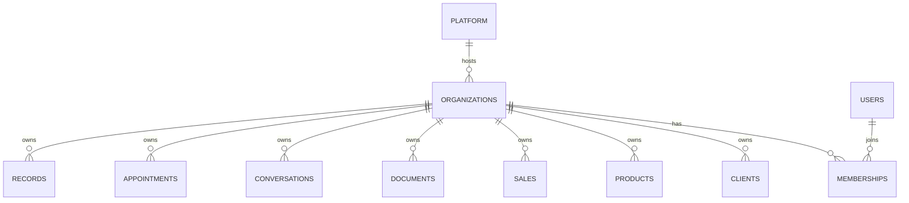
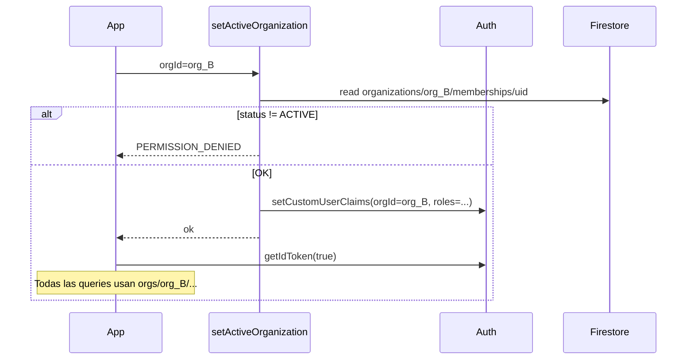

# NexoGo Platform — Multi-Tenant Architecture

> **Arquitectura SaaS multiempresa con aislamiento estricto por tenant.**  
> Fecha: 2026-09-18  
> Complementa: `ROLE_SYSTEM.md` · `MODULE_DESIGN.md` · `BUSINESS_PLATFORM_ARCHITECTURE.md` · `MASTER_ARCHITECTURE.md`  
> **Solo diseño; no modifica código.**

---

## 1. Objetivo

NexoGo opera como **SaaS multiempresa (multi-tenant)**:

- Cada **empresa** (`organization`) es un tenant.
- Los datos de **usuarios (membresías)**, **clientes**, **documentos**, **inventario**, **ventas** y **chat** están **completamente aislados** entre empresas.
- Ninguna query de negocio de la Empresa A puede leer/escribir datos de la Empresa B.
- `SUPER_ADMIN` de plataforma puede operar cross-tenant solo con controles y auditoría explícitos.

### 1.1 Principios de aislamiento

| Principio | Regla |
|-----------|--------|
| **Tenant en cada dato** | Todo documento de negocio vive bajo path o campo de empresa |
| **Empresa activa en token** | Claims llevan `orgId` de la sesión |
| **Deny by default** | Sin match de org → denegado |
| **Sin joins cross-tenant** | Prohibido referenciar IDs de otra empresa |
| **Storage namespaced** | Bytes solo bajo `orgs/{orgId}/...` |
| **Un Auth, muchas membresías** | `uid` global; aislamiento en membership + datos |

---

## 2. Modelo de tenancy

### 2.1 Entidades



| Entidad | Alcance | ¿Aislada por empresa? |
|---------|---------|------------------------|
| `users` (perfil Auth) | Global (uid) | Perfil mínimo global; **datos operativos no** |
| `memberships` | Por empresa | Sí |
| `clients` | Por empresa | Sí |
| `documents` | Por empresa | Sí |
| `products` / inventario | Por empresa | Sí |
| `sales` | Por empresa | Sí |
| `conversations` / chat | Por empresa | Sí |
| `organizations` | Plataforma | Registro del tenant |

### 2.2 Identificador de empresa

```
organizationId  // alias: orgId, empresaId
formato: "org_" + nanoid / UUID
```

Inmutable tras creación. Presente en:

- Path Firestore (modelo recomendado)
- Custom claims (`orgId`)
- Metadata de Storage
- Logs de auditoría

### 2.3 Estrategia de datos elegida: **Hierarchical Tenant Root**

Para aislamiento “completo” se adopta:

```
organizations/{orgId}/...subcolecciones de negocio...
```

**Por qué no solo root collections + campo `organizationId`:**

| Criterio | Root + campo | Jerárquico bajo `organizations/{orgId}` |
|----------|--------------|-------------------------------------------|
| Aislamiento mental/ops | Débil (fácil olvidar where) | Fuerte |
| Security Rules | Requiere chequear campo siempre | Path ya implica tenant |
| Storage alineado | Manual | 1:1 con path |
| Queries | Índice compuesto orgId+… | Scope natural al padre |
| Export/borrar tenant | Difícil | Borrado/export por subárbol |

El campo `organizationId` **también** se denormaliza dentro de cada documento (defensa en profundidad + exports).

---

## 3. Firestore

### 3.1 Árbol canónico

```
/ (root)
├── platform/                          # solo SUPER_ADMIN
│   ├── config/main
│   ├── plans/{planId}
│   └── audit_logs/{logId}
│
├── users/{uid}                        # perfil global mínimo
│   └── private/main                   # secrets de usuario (opcional)
│
├── organization_index/{orgId}         # índice liviano para listados plataforma
│
└── organizations/{orgId}              # TENANT ROOT
    ├── profile                        # doc o campos del org
    ├── settings/main
    ├── memberships/{uid}              # usuarios de ESTA empresa
    ├── roles/{roleId}                 # roles custom de la empresa
    ├── role_permissions/{roleCode}
    │
    ├── clients/{clientId}
    ├── contacts/{contactId}
    │
    ├── records/{recordId}
    ├── record_templates/{templateId}
    │
    ├── appointments/{appointmentId}
    ├── services/{serviceId}
    ├── staff_schedules/{scheduleId}
    │
    ├── products/{productId}
    ├── stock_movements/{movementId}
    ├── categories/{categoryId}
    │
    ├── sales/{saleId}
    │
    ├── conversations/{conversationId}
    │   └── messages/{messageId}
    │
    ├── documents/{documentId}         # metadatos
    │
    ├── opportunities/{opportunityId}
    ├── crm_activities/{activityId}
    ├── pipeline_stages/{stageId}
    │
    ├── dashboard_layouts/{userId}
    ├── dashboard_snapshots/{periodId}
    │
    └── audit_logs/{logId}             # auditoría de la empresa
```

### 3.2 Aislamiento de los dominios obligatorios

#### Usuarios (por empresa)

| Dato | Dónde | Aislamiento |
|------|-------|-------------|
| Identidad Auth | Firebase Auth `uid` | Global |
| Perfil display | `users/{uid}` | Global mínimo (nombre, email, photo) |
| Rol, status, scopes en empresa | `organizations/{orgId}/memberships/{uid}` | **Aislado** |
| Preferencias de módulo en empresa | p.ej. `dashboard_layouts/{uid}` bajo org | **Aislado** |

Regla: **no** guardar `clients`, ventas ni chat del tenant en `users/{uid}`.

Documento membership:

```json
{
  "userId": "uid_x",
  "organizationId": "org_abc",
  "roles": ["MANAGER"],
  "customRoleIds": [],
  "status": "ACTIVE",
  "scopes": { "type": "ORG", "branchIds": [] },
  "linkedClientId": null,
  "createdAt": "...",
  "updatedAt": "..."
}
```

#### Clientes

```
organizations/{orgId}/clients/{clientId}
organizations/{orgId}/contacts/{contactId}
```

IDs de cliente **no son globales**; el mismo `clientId` en dos orgs son entidades distintas (preferible generar IDs opacos por org).

#### Documentos

```
organizations/{orgId}/documents/{documentId}
```

```json
{
  "organizationId": "org_abc",
  "refType": "CLIENT" | "RECORD" | "SALE" | "CHAT" | "ORG",
  "refId": "...",
  "storagePath": "orgs/org_abc/documents/doc_1",
  "mimeType": "application/pdf",
  "name": "comprobante.pdf",
  "createdBy": "uid_x"
}
```

Prohibido: `storagePath` que no empiece por `orgs/{orgId}/`.

#### Inventario

```
organizations/{orgId}/products/{productId}
organizations/{orgId}/stock_movements/{movementId}
organizations/{orgId}/categories/{categoryId}
```

Movimientos siempre con `productId` del mismo `orgId`.

#### Ventas

```
organizations/{orgId}/sales/{saleId}
```

`clientId`, `productId`, `serviceId` deben existir bajo el mismo `organizations/{orgId}`.

#### Chat

```
organizations/{orgId}/conversations/{conversationId}
organizations/{orgId}/conversations/{conversationId}/messages/{messageId}
```

`participantIds` solo `uid` con membership ACTIVE en esa org.  
Prohibido crear conversación con participantes de otra empresa.

### 3.3 Datos de plataforma (no tenant)

| Path | Contenido | Quién |
|------|-----------|-------|
| `platform/**` | Planes, feature flags globales | SUPER_ADMIN |
| `users/{uid}` | Perfil global | Dueño + admin platform |
| `organization_index/{orgId}` | nombre, status, planId | SUPER_ADMIN / bootstrap |

### 3.4 Índices y queries

Todas las queries de negocio:

```
collection: organizations/{orgId}/clients
where: status == ACTIVE
orderBy: updatedAt
```

**Nunca:**

```
collectionGroup("clients").where(...) // sin filtro de org en rules + claim
```

Si se usan **collection group indexes** (p.ej. búsqueda soporte), rules deben exigir `isSuperAdmin()` o que `resource.data.organizationId == request.auth.token.orgId`.

### 3.5 Integridad referencial (soft)

Firestore no tiene FK. Contratos:

1. App/Functions validan que `clientId` ∈ misma org.  
2. Al archivar cliente: no borrar en cascada ciega; marcar referencias.  
3. Cloud Function `onWrite` puede rechazar inconsistencias críticas.  
4. Borrado de empresa = job de platform (ver §9).

### 3.6 Documento de empresa

```
organizations/{orgId}
```

```json
{
  "name": "Clínica Ejemplo",
  "status": "ACTIVE",
  "planId": "pro",
  "industryPacks": ["veterinary"],
  "createdAt": "...",
  "organizationId": "org_abc"
}
```

`settings/main` separa branding, horarios, policies.

---

## 4. Storage

### 4.1 Namespace obligatorio

```
orgs/{orgId}/
  ├── branding/
  │     logo.png
  ├── clients/{clientId}/
  │     profile/{fileName}
  │     gallery/{fileName}
  ├── records/{recordId}/
  │     files/{fileName}
  │     pdfs/{fileName}
  ├── sales/{saleId}/
  │     documents/{fileName}
  ├── chat/{conversationId}/
  │     files/{fileName}
  ├── products/{productId}/
  │     images/{fileName}
  └── documents/{documentId}/
        original
```

Bucket: el configurado en Firebase (`nexogo-….firebasestorage.app` u otro).  
**Un solo bucket**; el aislamiento es por **prefijo de path**, no por bucket por empresa (más simple y barato). Opción enterprise futura: bucket por plan — fuera de v1.

### 4.2 Reglas de path

| Regla | Detalle |
|-------|---------|
| Prefijo | Todo object path comienza con `orgs/{orgId}/` |
| Claim | `orgId` del token == segmento `{orgId}` del path |
| Metadatos | Custom metadata `organizationId`, `uploadedBy` |
| Tamaño/MIME | Validar en rules (`request.resource.size`, `contentType`) |
| Sin paths legacy | Prohibir `users/`, `patients/` sin org en diseños nuevos |

### 4.3 Relación Storage ↔ Firestore

1. Subir a Storage bajo path de org.  
2. Crear doc en `organizations/{orgId}/documents/{id}` con `storagePath`.  
3. Lectura: rules de Storage + opcional check de doc padre.  
4. Borrado: borrar object + doc (Function o transacción cliente con permisos).

### 4.4 Aislamiento de documentos / inventario / chat en Storage

| Dominio | Path | Quién lee |
|---------|------|-----------|
| Documentos genéricos | `orgs/{orgId}/documents/...` | Membership + permiso |
| Clientes | `orgs/{orgId}/clients/...` | Staff org / CLIENT own |
| Inventario (fotos producto) | `orgs/{orgId}/products/...` | Staff con inventory.read |
| Ventas (PDF) | `orgs/{orgId}/sales/...` | Staff / CLIENT own sale |
| Chat | `orgs/{orgId}/chat/{conversationId}/...` | Solo participantes + moderadores org |

---

## 5. Claims (Firebase Auth)

Alineado a `ROLE_SYSTEM.md`, reforzado para multi-tenant.

### 5.1 Claim de sesión (activo)

```json
{
  "platformRole": null,
  "orgId": "org_abc",
  "roles": ["ADMIN"],
  "scope": "ORG",
  "branches": [],
  "linkedClientId": null,
  "flags": {
    "approved": true,
    "suspended": false
  },
  "permsVersion": 12
}
```

| Campo | Rol en aislamiento |
|-------|-------------------|
| `orgId` | **Única empresa** cuyos paths puede tocar en esta sesión |
| `roles` | Autorización dentro de esa empresa |
| `flags.approved` | Membership usable |
| `flags.suspended` | Kill switch rápido |
| `platformRole` | Solo `SUPER_ADMIN` bypass controlado |

### 5.2 Cambio de empresa



Tras el switch, la app **debe** invalidar caches locales del org anterior.

### 5.3 Lista de empresas del usuario

No va en claims (tamaño). Query:

```
collectionGroup("memberships")
  .where("userId", "==", uid)
  .where("status", "==", "ACTIVE")
```

O índice inverso:

```
users/{uid}/org_memberships/{orgId}  // espejo liviano
```

Rules del espejo: solo el dueño lee; escribe solo Admin SDK / Functions.

### 5.4 SUPER_ADMIN

```json
{
  "platformRole": "SUPER_ADMIN",
  "orgId": null,
  "roles": [],
  "flags": { "approved": true, "suspended": false }
}
```

Para operar una empresa: debe llamar `setActiveOrganization` (soport mode) que setea `orgId` **y** escribe `audit_logs` de impersonación/soporte.

---

## 6. Seguridad

### 6.1 Capas de defensa

```
1. Firebase Auth (identidad)
2. Custom claims (org activa + roles + flags)
3. Firestore / Storage Security Rules (path + orgId + rol)
4. App gates (módulos / permisos)
5. Cloud Functions (operaciones privilegiadas)
6. Audit logs
```

Ninguna capa sola es suficiente.

### 6.2 Firestore Rules — patrón tenant

```
rules_version = '2';
service cloud.firestore {
  match /databases/{database}/documents {

    function isSignedIn() {
      return request.auth != null;
    }

    function isSuperAdmin() {
      return isSignedIn()
        && request.auth.token.platformRole == 'SUPER_ADMIN';
    }

    function claimOrg() {
      return request.auth.token.orgId;
    }

    function isApprovedMember() {
      return isSignedIn()
        && request.auth.token.flags.approved == true
        && request.auth.token.flags.suspended != true
        && claimOrg() != null;
    }

    function isMemberOf(orgId) {
      return isApprovedMember() && claimOrg() == orgId;
    }

    function hasRole(role) {
      return role in request.auth.token.roles;
    }

    function isStaff() {
      return hasRole('ADMIN') || hasRole('MANAGER') || hasRole('EMPLOYEE');
    }

    function isClient() {
      return hasRole('CLIENT');
    }

    // Perfil global
    match /users/{uid} {
      allow read: if isSignedIn() && (request.auth.uid == uid || isSuperAdmin());
      allow write: if isSignedIn() && request.auth.uid == uid;
    }

    // Índice plataforma
    match /organization_index/{orgId} {
      allow read: if isSuperAdmin();
      allow write: if isSuperAdmin();
    }

    match /platform/{document=**} {
      allow read, write: if isSuperAdmin();
    }

    // ========== TENANT ROOT ==========
    match /organizations/{orgId} {
      allow read: if isMemberOf(orgId) || isSuperAdmin();
      allow create: if isSuperAdmin();
      allow update: if isSuperAdmin()
        || (isMemberOf(orgId) && hasRole('ADMIN'));
      allow delete: if isSuperAdmin();

      match /memberships/{memberId} {
        allow read: if isMemberOf(orgId)
          && (isStaff() || request.auth.uid == memberId);
        allow write: if isSuperAdmin()
          || (isMemberOf(orgId) && hasRole('ADMIN'));
      }

      match /clients/{clientId} {
        allow read: if isMemberOf(orgId) && (
          isStaff()
          || (isClient()
              && clientId == request.auth.token.linkedClientId)
        );
        allow create, update: if isMemberOf(orgId) && isStaff();
        allow delete: if isMemberOf(orgId)
          && (hasRole('ADMIN') || hasRole('MANAGER'));
      }

      match /products/{productId} {
        allow read: if isMemberOf(orgId) && isStaff();
        allow write: if isMemberOf(orgId)
          && (hasRole('ADMIN') || hasRole('MANAGER'));
      }

      match /stock_movements/{id} {
        allow read: if isMemberOf(orgId) && isStaff();
        allow create: if isMemberOf(orgId) && isStaff();
        allow update, delete: if isMemberOf(orgId) && hasRole('ADMIN');
      }

      match /sales/{saleId} {
        allow read: if isMemberOf(orgId) && (
          isStaff()
          || (isClient()
              && resource.data.clientId == request.auth.token.linkedClientId)
        );
        allow create, update: if isMemberOf(orgId) && isStaff();
        allow delete: if isMemberOf(orgId)
          && (hasRole('ADMIN') || hasRole('MANAGER'));
      }

      match /documents/{docId} {
        allow read: if isMemberOf(orgId) && (
          isStaff()
          || (isClient() && resource.data.visibility == 'CLIENT_OWN'
              && resource.data.ownerClientId
                 == request.auth.token.linkedClientId)
        );
        allow create: if isMemberOf(orgId)
          && (isStaff() || isClient());
        allow update, delete: if isMemberOf(orgId)
          && (hasRole('ADMIN') || hasRole('MANAGER'));
      }

      match /conversations/{conversationId} {
        allow read, update: if isMemberOf(orgId)
          && request.auth.uid in resource.data.participantIds;
        allow create: if isMemberOf(orgId)
          && request.auth.uid in request.resource.data.participantIds
          && request.resource.data.organizationId == orgId;
        allow delete: if isMemberOf(orgId) && hasRole('ADMIN');

        match /messages/{messageId} {
          allow read, create: if isMemberOf(orgId)
            && request.auth.uid in
               get(/databases/$(database)/documents/organizations/$(orgId)/conversations/$(conversationId))
                 .data.participantIds;
          allow delete: if isMemberOf(orgId) && hasRole('ADMIN');
        }
      }

      // Catch-all tenant: staff read; writes más específicas arriba
      match /{sub=**} {
        allow read: if isMemberOf(orgId) && isStaff();
        allow write: if false; // forzar matches explícitos en producción
      }
    }
  }
}
```

> El bloque final `allow write: if false` fuerza declarar cada colección; en desarrollo puede abrirse a `isMemberOf && isStaff` con riesgo controlado.

### 6.3 Storage Rules — patrón tenant

```
rules_version = '2';
service firebase.storage {
  match /b/{bucket}/o {

    function isSignedIn() {
      return request.auth != null;
    }

    function isApproved() {
      return isSignedIn()
        && request.auth.token.flags.approved == true
        && request.auth.token.flags.suspended != true;
    }

    function claimOrg() {
      return request.auth.token.orgId;
    }

    function isMemberOf(orgId) {
      return isApproved() && claimOrg() == orgId;
    }

    function isStaff() {
      return 'ADMIN' in request.auth.token.roles
        || 'MANAGER' in request.auth.token.roles
        || 'EMPLOYEE' in request.auth.token.roles;
    }

    function validUpload() {
      return request.resource.size < 25 * 1024 * 1024
        && request.resource.contentType.matches('image/.*|application/pdf|audio/.*|video/.*|text/.*');
    }

    match /orgs/{orgId}/{allPaths=**} {
      allow read: if isMemberOf(orgId);
      allow write: if isMemberOf(orgId)
        && isStaff()
        && validUpload();
    }

    // Chat más restrictivo (participantes) — idealmente validar vía metadata
    match /orgs/{orgId}/chat/{conversationId}/{fileName} {
      allow read: if isMemberOf(orgId);
      allow write: if isMemberOf(orgId) && validUpload();
    }
  }
}
```

Refinar chat/client own con metadata `participantIds` / `linkedClientId` en objects cuando haga falta.

### 6.4 Invariantes de seguridad (checklist)

| # | Invariante |
|---|------------|
| 1 | No existe lectura de `organizations/{orgA}/**` con claim `orgId=orgB` |
| 2 | Membership de orgA no otorga paths de orgB |
| 3 | `CLIENT` solo recursos con su `linkedClientId` |
| 4 | Storage fuera de `orgs/{orgId}/` denegado para miembros |
| 5 | Claims solo los escribe Admin SDK |
| 6 | Suspender membership invalida acceso aunque el token viejo exista (flags + reglas + TTL corto) |
| 7 | Collection group queries protegidas |
| 8 | Export de empresa solo SUPER_ADMIN o ADMIN de esa org |
| 9 | Chat no admite participantes sin membership de la misma org |
| 10 | IDs de otras orgs en campos FK → rechazo en Function |

### 6.5 Amenazas multi-tenant

| Amenaza | Mitigación |
|---------|------------|
| IDOR cambiando `orgId` en request | Path rules + claim inmutable hasta refresh |
| Enumeración de `orgId` | IDs no secuenciales; index no público |
| Token robado | Sesión corta, suspend flag, revoke refresh |
| Empleado copia datos a otra org | Audit + DLP futuro; no hay write cross-path |
| SUPER_ADMIN malicioso | Dual control + audit obligatorio |
| Reglas legacy `allow if true` | Prohibidas en producción (ver estado actual del repo) |
| App olvida filtrar org | Rules siguen denegando |

---

## 7. Ciclo de vida del tenant

### 7.1 Provisioning

1. `SUPER_ADMIN` / signup business crea `organizations/{orgId}` + `organization_index`.  
2. Crea `settings/main`, categorías default, pipeline default.  
3. Crea membership `ADMIN` para el owner.  
4. `setCustomUserClaims` con `orgId` + `roles: ["ADMIN"]`.  
5. (Opcional) seed de `services` / `record_templates` del pack.

### 7.2 Invitación de usuarios

1. ADMIN invita email → membership `INVITED`/`PENDING`.  
2. Usuario acepta / ADMIN aprueba → `ACTIVE`.  
3. Claims solo si esa org es la activa.

### 7.3 Suspensión

- `organizations/{orgId}.status = SUSPENDED`  
- Functions: no refrescar claims; al login forzar logout de esa org  
- Rules: `isMemberOf` puede exigir org status ACTIVE vía `get(organizations/orgId)`

### 7.4 Offboarding / borrado

Job asíncrono:

1. Marcar org `DELETED`.  
2. Borrar/archivar Storage prefix `orgs/{orgId}/`.  
3. Borrar subárbol Firestore (batched).  
4. Anular memberships y claims de usuarios que solo tenían esa org.  
5. Audit trail en `platform/audit_logs`.

---

## 8. Capas de aplicación (contrato)

```
App
 ├─ TenantContext (orgId activo, roles, permsVersion)
 ├─ Repositories obligados a recibir orgId
 │    clientsRepo.list(orgId)
 │    salesRepo.create(orgId, sale)
 │    storage.upload(orgId, path, bytes)
 └─ Prohibido: Firebase paths sin orgId
```

Tests de aceptación multi-tenant:

1. Usuario orgA no lista clients de orgB.  
2. Switch org refresca token y datos.  
3. Upload a `orgs/orgB/...` con claim orgA → fail.  
4. CLIENT orgA no lee sale de otro clientId.  
5. Chat create con participant de otra org → fail.

---

## 9. Mapa de aislamiento por dominio (resumen)

| Dominio | Firestore | Storage | Claim / Rule clave |
|---------|-----------|---------|---------------------|
| Usuarios empresa | `organizations/{orgId}/memberships` | — | `isMemberOf` + ADMIN manage |
| Clientes | `.../clients`, `contacts` | `orgs/{orgId}/clients/**` | staff vs `linkedClientId` |
| Documentos | `.../documents` | `orgs/{orgId}/documents/**` (+ refs) | org + visibility |
| Inventario | `.../products`, `stock_movements` | `orgs/{orgId}/products/**` | staff only |
| Ventas | `.../sales` | `orgs/{orgId}/sales/**` | staff / own client |
| Chat | `.../conversations/messages` | `orgs/{orgId}/chat/**` | participants ⊆ org |

---

## 10. Relación con el código actual

Estado hoy (`MASTER_ARCHITECTURE.md`): colecciones planas (`usuarios`, `citas`, `patients`, …) **sin** `organizationId` ni árbol por empresa.

| Legacy | Destino multi-tenant |
|--------|----------------------|
| `usuarios` / `users` | `users/{uid}` + `organizations/{orgId}/memberships/{uid}` |
| `clients` / patients | `organizations/{orgId}/clients` |
| Storage `users/`, `patients/` | `orgs/{orgId}/...` |
| Claims inexistentes / rol en doc | Claims `orgId` + roles |
| Rules permissivas / dual ES-EN | Rules por path de tenant |

Este documento define el **target SaaS**; la migración será un proyecto aparte.

---

## 11. Criterios de aceptación SaaS

1. Dos empresas provisionadas no comparten ningún documento de clientes, inventario, ventas, chat ni documentos.  
2. El mismo `uid` puede ser ADMIN en A y EMPLOYEE en B sin fuga de datos.  
3. Storage solo accesible bajo `orgs/{activeOrgId}/`.  
4. Claims sin `orgId` no permiten leer `organizations/**` de negocio.  
5. SUPER_ADMIN deja rastro en audit al entrar a un tenant.  
6. Borrado/suspensión de empresa corta el acceso efectivamente.  
7. No hay rules de emergencia `allow if true` en producción.

---

## 12. Documentos relacionados

| Documento | Uso |
|-----------|-----|
| `ROLE_SYSTEM.md` | Roles, permisos, claims detallados |
| `MODULE_DESIGN.md` | Módulos y colecciones lógicas |
| `BUSINESS_PLATFORM_ARCHITECTURE.md` | Visión multiindustria |
| `MASTER_ARCHITECTURE.md` | Código actual (pre-SaaS) |
| **`MULTITENANT_ARCHITECTURE.md`** | Aislamiento Firestore / Storage / Claims / Seguridad |

---

*Fin de MULTITENANT_ARCHITECTURE.md — arquitectura SaaS multiempresa de NexoGo Platform.*
