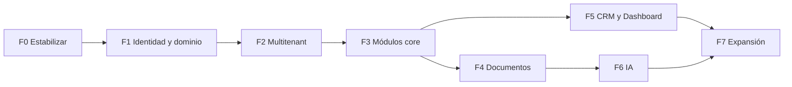

# NexoGo Platform — Roadmap 2026–2027

> **Plan estratégico** (sin implementación de código en este documento).  
> Fecha: 2026-09-18  
> Fuentes:  
> `MASTER_ARCHITECTURE.md` · `BUSINESS_PLATFORM_ARCHITECTURE.md` · `MODULE_DESIGN.md` ·  
> `ROLE_SYSTEM.md` · `MULTITENANT_ARCHITECTURE.md` · `DOCUMENT_MANAGEMENT.md` · `AI_MODULE.md`

---

## 1. Propósito

Convertir NexoGo de **app veterinaria monolítica con deuda técnica** en **plataforma SaaS multiempresa multiindustria**, con módulos core, IAM empresarial, Documentos e IA — en fases financiables y dependientes entre sí.

### 1.1 Norte del periodo

| Horizonte | Resultado de negocio |
|-----------|----------------------|
| Fin 2026 | Base estable: auth unificado, lenguaje Clientes/Expedientes, primer tenant real |
| 1H 2027 | SaaS usable: multiempresa + módulos core operativos + Documentos v1 |
| 2H 2027 | Diferenciación: CRM/Dashboard maduros + IA v1/v2 + segundo vertical |

### 1.2 Leyenda

**Prioridad**

| Código | Significado |
|--------|-------------|
| P0 | Bloqueante / cimiento |
| P1 | Crítico para SaaS vendible |
| P2 | Alto valor, puede esperar al cimiento |
| P3 | Diferenciador / expansión |

**Complejidad**

| Código | Significado | Esfuerzo relativo |
|--------|-------------|-------------------|
| S | Pequeña | ~1–2 semanas |
| M | Media | ~3–5 semanas |
| L | Grande | ~6–10 semanas |
| XL | Muy grande | ~11–16+ semanas |

**Duración:** calendario estimado con equipo pequeño (1–3 ingenieros + producto). Ajustar × paralelismo.

---

## 2. Mapa de fases (visión)



| Fase | Nombre | Ventana sugerida |
|------|--------|------------------|
| **F0** | Estabilización del producto actual | Oct – Nov 2026 |
| **F1** | Identidad, roles y renombre de dominio | Nov 2026 – Ene 2027 |
| **F2** | Arquitectura SaaS multiempresa | Ene – Mar 2027 |
| **F3** | Módulos core (Clientes → Chat) | Mar – Jun 2027 |
| **F4** | Documentos empresarial | May – Jul 2027 |
| **F5** | CRM + Dashboard | Jun – Ago 2027 |
| **F6** | Módulo IA (OpenAI) | Ago – Nov 2027 |
| **F7** | Expansión vertical y enterprise | Oct 2027 – Dic 2027 |

Las ventanas se solapan a propósito (F3/F4/F5) cuando las dependencias lo permiten.

---

## 3. Fase 0 — Estabilización (base del código actual)

**Objetivo:** dejar de pelear con crashes, duplicados y flujos ambiguos descritos en `MASTER_ARCHITECTURE.md`, sin aún rediseñar SaaS.

| ID | Iniciativa | Prioridad | Complejidad | Dependencias | Duración |
|----|------------|-----------|-------------|--------------|----------|
| F0.1 | Congelar flujo activo oficial (Splash → SimpleLogin → Home) y documentar en release notes | P0 | S | — | 1 sem |
| F0.2 | Quitar diagnósticos/mock data del cold start de producción | P0 | S | F0.1 | 1 sem |
| F0.3 | Inventario de pantallas/ViewModels/repos muertos vs vivos (basado en Master) | P0 | M | F0.1 | 2 sem |
| F0.4 | Unificar entrada de Auth (un ViewModel + un AuthRepository en el camino vivo) | P0 | M | F0.3 | 3 sem |
| F0.5 | Google Sign-In operativo (OAuth + Web Client ID) *o* decisión explícita de diferir | P1 | M | F0.4 | 2–3 sem |
| F0.6 | Completar Ventas lista (hoy stub) al nivel mínimo usable | P1 | M | F0.3 | 3 sem |
| F0.7 | Pacientes: dejar de depender solo de DataStore; plan de persistencia cloud | P1 | M | F0.3 | 2 sem |
| F0.8 | Rules Firestore/Storage: eliminar variantes de emergencia del camino prod | P0 | M | — | 2 sem |
| F0.9 | Suite mínima de pruebas de humo (login, citas, inventario) | P1 | M | F0.1–F0.4 | 3 sem |

**Salida de fase:** app usable en un solo “modo clínica” sin ruido de debug; deuda catalogada; auth predecible.

**Riesgo si se salta:** multi-tenant e IA se construyen sobre arena movediza.

---

## 4. Fase 1 — Identidad, roles y lenguaje de plataforma

**Objetivo:** alinear producto a `BUSINESS_PLATFORM_ARCHITECTURE.md` + `ROLE_SYSTEM.md` (aún single-tenant o “una org implícita”).

| ID | Iniciativa | Prioridad | Complejidad | Dependencias | Duración |
|----|------------|-----------|-------------|--------------|----------|
| F1.1 | Renombre de producto UX: Pacientes → **Clientes**, Historial → **Expedientes**, Citas → **Agenda** | P0 | M | F0.3 | 3 sem |
| F1.2 | Unificar enum/modelo de roles hacia base `ADMIN/MANAGER/EMPLOYEE/CLIENT` (+ map legacy vet) | P0 | L | F0.4 | 5–6 sem |
| F1.3 | Diseño e implementación de **permissions catalog** + bundles por rol | P0 | L | F1.2 | 4–5 sem |
| F1.4 | Custom claims Firebase (org placeholder + roles + flags) | P0 | M | F1.2 | 3 sem |
| F1.5 | Membership + aprobación de usuarios alineada a estados (PENDING/ACTIVE/…) | P1 | M | F1.2, F1.4 | 3 sem |
| F1.6 | Roles personalizados (modelo datos + UI admin) — MVP | P2 | L | F1.3, F1.4 | 5 sem |
| F1.7 | Unificar colecciones `users`/`usuarios` y campos ES/EN | P0 | L | F1.2 | 4–6 sem |
| F1.8 | Gates de navegación por permiso/módulo | P1 | M | F1.3 | 2–3 sem |

**Salida de fase:** lenguaje de plataforma en UI; IAM coherente; claims listos para enganchar tenancy.

**Dependencia externa de docs:** `ROLE_SYSTEM.md`, `BUSINESS_PLATFORM_ARCHITECTURE.md`.

---

## 5. Fase 2 — SaaS multiempresa

**Objetivo:** isolation real según `MULTITENANT_ARCHITECTURE.md`.

| ID | Iniciativa | Prioridad | Complejidad | Dependencias | Duración |
|----|------------|-----------|-------------|--------------|----------|
| F2.1 | Provisioning de `organizations` + `organization_index` + settings | P0 | M | F1.4 | 3 sem |
| F2.2 | Migración de datos a árbol `organizations/{orgId}/…` (o dual-write) | P0 | XL | F1.7, F2.1 | 10–14 sem |
| F2.3 | Storage bajo `orgs/{orgId}/…` + migración de paths | P0 | L | F2.1 | 6–8 sem |
| F2.4 | `setActiveOrganization` + refresh claims + switcher UI | P0 | M | F1.4, F2.1 | 3–4 sem |
| F2.5 | Security Rules reescritas por path de tenant (deny-by-default) | P0 | L | F2.2, F2.3 | 5–6 sem |
| F2.6 | Memberships por empresa; multi-org mismo uid | P0 | L | F2.1, F1.5 | 5 sem |
| F2.7 | Suspensión / borrado de tenant (jobs) | P1 | M | F2.2, F2.3 | 3–4 sem |
| F2.8 | Tests de fuga cross-tenant (automáticos) | P0 | M | F2.5 | 2–3 sem |
| F2.9 | SUPER_ADMIN plataforma + audit de soporte | P1 | M | F1.2, F2.1 | 3 sem |

**Salida de fase:** dos empresas reales sin datos cruzados; usuarios con membresías distintas.

**Nota:** F2.2 es el ítem más largo del roadmap; puede ir en oleadas (Clientes → Agenda → Ventas → resto).

---

## 6. Fase 3 — Módulos core de plataforma

**Objetivo:** materializar `MODULE_DESIGN.md` sobre tenancy.

| ID | Iniciativa | Prioridad | Complejidad | Dependencias | Duración |
|----|------------|-----------|-------------|--------------|----------|
| F3.1 | **Clientes** (+ Contactos, vista 360° básica) | P0 | L | F2.2 (clients), F1.1 | 6–8 sem |
| F3.2 | **Expedientes** unificados (fusionar history/clinical/medical) | P0 | XL | F3.1 | 10–12 sem |
| F3.3 | **Agenda** (appointments unificados, estados, atajos a expediente/venta) | P0 | L | F3.1 | 6–8 sem |
| F3.4 | **Inventario** (productos, movimientos, alertas) endurecido multi-tenant | P1 | L | F2.2 | 5–7 sem |
| F3.5 | **Ventas** ciclo completo (lista, cobro, descuento stock, PDF mínimo) | P0 | L | F3.1, F3.4 | 7–9 sem |
| F3.6 | **Chat** contextual (link Cliente/Cita) + participantes solo de la org | P1 | L | F2.6, F3.1 | 6–8 sem |
| F3.7 | **Configuración** org (branding, horarios, categorías, packs flag) | P1 | M | F2.1 | 4 sem |
| F3.8 | Catálogo **Services** separado y usado por Agenda/Ventas | P1 | M | F3.3, F3.5 | 3–4 sem |
| F3.9 | Pack vertical **Veterinaria** como extensión (no core) | P1 | L | F3.1–F3.3 | 6 sem |
| F3.10 | Limpieza de módulos/pantallas legacy post-corte | P2 | M | F3.1–F3.6 | 3–4 sem |

**Salida de fase:** operación diaria completa por empresa en los 6 módulos de negocio + config.

**Paralelismo posible:** F3.4 Inventario ∥ F3.3 Agenda tras F3.1; Chat tras multi-org estable.

---

## 7. Fase 4 — Documentos

**Objetivo:** `DOCUMENT_MANAGEMENT.md` v1 (y bases de v2).

| ID | Iniciativa | Prioridad | Complejidad | Dependencias | Duración |
|----|------------|-----------|-------------|--------------|----------|
| F4.1 | Metadatos Document + Version + Storage versionado | P0 | L | F2.3, F3.1 | 5–6 sem |
| F4.2 | Carpetas (árbol + ancladas a entidad) | P0 | M | F4.1 | 3–4 sem |
| F4.3 | Etiquetas | P1 | S | F4.1 | 1–2 sem |
| F4.4 | Links a Clientes / Expedientes / Ventas / Empleados | P0 | M | F4.1, F3.1–F3.5 | 3–4 sem |
| F4.5 | Upload PDF / Word / Excel / Imágenes + validación MIME | P0 | M | F4.1 | 3 sem |
| F4.6 | Generadores: PDF Expediente + comprobante Venta → Documentos | P1 | L | F4.4, F3.2, F3.5 | 5–6 sem |
| F4.7 | UI Biblioteca + widgets en fichas | P1 | M | F4.2–F4.5 | 4 sem |
| F4.8 | Permisos `documents.*` + sharing CLIENT | P1 | M | F1.3, F4.4 | 3 sem |
| F4.9 | Papelera + retención (v2 early) | P2 | M | F4.1 | 2–3 sem |

**Salida de fase:** repositorio documental por empresa, versionado y vinculado.

**Bloquea:** IA (F6) de forma dura — sin corpus documental indexable la IA no aporta.

---

## 8. Fase 5 — CRM y Dashboard

**Objetivo:** módulos #8 y #9 de `MODULE_DESIGN.md`.

| ID | Iniciativa | Prioridad | Complejidad | Dependencias | Duración |
|----|------------|-----------|-------------|--------------|----------|
| F5.1 | CRM: oportunidades + etapas + actividades | P1 | L | F3.1, F3.7 | 6–8 sem |
| F5.2 | Integración CRM → Ventas (cerrar oportunidad) | P2 | M | F5.1, F3.5 | 2–3 sem |
| F5.3 | Dashboard KPIs core (citas, ventas, stock, clientes) | P1 | M | F3.1–F3.5 | 4–5 sem |
| F5.4 | Dashboard por rol (staff vs CLIENT home) | P1 | M | F1.8, F5.3 | 2–3 sem |
| F5.5 | Widgets de pack vertical (vet) | P2 | M | F3.9, F5.3 | 3 sem |
| F5.6 | Reportes (reemplazar placeholders actuales) | P2 | L | F5.3 | 5–7 sem |

**Salida de fase:** dirección de negocio y seguimiento comercial por empresa.

---

## 9. Fase 6 — Inteligencia Artificial

**Objetivo:** `AI_MODULE.md` — OpenAI solo en backend, RAG multi-tenant.

| ID | Iniciativa | Prioridad | Complejidad | Dependencias | Duración |
|----|------------|-----------|-------------|--------------|----------|
| F6.1 | AI Orchestrator + Secret Manager + metering | P1 | L | F2.5, F1.3 | 5–6 sem |
| F6.2 | Ingestión / parse / chunking / embeddings por org | P1 | XL | F4.1, F6.1 | 8–10 sem |
| F6.3 | `summarize` + `extract` (schemas base) | P1 | L | F6.2 | 4–5 sem |
| F6.4 | `search` semántico tenant-scoped | P1 | L | F6.2 | 4 sem |
| F6.5 | `doc_chat` con citations | P1 | L | F6.2, F6.4 | 5–6 sem |
| F6.6 | Cuotas por plan + UI uso | P1 | M | F6.1 | 2–3 sem |
| F6.7 | ACL: IA no bypasea Documentos | P0 | M | F4.8, F6.2 | 2 sem |
| F6.8 | OCR imágenes / Excel rico (v2) | P2 | L | F6.2 | 5–6 sem |
| F6.9 | BYOK por empresa (v2/v3) | P3 | M | F6.1, F2.1 | 3–4 sem |
| F6.10 | Tool calling con confirmación humana (CRM/Expediente) | P3 | L | F5.1, F6.5 | 6 sem |

**Salida de fase:** IA v1 en producción con cuotas; v2 iniciado en Q4 2027.

---

## 10. Fase 7 — Expansión 2027 (cierre de año)

**Objetivo:** multiindustria y endurecimiento enterprise.

| ID | Iniciativa | Prioridad | Complejidad | Dependencias | Duración |
|----|------------|-----------|-------------|--------------|----------|
| F7.1 | Segundo pack vertical (p.ej. clínica humana o estética) | P2 | XL | F3.9, F3.1–F3.3 | 10–12 sem |
| F7.2 | Multi-sede / scopes BRANCH (`ROLE_SYSTEM`) | P2 | L | F2.6 | 6–8 sem |
| F7.3 | Auditoría integral + exportaciones de cumplimiento | P2 | M | F2.9 | 4 sem |
| F7.4 | Consola web admin (lectura/ops) — opcional | P3 | XL | F2, F3 | 12+ sem |
| F7.5 | Billing SaaS (planes Free/Pro/Business) | P2 | L | F2.1, F6.6 | 6–8 sem |
| F7.6 | Hardening seguridad (penetração ligera, rules review, DLP logs IA) | P1 | M | F2.5, F6.7 | 3–4 sem |

**Salida de fase:** plataforma creíble como SaaS multiindustria; lista para 2028 (web, más verticales, marketplace de packs).

---

## 11. Vista por trimestre

### 2026 Q4 (Oct–Dic)

- F0 completa  
- F1 en curso (renombres + roles + claims)  
- Arranque F2.1 (modelo org)  
**Hito:** “NexoGo Platform Preview” — una empresa, lenguaje nuevo, auth sólido  

### 2027 Q1 (Ene–Mar)

- F1 cierre  
- F2 núcleo (migración oleada 1–2, rules, switch org)  
**Hito:** “Multi-tenant Alpha” — dos orgs en staging sin fuga  

### 2027 Q2 (Abr–Jun)

- F2 cierre oleadas críticas  
- F3 Clientes, Agenda, Expedientes, Ventas/Inventario  
- Inicio F4 Documentos  
**Hito:** “Core Ops Beta” — operación diaria multiempresa  

### 2027 Q3 (Jul–Sep)

- F4 Documentos v1  
- F5 CRM + Dashboard  
- Inicio F6 (orchestrator + ingestión)  
**Hito:** “Business Suite” — docs + CRM + KPIs  

### 2027 Q4 (Oct–Dic)

- F6 IA v1 (summarize/extract/search/chat)  
- F7 billing + hardening + kickoff 2º vertical  
**Hito:** “AI-Assisted SaaS” — diferenciador en mercado  

---

## 12. Dependencias críticas (cadena)

```
Estabilizar Auth (F0)
  → Roles + Claims (F1)
    → Organizations + Rules (F2)
      → Clientes (F3.1)
        → Expedientes + Agenda + Ventas (F3)
          → Documentos (F4)
            → Embeddings + IA (F6)
      → CRM/Dashboard (F5)  [tras Clientes/Ventas]
```

**No iniciar F6 sin F4 + F2.5.**  
**No vender multiempresa sin F2.8 (tests de fuga).**

---

## 13. Matriz consolidada (épicas P0/P1)

| Épica | Fase | Prioridad | Complejidad | Duración est. | Depende de |
|-------|------|-----------|-------------|---------------|------------|
| Flujo y auth estables | F0 | P0 | M–L | 6–8 sem | — |
| Renombre dominio UX | F1 | P0 | M | 3 sem | F0 |
| IAM roles + claims | F1 | P0 | L | 8–10 sem | F0 auth |
| Multitenant data+rules | F2 | P0 | XL | 14–18 sem | F1 |
| Clientes | F3 | P0 | L | 6–8 sem | F2 |
| Expedientes | F3 | P0 | XL | 10–12 sem | Clientes |
| Agenda | F3 | P0 | L | 6–8 sem | Clientes |
| Ventas E2E | F3 | P0 | L | 7–9 sem | Clientes, Inventario |
| Documentos v1 | F4 | P0–P1 | L | 10–12 sem | F2 Storage, Clientes |
| Dashboard KPIs | F5 | P1 | M | 4–5 sem | Core módulos |
| CRM MVP | F5 | P1 | L | 6–8 sem | Clientes |
| IA v1 | F6 | P1 | XL | 14–18 sem | Documentos, Multitenant |
| 2º vertical | F7 | P2 | XL | 10–12 sem | Pack vet + core |

---

## 14. Capacidad y supuestos de planning

| Supuesto | Valor |
|----------|-------|
| Equipo | 2–3 devs Android/Firebase + 0.5 producto |
| Paralelismo | Máx. 2 frentes P0 a la vez |
| Holidays / imprevistos | Buffer 15–20% por fase |
| Migración datos | Puede dictar el ritmo de F2/F3 más que features nuevas |
| OpenAI | Costos operativos post-F6 (ver `AI_MODULE.md`); BYOK en F7 |

Si el equipo es 1 FTE: multiplicar duraciones ×1.6–2 y deslizar IA a 2028 H1.

---

## 15. Criterios de éxito por año

### Fin de 2026

- [ ] Un solo flujo de auth en producción  
- [ ] UI habla Clientes / Expedientes / Agenda  
- [ ] Roles base implementados (aunque sea single-org)  
- [ ] Claims con `orgId` placeholder  
- [ ] Sin rules de emergencia en prod  

### Fin de 2027

- [ ] ≥2 empresas reales aisladas en producción  
- [ ] Módulos: Clientes, Expedientes, Agenda, Inventario, Ventas, Chat, Documentos, Config  
- [ ] CRM + Dashboard operativos  
- [ ] IA: resumir, extraer, buscar, chat con citations  
- [ ] Pack Veterinaria como vertical; segundo pack en beta  
- [ ] Billing o cuotas IA por plan  

---

## 16. Fuera de alcance explícito 2026–2027 (salvo pull de mercado)

- Marketplace de packs de terceros  
- App iOS nativa  
- Firma electrónica certificada avanzada  
- ERP contable completo  
- Offline-first total  
- Sustitución de Firebase por backend propio  

---

## 17. Gobernanza del roadmap

1. **Fuente de verdad técnica actual:** `MASTER_ARCHITECTURE.md` (actualizar en cada corte de flujo).  
2. **Fuente de verdad de producto:** docs de arquitectura Platform (Business, Module, Role, Multitenant, Documents, AI).  
3. Cada fase termina con: demo, checklist de aceptación del doc correspondiente, y actualización de Master.  
4. Cambios de prioridad: solo con impacto en la cadena de dependencias §12.

---

## 18. Resumen ejecutivo

NexoGo 2026–2027 es un programa en **ocho fases**: estabilizar lo existente → identidad/roles → multiempresa → módulos core → documentos → CRM/dashboard → IA → expansión.  

La ruta crítica es **Auth → IAM/Claims → Tenant isolation → Clientes → Documentos → IA**. Todo lo demás (CRM, segundo vertical, BYOK, web admin) se engancha cuando esa espina dorsal está sólida.

---

*Fin de ROADMAP_2026_2027.md — plan estratégico NexoGo Platform.*
