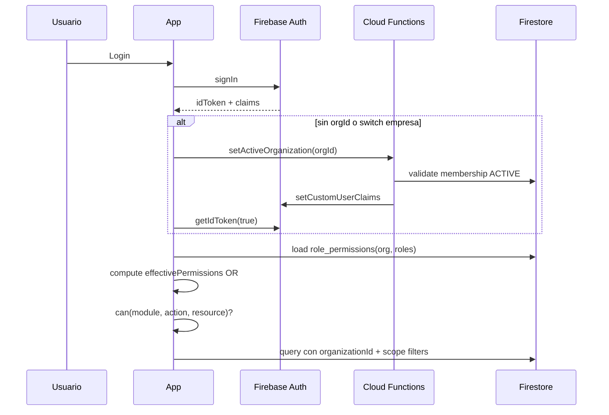

# NexoGo Platform — Role System

> **Arquitectura empresarial de roles, permisos y claims.**  
> Fecha: 2026-09-18  
> Complementa: `MODULE_DESIGN.md` · `BUSINESS_PLATFORM_ARCHITECTURE.md` · `MASTER_ARCHITECTURE.md`  
> **Solo diseño; no modifica código.**

---

## 1. Visión

El sistema de acceso de NexoGo Platform se basa en:

1. **Roles base** (fijos de plataforma)  
2. **Roles personalizados** (por empresa / organización)  
3. **Permisos atómicos** (`módulo.recurso.acción`)  
4. **Claims Firebase Auth** (autorización en cliente + Security Rules)  
5. **Membresía por empresa** (un usuario puede pertenecer a N empresas)

Principio rector:

> El **rol** es un conjunto nombrado de permisos.  
> La **autorización real** se evalúa por **permisos + empresa activa + alcance (scope)**.  
> Los roles base no se borran; los personalizados solo existen dentro de una empresa.

### 1.1 Mapeo desde diseño modular previo

| Rol en `MODULE_DESIGN.md` | Rol base en este documento |
|---------------------------|----------------------------|
| *(nuevo — plataforma)* | `SUPER_ADMIN` |
| `ORG_ADMIN` | `ADMIN` |
| `STAFF_LEAD` | `MANAGER` |
| `STAFF` | `EMPLOYEE` |
| `CLIENT_USER` | `CLIENT` |
| `PENDING` | Estado de membresía, **no** rol base |

---

## 2. Roles base

### 2.1 Catálogo fijo

| Rol | Código | Ámbito | Descripción |
|-----|--------|--------|-------------|
| Super administrador | `SUPER_ADMIN` | **Plataforma** (cross-tenant) | Opera NexoGo como SaaS: empresas, billing plataforma, soporte, impersonación controlada |
| Administrador | `ADMIN` | **Empresa** | Dueño/operador total de una empresa (tenant) |
| Manager | `MANAGER` | **Empresa** | Liderazgo operativo: agenda, expedientes, ventas, CRM, inventario |
| Empleado | `EMPLOYEE` | **Empresa** | Operación diaria con permisos estándar de staff |
| Cliente | `CLIENT` | **Empresa** (portal) | Acceso a recursos propios vinculados a su cuenta/cliente |

Propiedades de roles base:

- `isSystem: true`
- `isAssignable`: todos excepto que `SUPER_ADMIN` solo lo asigna otro `SUPER_ADMIN` / bootstrap
- No se eliminan ni se renombran sus códigos
- Pueden tener **displayName** localizado por pack vertical (“Veterinario” como etiqueta sobre `MANAGER`, etc.)

### 2.2 Responsabilidades por rol base

#### `SUPER_ADMIN`
- Crear / suspender / borrar empresas
- Asignar `ADMIN` inicial de una empresa
- Ver métricas globales de plataforma
- Acceso de soporte con audit log obligatorio
- **No** usa la app como empleado de una clínica salvo que tenga membresía explícita

#### `ADMIN`
- Configuración completa de la empresa
- Invitar usuarios, aprobar membresías, asignar roles (base o custom)
- CRUD total en módulos de la empresa
- Activar packs verticales
- No puede crear otras empresas (salvo que también sea `SUPER_ADMIN`)

#### `MANAGER`
- Opera y supervisa módulos de negocio
- Puede aprobar/finalizar expedientes, cobrar ventas, ajustar inventario
- Puede gestionar empleados en lo operativo (según permisos; por defecto no cambia roles de `ADMIN`)
- Ve KPIs de dashboard de empresa

#### `EMPLOYEE`
- Alta/edición de clientes, citas, borradores de expediente, chat
- Ventas según policy
- Sin acceso a configuración crítica ni a borrar masivo

#### `CLIENT`
- Ve y edita su perfil / datos propios
- Agenda o consulta citas propias
- Lee expedientes y documentos propios
- Chat con staff
- Sin inventario, CRM interno, ni settings de empresa

---

## 3. Roles personalizados

### 3.1 Definición

Un **rol personalizado** es un documento de empresa:

```
CustomRole
├── id
├── organizationId          # empresa dueña
├── code                    # slug único en la empresa (ej. receptionist)
├── name                    # "Recepcionista"
├── description
├── baseTemplate?           # EMPLOYEE | MANAGER | … (opcional, para heredar defaults)
├── permissions[]           # lista de permission keys
├── moduleAccess{}          # overrides de módulos (enable/disable)
├── isSystem: false
├── isActive
├── createdAt / updatedAt / createdBy
```

### 3.2 Reglas

1. Solo existen bajo un `organizationId`.  
2. El `code` es único por empresa (`organizationId + code`).  
3. No pueden otorgar permisos de plataforma (`platform.*`) salvo vía `SUPER_ADMIN`.  
4. No pueden superar el techo del rol de quien los crea (anti-privilege escalation).  
5. Asignación: un membership referencia `roleIds[]` (base y/o custom).  
6. Si un usuario tiene varios roles en la misma empresa, los permisos se **unen (OR)**.  
7. Desactivar un custom role no borra historial; bloquea nuevas asignaciones y niega permisos en runtime.

### 3.3 Ejemplos por industria

| Empresa tipo | Custom role | Hereda de | Enfoque |
|--------------|-------------|-----------|---------|
| Veterinaria | `vet_surgeon` | `MANAGER` | Expedientes + agenda, sin settings |
| Clínica | `receptionist` | `EMPLOYEE` | Agenda + clientes + chat |
| Retail servicios | `cashier` | `EMPLOYEE` | Ventas + inventario read |
| Legal | `paralegal` | `EMPLOYEE` | Expedientes + documentos |

---

## 4. Modelo de membresía por empresa

Un usuario Auth (`uid`) no “es” un rol global (excepto `SUPER_ADMIN`).  
Tiene **membresías**:

```
Membership
├── id                      # organizationId_uid o auto-id
├── userId
├── organizationId
├── roleCodes[]             # ["ADMIN"] o ["EMPLOYEE","receptionist"]
├── customRoleIds[]
├── status                  # INVITED | PENDING | ACTIVE | SUSPENDED | REVOKED
├── scopes                  # ver §7
├── isDefault               # empresa por defecto al login
├── invitedBy
├── approvedBy?
├── createdAt / updatedAt
```

### 4.1 Empresa activa

En sesión:

```
activeOrganizationId = claim.orgId || membership.isDefault || última usada
```

Toda query de negocio filtra por `activeOrganizationId`.

### 4.2 Multi-empresa

- Un `uid` puede ser `ADMIN` en Empresa A y `EMPLOYEE` en Empresa B.  
- Al cambiar de empresa se refrescan claims (o se usa claim de lista + validación en rules con membership doc).  
- `CLIENT` suele tener membresía en una sola empresa, pero no está prohibido multi-empresa.

### 4.3 Estados ≠ roles

| Estado membresía | Efecto |
|------------------|--------|
| `INVITED` | Sin acceso hasta aceptar |
| `PENDING` | Esperando aprobación `ADMIN` |
| `ACTIVE` | Acceso según permisos |
| `SUSPENDED` | Auth ok, acceso denegado a módulos |
| `REVOKED` | Sin membresía efectiva |

---

## 5. Catálogo de permisos

### 5.1 Formato

```
{domain}.{resource}.{action}
```

Ejemplos:

- `clients.client.create`
- `records.record.finalize`
- `sales.sale.refund`
- `settings.org.update`
- `platform.organization.suspend`

### 5.2 Acciones estándar

| Acción | Código | Significado |
|--------|--------|-------------|
| Ver | `read` | Lectura |
| Crear | `create` | Alta |
| Actualizar | `update` | Edición |
| Eliminar/Archivar | `delete` | Baja lógica/física según policy |
| Gestionar | `manage` | Atajo = CRUD + acciones admin del recurso |
| Exportar | `export` | PDF / reportes |
| Aprobar | `approve` | Workflow |
| Asignar | `assign` | Asignar staff / owner |

### 5.3 Permisos por módulo (catálogo core)

#### Clientes (`clients`)
| Permiso | Descripción |
|---------|-------------|
| `clients.client.read` | Listar/ver clientes |
| `clients.client.create` | Crear |
| `clients.client.update` | Editar |
| `clients.client.delete` | Archivar/eliminar |
| `clients.contact.manage` | Contactos |
| `clients.client.read_own` | Solo vinculados al usuario CLIENT |

#### Expedientes (`records`)
| Permiso | Descripción |
|---------|-------------|
| `records.record.read` | Leer |
| `records.record.create` | Crear borrador |
| `records.record.update` | Editar borrador |
| `records.record.finalize` | Pasar a FINAL |
| `records.record.delete` | Archivar |
| `records.record.export` | PDF |
| `records.record.read_own` | Cliente: propios |

#### Agenda (`agenda`)
| Permiso | Descripción |
|---------|-------------|
| `agenda.appointment.read` | Calendario |
| `agenda.appointment.create` | Crear citas |
| `agenda.appointment.update` | Editar / estados |
| `agenda.appointment.delete` | Cancelar/eliminar |
| `agenda.appointment.read_own` | Solo propias |
| `agenda.service.manage` | Catálogo servicios |

#### Inventario (`inventory`)
| Permiso | Descripción |
|---------|-------------|
| `inventory.product.read` | Ver stock |
| `inventory.product.manage` | CRUD productos |
| `inventory.stock.adjust` | Ajustes |
| `inventory.movement.read` | Kardex |

#### Ventas (`sales`)
| Permiso | Descripción |
|---------|-------------|
| `sales.sale.read` | Listar |
| `sales.sale.create` | Crear |
| `sales.sale.update` | Editar |
| `sales.sale.charge` | Marcar pagado |
| `sales.sale.refund` | Anular/reembolso |
| `sales.sale.read_own` | Cliente: propias |
| `sales.sale.export` | Comprobante |

#### Chat (`chat`)
| Permiso | Descripción |
|---------|-------------|
| `chat.conversation.read` | Ver hilos propios |
| `chat.conversation.create` | Iniciar |
| `chat.message.send` | Enviar |
| `chat.conversation.moderate` | Moderar/borrar |
| `chat.bot.manage` | Chatbot |

#### Documentos (`documents`)
| Permiso | Descripción |
|---------|-------------|
| `documents.file.read` | Descargar si hay acceso al padre |
| `documents.file.upload` | Subir |
| `documents.file.delete` | Eliminar |
| `documents.file.read_own` | Solo propios |

#### CRM (`crm`)
| Permiso | Descripción |
|---------|-------------|
| `crm.opportunity.read` | Pipeline |
| `crm.opportunity.manage` | CRUD oportunidades |
| `crm.activity.manage` | Actividades |
| `crm.pipeline.manage` | Etapas |

#### Dashboard (`dashboard`)
| Permiso | Descripción |
|---------|-------------|
| `dashboard.kpis.read` | KPIs empresa |
| `dashboard.kpis.read_own` | Home cliente |
| `dashboard.layout.update` | Personalizar layout |

#### Configuración (`settings`)
| Permiso | Descripción |
|---------|-------------|
| `settings.org.read` | Ver settings |
| `settings.org.update` | Editar empresa |
| `settings.members.manage` | Invitar/aprobar/roles |
| `settings.roles.manage` | Crear roles custom |
| `settings.categories.manage` | Categorías |
| `settings.packs.manage` | Packs verticales |

#### Plataforma (`platform`) — solo SUPER_ADMIN
| Permiso | Descripción |
|---------|-------------|
| `platform.organization.create` | Alta empresas |
| `platform.organization.suspend` | Suspender |
| `platform.organization.read_all` | Listado global |
| `platform.user.impersonate` | Soporte auditado |
| `platform.billing.manage` | Billing SaaS |

### 5.4 Bundles por rol base (default)

| Rol | Bundle resumido |
|-----|-----------------|
| `SUPER_ADMIN` | Todos `platform.*` + capacidad de membership emergency |
| `ADMIN` | `*.manage` / CRUD completo empresa + `settings.*` (sin `platform.*`) |
| `MANAGER` | Negocio completo: clients, records (+finalize), agenda, inventory, sales (+charge/refund), crm, chat, documents, dashboard.kpis; settings limitado (categories) |
| `EMPLOYEE` | clients CRU, records CRU (sin finalize por default), agenda CRUD, sales create/update, chat, documents upload/read, dashboard parcial; sin refund/settings críticos |
| `CLIENT` | `*_own` en clients/records/agenda/sales/documents + chat + dashboard.kpis.read_own |

Los custom roles parten de un bundle y añaden/quitan keys explícitas.

---

## 6. Acceso por módulo

### 6.1 Matriz módulo × rol base

Leyenda: **Full** · **Operativo** · **Limitado** · **Own** · **—**

| Módulo | SUPER_ADMIN | ADMIN | MANAGER | EMPLOYEE | CLIENT |
|--------|-------------|-------|---------|----------|--------|
| Clientes | Full* | Full | Full | Operativo | Own |
| Expedientes | Full* | Full | Full | Limitado (sin finalize†) | Own |
| Agenda | Full* | Full | Full | Operativo | Own |
| Inventario | Full* | Full | Full | Limitado (read + adjust†) | — |
| Ventas | Full* | Full | Full | Operativo (sin refund†) | Own |
| Chat | Full* | Full | Operativo | Operativo | Own |
| Documentos | Full* | Full | Operativo | Limitado | Own |
| CRM | Full* | Full | Full | Limitado / asignado | — |
| Dashboard | Platform + org* | Full KPIs | Full KPIs | Parcial | Own home |
| Configuración | Platform settings | Full | Limitado | — / prefs | Prefs |

\* `SUPER_ADMIN` en contexto de soporte/empresa elegida; no mezcla datos cross-tenant sin `orgId` activo.  
† Configurable por custom role o policy de empresa.

### 6.2 Gate de módulo (app)

Antes de entrar a una ruta de módulo:

```
canEnter(module) =
  membership.status == ACTIVE
  && activeOrganizationId != null
  && (
       hasPermission(module.open_permission)
       || moduleAccess[module] == true
     )
```

Ejemplo: módulo Inventario requiere al menos `inventory.product.read`.

### 6.3 Overrides `moduleAccess` en custom roles

Además de permisos finos, un rol custom puede forzar:

```json
{
  "inventory": false,
  "crm": true,
  "settings": false
}
```

Si `false`, el módulo se oculta aunque exista algún permiso residual (defensa en profundidad).

---

## 7. Acceso por empresa (scopes)

### 7.1 Niveles de alcance

| Scope | Código | Efecto |
|-------|--------|--------|
| Empresa completa | `ORG` | Todos los recursos del `organizationId` |
| Sucursal / sede | `BRANCH` | Filtra `branchId in membership.scopes.branchIds` |
| Equipo | `TEAM` | Filtra por `teamId` |
| Asignados | `ASSIGNED` | Solo donde `assigneeIds` / `ownerId` / `staffIds` incluye al uid |
| Propios | `OWN` | Solo recursos del cliente vinculado (`clientId` del usuario) |

Default por rol:

| Rol | Scope default |
|-----|---------------|
| `SUPER_ADMIN` | N/A plataforma + org elegida |
| `ADMIN` | `ORG` |
| `MANAGER` | `ORG` (o `BRANCH` si multi-sede) |
| `EMPLOYEE` | `ASSIGNED` o `ORG` según policy empresa |
| `CLIENT` | `OWN` |

### 7.2 Campos en membership

```json
{
  "scopes": {
    "type": "BRANCH",
    "branchIds": ["br_1"],
    "teamIds": [],
    "clientIds": []
  }
}
```

Para `CLIENT`, `clientIds` (o `linkedClientId`) define el alcance OWN.

### 7.3 Regla de evaluación

```
allow resource =
  resource.organizationId == activeOrgId
  && userHasPermission(action)
  && scopeAllows(resource, membership.scopes)
```

---

## 8. Firebase Custom Claims

### 8.1 Diseño de claims

Firebase limita claims (~1000 bytes). Por eso:

- Claims llevan **identidad de acceso compacta**  
- El detalle de permisos custom vive en Firestore y se cachea en app  
- Security Rules usan claims + lecturas de membership cuando haga falta

### 8.2 Claim schema (recomendado)

```json
{
  "platformRole": "SUPER_ADMIN" | null,
  "orgId": "org_abc",
  "roles": ["ADMIN"],
  "permsVersion": 3,
  "scope": "ORG",
  "branches": ["br_1"],
  "flags": {
    "approved": true,
    "suspended": false
  }
}
```

#### Campos

| Claim | Tipo | Uso |
|-------|------|-----|
| `platformRole` | string? | Solo `SUPER_ADMIN` |
| `orgId` | string | Empresa activa |
| `roles` | string[] | Códigos base y/o custom codes cortos |
| `permsVersion` | number | Invalidar caché de permisos en cliente |
| `scope` | string | `ORG` \| `BRANCH` \| `TEAM` \| `ASSIGNED` \| `OWN` |
| `branches` | string[] | Compacto; vacío si ORG |
| `flags.approved` | bool | Membresía activa |
| `flags.suspended` | bool | Bloqueo rápido en rules |

### 8.3 Qué NO va en claims

- Lista completa de 50+ permission keys (riesgo de tamaño)  
- Datos PII innecesarios  
- Lista de todas las empresas del usuario (usar colección `memberships` + claim solo de activa)

### 8.4 Multi-empresa y refresh

1. Usuario elige empresa → Cloud Function `setActiveOrganization(orgId)`  
2. Verifica membership ACTIVE  
3. Escribe claims (`orgId`, `roles`, `scope`, `flags`)  
4. Cliente fuerza `getIdToken(true)`  
5. Incrementa `permsVersion` si cambiaron roles/permisos

### 8.5 Claims de CLIENT

```json
{
  "orgId": "org_abc",
  "roles": ["CLIENT"],
  "scope": "OWN",
  "linkedClientId": "cli_123",
  "flags": { "approved": true, "suspended": false }
}
```

`linkedClientId` puede ir en claim si es corto; si no, solo en `users/{uid}` / membership.

### 8.6 Emisión (responsables)

| Evento | Quién setea claims |
|--------|--------------------|
| Signup / approve membership | Cloud Function Admin SDK |
| Cambio de rol | Cloud Function |
| Switch empresa | Cloud Function |
| Suspender usuario | Cloud Function |
| Bootstrap SUPER_ADMIN | Script/Admin único |

**Nunca** confiar en que el cliente escriba sus propios claims.

---

## 9. Security Rules (patrón)

### 9.1 Helpers conceptuales

```
function isSignedIn() {
  return request.auth != null;
}

function isSuperAdmin() {
  return request.auth.token.platformRole == 'SUPER_ADMIN';
}

function activeOrg() {
  return request.auth.token.orgId;
}

function inOrg(orgId) {
  return isSignedIn()
    && request.auth.token.flags.approved == true
    && request.auth.token.flags.suspended != true
    && activeOrg() == orgId;
}

function hasRole(role) {
  return role in request.auth.token.roles;
}

function isAdmin() {
  return isSuperAdmin() || hasRole('ADMIN');
}
```

Permisos finos:

- **Opción A (simple):** rules por rol base (`isAdmin()`, `hasRole('MANAGER')`, …)  
- **Opción B (enterprise):** documento `role_permissions/{orgId}_{roleCode}` leído en rules (costo de `get`)  
- **Opción C (híbrida recomendada):** roles base en claims; custom roles resueltos en backend + rules por rol base + ownership

### 9.2 Ejemplo de match por empresa

```
match /clients/{id} {
  allow read: if inOrg(resource.data.organizationId)
    && (isAdmin() || hasRole('MANAGER') || hasRole('EMPLOYEE')
        || (hasRole('CLIENT') && resource.id == request.auth.token.linkedClientId));
  allow create: if inOrg(request.resource.data.organizationId)
    && (isAdmin() || hasRole('MANAGER') || hasRole('EMPLOYEE'));
}
```

---

## 10. Colecciones Firestore del sistema de roles

| Colección | Documento | Contenido |
|-----------|-----------|-----------|
| `users` | `{uid}` | Perfil global: email, displayName, `platformRole?`, `defaultOrgId` |
| `organizations` | `{orgId}` | Empresa |
| `memberships` | `{membershipId}` | userId, orgId, roles, status, scopes |
| `roles` | `{roleId}` | Roles custom (+ opcionalmente copia de base por org) |
| `permissions_catalog` | `{permissionKey}` | Metadato del permiso (global) |
| `role_permissions` | `{orgId}_{roleCode}` | Array/map de permission keys efectivos |
| `audit_logs` | auto-id | Cambios de rol, claims refresh, impersonación |

### 10.1 Documento `roles` (custom)

```json
{
  "organizationId": "org_abc",
  "code": "receptionist",
  "name": "Recepcionista",
  "baseTemplate": "EMPLOYEE",
  "permissions": [
    "clients.client.read",
    "clients.client.create",
    "agenda.appointment.manage",
    "chat.conversation.create",
    "chat.message.send"
  ],
  "moduleAccess": {
    "inventory": false,
    "crm": false,
    "settings": false
  },
  "isSystem": false,
  "isActive": true
}
```

### 10.2 Documento `role_permissions` (efectivo compilado)

Se materializa al guardar un rol (base override o custom) para:

- App (caché)  
- Rules / Functions  
- Auditoría de “qué podía hacer X el día Y”

---

## 11. Flujo de autorización en runtime



### 11.1 Effective permissions

```
effectivePermissions =
  union(
    permissions(baseRoles),
    permissions(customRoles)
  )
  - denylist(orgPolicy)
```

Evaluación en UI:

```
can("sales.sale.refund")
canModule("inventory")
canOnResource("records.record.read", record)
```

---

## 12. Matriz consolidada de permisos clave

| Permiso | SUPER_ADMIN | ADMIN | MANAGER | EMPLOYEE | CLIENT |
|---------|:-----------:|:-----:|:-------:|:--------:|:------:|
| `platform.*` | ✓ | — | — | — | — |
| `settings.org.update` | ✓* | ✓ | — | — | — |
| `settings.members.manage` | ✓* | ✓ | —† | — | — |
| `settings.roles.manage` | ✓* | ✓ | — | — | — |
| `clients.client.*` | ✓* | ✓ | ✓ | CRU | own |
| `records.record.finalize` | ✓* | ✓ | ✓ | —† | — |
| `agenda.appointment.*` | ✓* | ✓ | ✓ | ✓ | own |
| `inventory.product.manage` | ✓* | ✓ | ✓ | — | — |
| `inventory.stock.adjust` | ✓* | ✓ | ✓ | † | — |
| `sales.sale.charge` | ✓* | ✓ | ✓ | † | — |
| `sales.sale.refund` | ✓* | ✓ | ✓ | — | — |
| `crm.opportunity.manage` | ✓* | ✓ | ✓ | † | — |
| `chat.*` (no moderate) | ✓* | ✓ | ✓ | ✓ | own |
| `chat.conversation.moderate` | ✓* | ✓ | † | — | — |
| `documents.file.upload` | ✓* | ✓ | ✓ | ✓ | own† |
| `dashboard.kpis.read` | ✓* | ✓ | ✓ | parcial | — |
| `dashboard.kpis.read_own` | — | — | — | — | ✓ |

\* en empresa activa / soporte · † según policy o custom role

---

## 13. APIs de administración (contrato funcional)

| Operación | Quién | Efecto |
|-----------|-------|--------|
| `inviteMember(orgId, email, roleCodes)` | ADMIN | Crea membership INVITED/PENDING |
| `approveMember(membershipId)` | ADMIN | ACTIVE + set claims si es org activa |
| `updateMemberRoles(...)` | ADMIN | Actualiza roles + `permsVersion++` |
| `createCustomRole(orgId, spec)` | ADMIN (`settings.roles.manage`) | Escribe `roles` + compila `role_permissions` |
| `setActiveOrganization(orgId)` | Usuario dueño de membership | Refresh claims |
| `suspendMember(...)` | ADMIN | flags.suspended + claims |
| `grantSuperAdmin(uid)` | SUPER_ADMIN | `users.platformRole` + claim |

---

## 14. Vertical packs y etiquetas

Los packs **no crean roles de seguridad nuevos** por defecto; aportan:

- `displayName` (“Médico veterinario” → rol base `MANAGER`)  
- Custom roles sugeridos (templates instalables en la empresa)  
- Permisos recomendados al activar el pack  

Seguridad siempre habla en códigos de plataforma (`MANAGER`, `clients.client.read`, …).

---

## 15. Amenazas y controles

| Riesgo | Control |
|--------|---------|
| Privilege escalation vía custom role | Techo = permisos del creador; deny `platform.*` |
| Claims stale | `permsVersion` + refresh obligatorio post-cambio |
| Cross-tenant leak | Todo doc con `organizationId` + `inOrg()` |
| CLIENT ve datos ajenos | Scope `OWN` + `linkedClientId` |
| SUPER_ADMIN abuse | Audit log + impersonación con ticket |
| Token grande | Permisos detallados en Firestore, no en claim |
| Rol eliminado con usuarios | Soft-disable; migrar memberships antes de borrar |

---

## 16. Criterios de aceptación del sistema de roles

1. Existen exactamente 5 roles base inmutables en código de plataforma.  
2. Una empresa puede crear N roles custom con permisos del catálogo.  
3. Un usuario puede pertenecer a N empresas con roles distintos.  
4. Claims Firebase reflejan empresa activa, roles y flags.  
5. La app oculta módulos sin `moduleAccess` / permiso mínimo.  
6. Rules niegan lecturas cross-`organizationId`.  
7. `CLIENT` solo alcanza recursos OWN.  
8. Cambios de rol quedan en `audit_logs`.

---

## 17. Relación con otros documentos

| Documento | Relación |
|-----------|----------|
| `MODULE_DESIGN.md` | Matrices CRUD antiguas (`ORG_ADMIN`…) → mapear a este sistema |
| `BUSINESS_PLATFORM_ARCHITECTURE.md` | Tenancy y packs; este doc fija IAM |
| `MASTER_ARCHITECTURE.md` | Hoy: `ADMIN/VET/USER` + `usuarios` — estado legacy a migrar |

---

## 18. Glosario

| Término | Definición |
|---------|------------|
| **Rol base** | Uno de los 5 roles de plataforma |
| **Rol custom** | Rol definido por empresa |
| **Permiso** | Capacidad atómica `domain.resource.action` |
| **Membresía** | Vínculo user ↔ empresa + roles + scope |
| **Empresa / Org** | Tenant (`organizationId`) |
| **Claim** | Custom claim en Firebase Auth token |
| **Scope** | Alcance de datos dentro de la empresa |
| **Effective permissions** | Unión de permisos de todos los roles activos en la org |

---

*Fin de ROLE_SYSTEM.md — arquitectura empresarial de roles de NexoGo Platform.*
