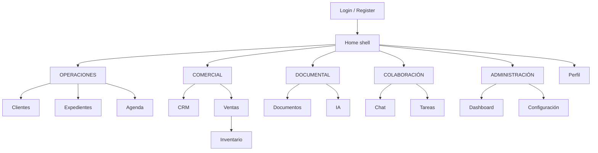

# NexoGo — Unified Navigation Plan

> **UX Architecture · Solo diseño**  
> Fecha: 2026-09-19  
> Objetivo: **un solo Home moderno** y navegación empresarial unificada por categorías.  
> **No modifica código.**

---

## 1. Resumen ejecutivo

NexoGo debe dejar de ser un hub veterinario fragmentado (Home + Dashboard paralelo + drawer plano + módulos legacy) y convertirse en una **shell empresarial multi-tenant** con:

1. **Un único punto de entrada post-login:** `Home` (eliminar Dashboard como hub rival).  
2. **Navegación por categorías de negocio** (Operaciones, Comercial, Documental, Colaboración, Administración).  
3. **Etiquetas de producto** alineadas a platform (`Clientes`, `Expedientes`, …), manteniendo compatibilidad temporal con pantallas legacy detrás de las mismas rutas canónicas.  
4. **Visibilidad por permisos de plataforma** (`PermissionChecker` / roles base), no solo por `UserRole` vet.  
5. **Empresa activa** siempre visible (Company session), con espacio futuro para switcher.

---

## 2. Diagnóstico UX (estado actual)

### 2.1 Problemas de información

| Problema | Impacto |
|----------|---------|
| Dos hubs: `home` vs `dashboard` | El usuario no sabe cuál es “la app” |
| Drawer plano sin categorías | Escala mal a 10+ módulos platform |
| Labels legacy (“Pacientes”, “Historial clínico”) | Desalineado con Clients / Records |
| Quick actions ≠ drawer | Descubrimiento inconsistente por rol |
| Rutas stub (Reports, SaleDetail, Mis Mascotas) | Expectativa rota |
| ClinicalRecords vs HistoryList | Dos entradas al mismo concepto |
| Platform sin destinos UI | Work de foundation invisible al usuario |
| Filtros por `UserRole` vet | No sirve a multiindustria / CLIENT portal |

### 2.2 Flujo vivo hoy

```
Splash → Login → Home (drawer + quick actions)
                ↘ Dashboard solo desde logins alternos (modern/ultra/minimal)
```

Company solo se **muestra** (nombre); no gobierna el mapa de navegación.

### 2.3 Principio de transición

> **Misma IA (information architecture), pantallas detrás intercambiables.**  
> Primero unificar shell y rutas canónicas; después sustituir composables legacy por platform UI.

---

## 3. Principios de diseño

| # | Principio |
|---|-----------|
| 1 | **One Home** — un solo hub post-auth |
| 2 | **Category-first** — módulos agrupados por trabajo, no por historia de código |
| 3 | **Deep, not wide** — Home muestra categorías + atajos; detalle vive en cada módulo |
| 4 | **Company-aware** — toda navegación asume tenant activo |
| 5 | **Permission-gated** — ítem visible solo si `canEnterModule` / permiso open |
| 6 | **Stable routes** — IDs de ruta canónicos (`clients`, `records`, …) aunque el composable sea legacy al inicio |
| 7 | **Mobile-primary shell** — drawer / rail adaptativo; mismo modelo mental en tablet |
| 8 | **Progressive disclosure** — Admin y debug fuera del camino diario |

---

## 4. Information Architecture unificada

### 4.1 Mapa de categorías (objetivo de producto)

```
HOME (shell)
│
├── OPERACIONES
│     ├── Clientes          → platform Clients (alias temporal: Patients)
│     ├── Expedientes       → platform Records (alias: Clinical / History)
│     └── Agenda            → Appointments
│
├── COMERCIAL
│     ├── CRM               → platform CRM (Leads / Pipeline)
│     └── Ventas            → Sales (+ Inventario como sub-destino o hijo)
│
├── DOCUMENTAL
│     ├── Documentos        → platform Documents
│     └── IA                → platform AI (jobs / chat documental)
│
├── COLABORACIÓN
│     ├── Chat              → Enterprise Chat (un solo stack)
│     └── Tareas            → platform Tasks
│
└── ADMINISTRACIÓN
      ├── Dashboard         → KPIs / widgets (platform Dashboard)
      └── Configuración     → Settings (+ roles, company, storage)
```

**Inventario** no es categoría raíz en el brief: se ubica como **hijo de Comercial → Ventas** (“Catálogo / Stock”) o acceso secundario desde Dashboard KPI. Evita un sexto cajón en mobile.

### 4.2 Destinos globales (fuera de categorías)

| Destino | Ubicación UI | Notas |
|---------|--------------|-------|
| Perfil | Top bar avatar | Siempre |
| Empresa activa | Subtítulo / chip Company | Switcher fase 2 |
| Notificaciones | Top bar (fase 2) | Badge chat/tareas |
| Ayuda / Acerca | Dentro de Configuración | |
| Admin / Aprobaciones | Configuración → Administración | No en Home grid |
| Firebase Test | Solo build debug / 7-tap | Fuera de IA producto |

### 4.3 Audiencias

| Audience | Home |
|----------|------|
| **STAFF** (ADMIN / MANAGER / EMPLOYEE) | Categorías completas según permisos |
| **CLIENT** (portal) | Home reducido: Agenda propia, Expedientes propios, Documentos propios, Chat, Perfil |
| **SUPER_ADMIN** | + atajo plataforma (fuera de v1 producto clínica) |

---

## 5. Un solo Home moderno

### 5.1 Anatomía del primer viewport

```
┌─────────────────────────────────────────┐
│ ☰   NexoGo              🔔   👤         │  TopAppBar
│     {Company.name}                      │  Tenant signal
├─────────────────────────────────────────┤
│  Buenos días, {user}                     │  Greeting (1 línea)
│  {1 KPI strip opcional: 4 chips max}    │  Desde DashboardMetrics
├─────────────────────────────────────────┤
│  OPERACIONES                            │  Section header
│  [Clientes] [Expedientes] [Agenda]      │  Module tiles
├─────────────────────────────────────────┤
│  COMERCIAL                              │
│  [CRM] [Ventas]                         │
├─────────────────────────────────────────┤
│  DOCUMENTAL                             │
│  [Documentos] [IA]                      │
├─────────────────────────────────────────┤
│  COLABORACIÓN                           │
│  [Chat ●] [Tareas ●]                    │  badges unread
├─────────────────────────────────────────┤
│  ADMINISTRACIÓN                         │
│  [Dashboard] [Configuración]            │
└─────────────────────────────────────────┘
```

Reglas UX:

- **Una composición**, no un “dashboard de dashboards”.  
- Brand + company visibles; el saludo no compite con la marca.  
- Máximo **1 fila de KPIs** (4 chips); el resto vive en módulo Dashboard.  
- Sin cards decorativas en hero; tiles = contenedores de acción.  
- Drawer espeja las mismas categorías (mismo orden, mismos labels).

### 5.2 Drawer unificado (espejo del Home)

```
Header: logo · Company.name · user chip
────────────────
OPERACIONES
  Clientes · Expedientes · Agenda
COMERCIAL
  CRM · Ventas
DOCUMENTAL
  Documentos · IA
COLABORACIÓN
  Chat · Tareas
ADMINISTRACIÓN
  Dashboard · Configuración
────────────────
Perfil
Cerrar sesión
```

Eliminar del drawer producto: Inventario suelto (va bajo Ventas), Historial vs Clínico duplicado, Firebase Test, Reports stubs hasta existir.

### 5.3 Tablet / landscape (fase 2)

`NavigationRail` con las 5 categorías como iconos + lista de módulos en panel secundario. Mismo grafo de rutas.

---

## 6. Catálogo de módulos y rutas canónicas

| Categoría | Módulo | Route canónica | Permiso open (ROLE_SYSTEM) | Destino código inicial |
|-----------|--------|----------------|----------------------------|------------------------|
| Operaciones | Clientes | `clients` | `clients.client.read` / `read_own` | Alias → `patients` hasta cutover |
| Operaciones | Expedientes | `records` | `records.record.read` / `read_own` | Alias → unificar `clinical_records` **o** `history_list` (elegir uno) |
| Operaciones | Agenda | `agenda` | `agenda.appointment.read` | Alias → `appointments` |
| Comercial | CRM | `crm` | `crm.opportunity.read` | Nueva UI / placeholder platform |
| Comercial | Ventas | `sales` | `sales.sale.read` | `sales` existente |
| Comercial | Inventario* | `inventory` | `inventory.product.read` | Hijo de Ventas |
| Documental | Documentos | `documents` | `documents.file.read` | Nueva UI / placeholder |
| Documental | IA | `ai` | futuro `ai.*` / settings flag | Placeholder foundation |
| Colaboración | Chat | `chat` | `chat.conversation.read` | Un solo stack (`chat_list`) |
| Colaboración | Tareas | `tasks` | futuro / staff default | Nueva UI / placeholder |
| Administración | Dashboard | `dashboard` | `dashboard.kpis.read` | Reusar ruta; contenido → widgets platform |
| Administración | Configuración | `settings` | `settings.org.read` | `settings` + hijos |

\*Inventario: no categoría raíz; deep link desde Ventas y KPI Dashboard.

### 6.1 Renombres de producto (labels)

| Label legacy | Label unificado |
|--------------|-----------------|
| Pacientes | **Clientes** |
| Historial clínico / Clinical Records / Medical Records | **Expedientes** |
| Citas | **Agenda** |
| Ventas y Servicios | **Ventas** |
| Chat | **Chat** |
| Configuración | **Configuración** |
| Inicio / Dashboard (doble) | **Home** + módulo **Dashboard** |

### 6.2 Rutas a deprecar / no exponer

| Route | Acción planificada |
|-------|-------------------|
| `modern_login`, `ultra_simple_login`, `minimal_login` | Quitar del camino producto; debug only |
| `dashboard` como hub post-login alterno | Dejar de navegar desde login; solo módulo |
| `clinical_records` **y** `history_list` | Consolidar a `records` |
| `medical_records` | Fusionar en Expedientes o eliminar del IA |
| `reports*` stubs | Ocultar hasta tener contenido |
| `firebase_test` | Solo debug gesture |
| `Screen.Chat` sin composable | Eliminar o mapear a `chat_list` |
| `admin_dashboard`, `*_dashboard` sin uso | No exponer |

---

## 7. Modelo de navegación (comportamiento)

### 7.1 Grafo lógico



### 7.2 Reglas de stack

| Regla | Detalle |
|-------|---------|
| Single-top Home | Back desde módulo raíz → Home (no apilar Homes) |
| Module root | Cada módulo tiene root (`clients`, `records`, …) + nested create/detail |
| Cross-links | Cliente → Expedientes / Chat / Tareas vía deep links con `clientId` |
| Company change | Fase 2: al cambiar Company, pop a Home y refrescar gates |

### 7.3 Visibilidad (matriz simplificada)

| Módulo | SUPER_ADMIN* | ADMIN | MANAGER | EMPLOYEE | CLIENT |
|--------|:------------:|:-----:|:-------:|:--------:|:------:|
| Clientes | ✓ | ✓ | ✓ | ✓ | own |
| Expedientes | ✓ | ✓ | ✓ | limitado | own |
| Agenda | ✓ | ✓ | ✓ | ✓ | own |
| CRM | ✓ | ✓ | ✓ | limitado | — |
| Ventas | ✓ | ✓ | ✓ | ✓ | own |
| Inventario | ✓ | ✓ | ✓ | read | — |
| Documentos | ✓ | ✓ | ✓ | ✓ | own |
| IA | flag | flag | flag | flag | — |
| Chat | ✓ | ✓ | ✓ | ✓ | ✓ |
| Tareas | ✓ | ✓ | ✓ | ✓ | — |
| Dashboard | ✓ | ✓ | ✓ | parcial | home reducido |
| Configuración | ✓ | ✓ | limitado | prefs | prefs |

\*En contexto de soporte con Company activa.

Implementación objetivo: `PermissionChecker.canEnterModule` + `CompanyFlags` (p.ej. `aiEnabled`).

---

## 8. Diseño de componentes de shell

| Componente | Responsabilidad |
|------------|-----------------|
| `AppShell` | TopBar + Drawer/Rail + NavHost |
| `HomeScreen` (nuevo IA) | Categorías + tiles + KPI strip |
| `NavCategory` | Enum: OPERATIONS, COMMERCIAL, DOCUMENTAL, COLLABORATION, ADMIN |
| `NavDestination` | id, category, route, label, icon, permission, badge |
| `NavCatalog` | Lista canónica de destinos (fuente única Home + Drawer) |
| `CompanyHeader` | Nombre + estado sesión |
| `ModulePlaceholder` | Pantalla temporal “Próximamente” con deep link estable |

**Fuente única:** Home y Drawer leen el mismo `NavCatalog` filtrado por permisos — elimina divergencia quick-actions vs drawer.

---

## 9. Estados vacíos y badges

| Módulo | Empty state | Badge |
|--------|-------------|-------|
| Clientes | CTA crear primer cliente | — |
| Expedientes | CTA crear / filtrar por cliente | Borradores DRAFT (opcional) |
| Agenda | Día vacío + crear cita | Citas hoy |
| CRM | Pipeline vacío | Follow-ups vencidos |
| Chat | Iniciar conversación | No leídos |
| Tareas | Crear tarea | Vencidas / asignadas a mí |
| Documentos | Subir primero | — |
| IA | Explicar enqueue + flag company | Jobs QUEUED (opcional) |

---

## 10. Plan de implementación (sin código aún)

### Fase N0 — Contrato de navegación (1 sprint corto)

- Definir `NavCategory` / `NavDestination` / `NavCatalog` (doc + tipos).  
- Congelar labels y routes canónicas de esta especificación.  
- Decisión: **un** destino Expedientes (`history_list` **o** `clinical_records` como backend temporal).

### Fase N1 — Shell unificado (UI)

- Rehacer Home como categorías (mismo grafo).  
- Rehacer Drawer espejo.  
- Login único → siempre `home` (no `dashboard` hub).  
- Dashboard pasa a tile Administración.  
- Company header consistente.

### Fase N2 — Aliases y placeholders

- Rutas `clients`, `records`, `agenda`, `crm`, `documents`, `ai`, `tasks` registradas.  
- Redirect/alias a pantallas legacy donde existan.  
- Placeholders para CRM / Documentos / IA / Tareas.

### Fase N3 — Gates de permiso

- Sustituir `when (UserRole)` del drawer por `PermissionChecker` + `LegacyRoleBridge`.  
- Home CLIENT reducido.

### Fase N4 — Cutover de contenido

- Clients UI → platform.  
- Records UI → platform.  
- Chat → un solo repository/UI.  
- Dashboard widgets → `DashboardRepository`.  
- Retirar rutas/labels legacy del IA.

### Fase N5 — Polish

- Rail tablet, switcher Company, notificaciones top bar, búsqueda global (opcional).

---

## 11. Criterios de aceptación (UX)

- [ ] Tras login hay **un solo** hub: Home categorizado.  
- [ ] Drawer y Home muestran **las mismas** 5 categorías y módulos (filtrados).  
- [ ] No coexisten “Pacientes” y “Clientes” como dos conceptos en UI.  
- [ ] No hay dos entradas a historial clínico.  
- [ ] Company name visible en shell.  
- [ ] Módulos sin UI muestran placeholder, no crash ni ruta muerta.  
- [ ] Reports/Firebase Test no aparecen en navegación producto.  
- [ ] Portal CLIENT no ve CRM / Inventario / Admin.

---

## 12. Fuera de alcance de este plan

- Implementación Compose / cambios a `NavGraph` (siguiente tarea).  
- Rediseño visual completo de cada módulo.  
- Security Rules / claims.  
- Web responsive (solo se anticipa el mismo `NavCatalog`).

---

## 13. Decisión pendiente (cerrar en N0)

| Tema | Opciones | Recomendación |
|------|----------|---------------|
| Expedientes temporal | HistoryList vs ClinicalRecords | **HistoryList** (`modules.history`) como root; clinical UI queda detalle legacy |
| Inventario | Categoría propia vs hijo de Ventas | **Hijo de Ventas** (+ KPI en Dashboard) |
| IA visible | Siempre vs `CompanyFlags.aiEnabled` | **Flag** company |
| Bottom nav | 4–5 tabs vs solo drawer | **Drawer + Home**; bottom nav solo si se prueba en mobile phase 2 |

---

## 14. Veredicto

La plataforma ya tiene **módulos de dominio** para llenar esta IA; lo que falta es un **sistema de navegación único**. Este plan fija:

- **Un Home moderno por categorías**  
- **Mapa OPERACIONES / COMERCIAL / DOCUMENTAL / COLABORACIÓN / ADMINISTRACIÓN**  
- **Rutas canónicas + transición sin big-bang**  
- **Gates de permiso y Company-aware shell**

Siguiente paso cuando se autorice código: Fase **N1** (shell Home + Drawer + NavCatalog) sin migrar aún la lógica de negocio.
